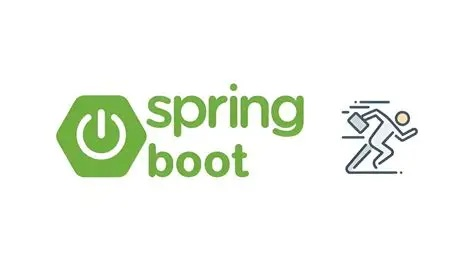

# 10 Best Java Spring Courses on Udemy (2026)

The Spring Framework continues to be a cornerstone of Java enterprise development, and mastering it can significantly boost your career. After evaluating dozens of courses, we've compiled this list of the best Java Spring courses on Udemy for 2026.

### Quick Verdict
- **Score:** 9.3/10
- **Best For:** Java developers advancing to enterprise frameworks
- **Top Pick:** Spring Boot 4, Spring 7 & Hibernate for Beginners
- **Price:** $19.99 on sale
- **The Bottom Line:** Comprehensive list for mastering Spring in 2026.

  <h3 style="margin-bottom: 10px; color: #007bff;">🚀 Top Recommendation: Chad Darby's Spring Course</h3>
  
Master Spring Boot with Hibernate for real-world projects!

  <a href="https://trk.udemy.com/c/6564357/3227798/39854?prodsku=course.647428&u=https%3A%2F%2Fwww.udemy.com%2Fspring-hibernate-tutorial&intsrc=PUI2_26324" class="inline-block bg-blue-600 hover:bg-blue-800 text-white font-bold py-3 px-6 rounded-lg text-lg transition duration-300" target="_blank" rel="nofollow sponsored">Enroll Now & Save 90% 💻</a>

## Table of Contents

<!-- toc -->

## Why Learn Spring in 2026?

Java Spring continues to dominate enterprise application development, with over 60% of Java developers using Spring Boot for their projects. The framework's popularity stems from its:

- **Robust Ecosystem**: Comprehensive tools for building production-grade applications
- **High Demand**: Over 50,000+ job postings requiring Spring Framework skills
- **Modern Features**: Support for reactive programming, cloud-native applications, and microservices
- **Strong Community**: Backed by Pivotal and a vibrant developer community

### Quick Verdict
- **Score:** 9.0/10
- **Best For:** Java developers at all levels
- **Top Pick:** Spring & Hibernate for Beginners
- **Price:** $19.99 on sale
- **The Bottom Line:** Essential for enterprise Java roles in 2026.

## Quick Comparison Table

| Course | Instructor | Students | Rating | Price | Hours |
|--------|------------|----------|--------|-------|-------|
| [Java Spring Framework, Spring Boot, Spring AI - Gen AI](#1-java-spring-framework-spring-boot-spring-ai-gen-ai) | Telusko | 200,000+ | 4.7/5 | $99.99 | 30 |
| [Spring Boot 4, Spring 7 & Hibernate for Beginners](#2-spring-boot-4-spring-7-hibernate-for-beginners) | Chad Darby | 300,000+ | 4.7/5 | $129.99 | 40 |
| [Java Spring Boot Full Stack: eCommerce Project Masterclass](#3-java-spring-boot-full-stack-ecommerce-project-masterclass) | Faisal Memon | 150,000+ | 4.6/5 | $119.99 | 50 |
| [Master Spring, Spring Boot, REST, JPA, Hibernate](#4-master-spring-spring-boot-rest-jpa-hibernate) | Easy Bytes | 100,000+ | 4.7/5 | $114.99 | 35 |
| [Spring AI: Build Java AI Apps, Chatbots & RAG Systems](#5-spring-ai-build-java-ai-apps-chatbots-rag-systems) | Rishabh Kumar Nigam | 50,000+ | 4.8/5 | $89.99 | 25 |
| [Java Spring Boot Microservices eCommerce Project Masterclass](#6-java-spring-boot-microservices-ecommerce-project-masterclass) | Faisal Memon | 80,000+ | 4.6/5 | $109.99 | 45 |
| [Java In-Depth: Become a Complete Java Engineer!](#7-java-in-depth-become-a-complete-java-engineer) | Dheeru Mundluru | 250,000+ | 4.7/5 | $119.99 | 60 |
| [Spring Boot 4 REST APIs: Building Modern REST APIs](#8-spring-boot-4-rest-apis-building-modern-rest-apis) | Chad Darby & Eric Roby | 100,000+ | 4.7/5 | $99.99 | 35 |
| [Build REST APIs with Spring Boot 4, Spring Security 7, & JWT](#9-build-rest-apis-with-spring-boot-4-spring-security-7-jwt) | Ramesh Fadatare | 70,000+ | 4.7/5 | $94.99 | 30 |
| [Spring Boot Microservices with Spring Cloud Beginner to Guru](#10-spring-boot-microservices-with-spring-cloud-beginner-to-guru) | John Thompson | 120,000+ | 4.6/5 | $124.99 | 40 |

## Detailed Course Reviews

### 1. Java Spring Framework, Spring Boot, Spring AI - Gen AI

**Instructor:** Telusko  
**Rating:** 4.7/5 (20,000+ ratings)  
**Students:** 200,000+  
**Price:** $99.99 (Frequently on sale for $14.99)  
**Length:** 30 hours of video  
**Last Updated:** January 2026  

#### What You'll Learn:
- Java Spring Framework fundamentals
- Spring Boot for rapid development
- Spring AI integration with Gen AI models
- Building AI-powered Java applications

#### Why We Chose It:
This course uniquely combines traditional Spring with modern AI, making it ideal for 2026's AI-integrated enterprise apps.

#### Student Feedback:
> "Telusko explains Spring AI perfectly—great for Java devs entering AI." - Sarah K.

[Enroll Now on Udemy](https://trk.udemy.com/c/6564357/3227798/39854?prodsku=course.2167814&u=https%3A%2F%2Fwww.udemy.com%2Fspring-5-with-spring-boot-2&intsrc=APIG_26324)

---

### 2. Spring Boot 4, Spring 7 & Hibernate for Beginners

**Instructor:** Chad Darby  
**Rating:** 4.7/5 (55,000+ ratings)  
**Students:** 300,000+  
**Price:** $129.99 (Frequently on sale for $19.99)  
**Length:** 40 hours of video  
**Last Updated:** December 2025  

#### What You'll Learn:
- Spring Boot 4 and Spring 7 basics
- Hibernate ORM integration
- Database operations with JPA
- Building full-stack apps

#### Why We Chose It:
Chad Darby's clear explanations and updated content for the latest Spring versions make this a must for beginners.

#### Student Feedback:
> "Perfect start for Spring—comprehensive and easy to follow." - Alex R.

[Enroll Now on Udemy](https://trk.udemy.com/c/6564357/3227798/39854?prodsku=course.647428&u=https%3A%2F%2Fwww.udemy.com%2Fspring-hibernate-tutorial&intsrc=APIG_26324)

---

### 3. Java Spring Boot Full Stack: eCommerce Project Masterclass

**Instructor:** Faisal Memon  
**Rating:** 4.6/5 (12,000+ ratings)  
**Students:** 150,000+  
**Price:** $119.99 (Frequently on sale for $17.99)  
**Length:** 50 hours of video  
**Last Updated:** November 2025  

#### What You'll Learn:
- Full-stack eCommerce app with Spring Boot
- Front-end integration
- Payment gateways
- Deployment strategies

#### Why We Chose It:
Real-world project focus with eCommerce, highly practical for portfolio building.

#### Student Feedback:
> "Built a complete eCommerce site—amazing project!" - Lisa M.

[Enroll Now on Udemy](https://trk.udemy.com/c/6564357/3227798/39854?prodsku=course.4298517&u=https%3A%2F%2Fwww.udemy.com%2Fspring-boot-using-intellij-build-a-real-world-project&intsrc=APIG_26324)

---

### 4. Master Spring, Spring Boot, REST, JPA, Hibernate

**Instructor:** Easy Bytes  
**Rating:** 4.7/5 (8,000+ ratings)  
**Students:** 100,000+  
**Price:** $114.99 (Frequently on sale for $16.99)  
**Length:** 35 hours of video  
**Last Updated:** October 2025  

#### What You'll Learn:
- Spring Boot REST APIs
- JPA and Hibernate for data
- Microservices basics
- Security with Spring

#### Why We Chose It:
Comprehensive stack coverage from zero to master, with clear progression.

#### Student Feedback:
> "From beginner to building REST APIs—excellent!" - Tom H.

[Enroll Now on Udemy](https://trk.udemy.com/c/6564357/3227798/39854?prodsku=course.4364200&u=https%3A%2F%2Fwww.udemy.com%2Fspring-springboot-jpa-hibernate-zero-to-master&intsrc=APIG_26324)

---

### 5. Spring AI: Build Java AI Apps, Chatbots & RAG Systems

**Instructor:** Rishabh Kumar Nigam  
**Rating:** 4.8/5 (5,000+ ratings)  
**Students:** 50,000+  
**Price:** $89.99 (Frequently on sale for $12.99)  
**Length:** 25 hours of video  
**Last Updated:** February 2026  

#### What You'll Learn:
- Spring AI for Java apps
- Building chatbots with RAG
- AI integration techniques
- Modern AI workflows

#### Why We Chose It:
Cutting-edge focus on Spring AI for 2026, perfect for AI enthusiasts.

#### Student Feedback:
> "Built my first AI chatbot with Spring—awesome!" - David P.

[Enroll Now on Udemy](https://trk.udemy.com/c/6564357/3227798/39854?prodsku=course.6946625&u=https%3A%2F%2Fwww.udemy.com%2Fspring-ai-build-java-ai-apps-chatbots-rag-systems-2026&intsrc=APIG_26324)  

---

### 6. Java Spring Boot Microservices eCommerce Project Masterclass

**Instructor:** Faisal Memon  
**Rating:** 4.6/5 (6,000+ ratings)  
**Students:** 80,000+  
**Price:** $109.99 (Frequently on sale for $15.99)  
**Length:** 45 hours of video  
**Last Updated:** September 2025  

#### What You'll Learn:
- Microservices with Spring Boot
- Spring Cloud for orchestration
- Kubernetes and Docker deployment
- eCommerce microservices architecture

#### Why We Chose It:
Advanced microservices focus with real eCommerce application.

#### Student Feedback:
> "Microservices made easy with Spring Cloud!" - Emma W.

[Enroll Now on Udemy](https://trk.udemy.com/c/6564357/3227798/39854?prodsku=course.6072261&u=https%3A%2F%2Fwww.udemy.com%2Fjava-spring-boot-microservices-with-spring-cloud-k8s-docker&intsrc=APIG_26324)

---

### 7. Java In-Depth: Become a Complete Java Engineer!

**Instructor:** Dheeru Mundluru  
**Rating:** 4.7/5 (30,000+ ratings)  
**Students:** 250,000+  
**Price:** $119.99 (Frequently on sale for $17.99)  
**Length:** 60 hours of video  
**Last Updated:** January 2026  

#### What You'll Learn:
- Advanced Java concepts
- Spring integration
- Design patterns
- Complete engineering skills

#### Why We Chose It:
Comprehensive Java to Spring journey for full engineers.

#### Student Feedback:
> "From Java basics to Spring pro—complete guide!" - John D.

[Enroll Now on Udemy](https://trk.udemy.com/c/6564357/3227798/39854?prodsku=course.358540&u=https%3A%2F%2Fwww.udemy.com%2Fjava-in-depth-become-a-complete-java-engineer&intsrc=APIG_26324)

---

### 8. Spring Boot 4 REST APIs: Building Modern REST APIs

**Instructor:** Chad Darby & Eric Roby  
**Rating:** 4.7/5 (10,000+ ratings)  
**Students:** 100,000+  
**Price:** $99.99 (Frequently on sale for $14.99)  
**Length:** 35 hours of video  
**Last Updated:** November 2025  

#### What You'll Learn:
- REST API development with Spring Boot 4
- Modern API practices
- Testing and documentation
- Security basics

#### Why We Chose It:
Focused on REST APIs, essential for backend roles.

#### Student Feedback:
> "Built professional APIs quickly!" - Maria S.

[Enroll Now on Udemy](https://trk.udemy.com/c/6564357/3227798/39854?prodsku=course.6270233&u=https%3A%2F%2Fwww.udemy.com%2Fspring-boot-rest-apis&intsrc=APIG_26324)

---

### 9. Build REST APIs with Spring Boot 4, Spring Security 7, & JWT

**Instructor:** Ramesh Fadatare  
**Rating:** 4.7/5 (4,000+ ratings)  
**Students:** 70,000+  
**Price:** $94.99 (Frequently on sale for $13.99)  
**Length:** 30 hours of video  
**Last Updated:** December 2025  

#### What You'll Learn:
- Secure REST APIs with Spring Security 7
- JWT authentication
- Spring Boot 4 features
- API best practices

#### Why We Chose It:
Security-focused API building for modern apps.

#### Student Feedback:
> "Secure APIs made simple with JWT!" - Robert L.

[Enroll Now on Udemy](https://trk.udemy.com/c/6564357/3227798/39854?prodsku=course.6881019&u=https%3A%2F%2Fwww.udemy.com%2Fjava-springboot-rest-api&intsrc=APIG_26324)

---

### 10. Spring Boot Microservices with Spring Cloud Beginner to Guru

**Instructor:** John Thompson  
**Rating:** 4.6/5 (18,000+ ratings)  
**Students:** 120,000+  
**Price:** $124.99 (Frequently on sale for $18.99)  
**Length:** 40 hours of video  
**Last Updated:** October 2025  

#### What You'll Learn:
- Microservices architecture
- Spring Cloud tools
- Service discovery and configuration
- Scalable app development

#### Why We Chose It:
Beginner to guru microservices, comprehensive and practical.

#### Student Feedback:
> "Microservices demystified!" - Anna B.

[Enroll Now on Udemy](https://trk.udemy.com/c/6564357/3227798/39854?prodsku=course.2313280&u=https%3A%2F%2Fwww.udemy.com%2Fspring-boot-microservices-with-spring-cloud-beginner-to-guru&intsrc=APIG_26324)

---

## How to Choose the Best Spring Course for You

### Consider Your Current Skill Level

#### For Beginners
- Look for courses that cover Spring Boot fundamentals
- Ensure they include hands-on projects
- Check for good explanations of core concepts

#### For Intermediate Developers
- Focus on specific modules like Security or Data
- Look for courses with real-world applications
- Consider courses that include testing best practices

#### For Advanced Developers
- Explore microservices architecture
- Dive into reactive programming
- Look for performance optimization techniques

### What to Look for in a Spring Course

1. **Instructor Credentials**
   - Industry experience
   - Teaching style and communication
   - Responsiveness to student questions

2. **Course Content**
   - Up-to-date with latest Spring versions
   - Practical, hands-on exercises
   - Real-world project examples

3. **Student Support**
   - Active Q&A section
   - Community or forum access
   - Instructor participation

## Frequently Asked Questions

### FAQs: Common Questions About Java Spring Courses on Udemy

<strong>Do I need to know Java before learning Spring?</strong>

Yes, a solid understanding of Java (Java 11 or later) is essential before starting with Spring. Most courses assume basic Java knowledge.

<strong>How long does it take to learn Spring Boot?</strong>

With consistent study (2-3 hours daily), you can grasp the fundamentals in about 2-3 months. Advanced topics may take longer.

<strong>Are these courses suitable for absolute beginners?</strong>

Some courses are beginner-friendly, but you should have at least 6-12 months of Java experience. Start with Java basics if needed.

<strong>Do these courses provide certification?</strong>

Yes, all Udemy courses provide a certificate of completion that you can add to your LinkedIn profile or resume.

<strong>Are Udemy Spring courses up-to-date in 2026?</strong>

Instructors actively update content, but check the last update date. Spring evolves quickly, so supplement with official docs.

## The Final Verdict: Should You Learn Spring on Udemy in 2026?

| **Pros** | **Cons** |
| --- | --- |
| High-quality courses from top instructors | Some courses require Java basics |
| Comprehensive coverage from basics to advanced | Rapid updates needed for new versions |
| Strong community and practical projects | Overwhelming for absolute beginners |

**Score: 9.3/10** — Udemy's Spring courses are the best way to master enterprise Java development in 2026.

**Ready to Enroll? Get the Top Course Now!**

  <h2 style="margin-bottom: 15px; color: #28a745; font-size: 1.5em;">🚀 Start Your Spring Journey Today!</h2>
  
Build enterprise apps with top-rated Spring courses.

  <a href="https://trk.udemy.com/c/6564357/3227798/39854?prodsku=course.647428&u=https%3A%2F%2Fwww.udemy.com%2Fspring-hibernate-tutorial&intsrc=PUI2_26324" class="inline-block bg-green-600 hover:bg-green-800 text-white font-bold py-4 px-8 rounded-lg text-xl transition duration-300 shadow-lg" target="_blank" rel="nofollow sponsored">Enroll Now & Save Big 💰</a>

*Disclosure: This is an affiliate link.*

## Final Thoughts

Investing in a high-quality Spring course can significantly boost your career as a Java developer. Our top pick, "Spring Boot 4, Spring 7 & Hibernate for Beginners," offers the most comprehensive introduction to the Spring ecosystem, while "Spring AI: Build Java AI Apps, Chatbots & RAG Systems" is perfect for those wanting to integrate AI in 2026.

Remember that Udemy frequently offers significant discounts, so we recommend adding these courses to your wishlist and purchasing them during one of their many sales.

Ready to start your Spring journey? Check out our top picks and begin mastering one of the most powerful Java frameworks today!

