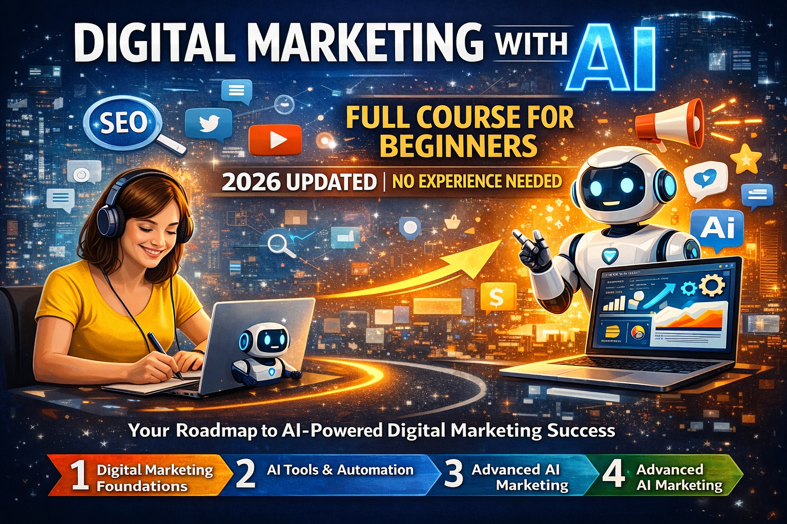

## Table of Contents

<!-- toc -->

## Digital Marketing with AI in 2026: What Beginners Must Know

Digital marketing in 2026 is no longer manual, repetitive, or guess-based. Artificial Intelligence has fundamentally transformed how marketers create content, optimize SEO, manage ads, analyze data, and scale campaigns.

With tools like **ChatGPT, AI content generators, predictive analytics, automated ad optimization, and AI-powered SEO**, beginners can now achieve results that previously required years of experience.

This guide curates the **best Udemy Digital Marketing + AI courses for beginners**, allowing you to learn everything—from zero to advanced—using structured, affordable, and practical training.

To get started visually, watch this **free 4-hour beginner AI digital marketing course**:

## Free Video: Digital Marketing with AI Full Course for Beginners in 4 HOURS - 2026 Updated [No Experience Needed]

<iframe width="100%" height="415"
src="https://www.youtube.com/embed/kunkYTKFNtI"
title="Digital Marketing with AI Full Course for Beginners"
frameborder="0"
allow="accelerometer; autoplay; clipboard-write; encrypted-media; gyroscope; picture-in-picture"
allowfullscreen>
</iframe>

---

Credit: Youtube and WSCube Tech Channel

## Why Learn AI-Powered Digital Marketing in 2026?

AI is now embedded in every major marketing channel:

- **SEO**: AI keyword clustering, content optimization, and search intent analysis
- **Social Media**: AI captions, scheduling, trend prediction
- **Paid Ads**: AI bidding, audience targeting, creative testing
- **Content Marketing**: Blog writing, video scripts, email automation [Learn more: Agentic AI in Marketing for 2026: Time To Get Real — and Get Ready](https://contentmarketinginstitute.com/ai-in-marketing/agentic-ai-marketing)
- **Analytics**: Predictive insights and conversion optimization  

Companies are actively hiring marketers who understand **AI workflows**, not just traditional tactics.

---

## How We Selected These Digital Marketing Courses

Our selection criteria follow strict quality benchmarks:

- Beginner-friendly with **step-by-step structure**
- Updated for **2026 AI tools & platforms**
- Covers **AI + practical marketing execution**
- Strong Udemy ratings and enrollments
- Includes **real-world projects**
- Affordable during Udemy sales (≤ $19.99)

---

## Best Digital Marketing with AI Courses on Udemy (2026)

### 1. The Complete Digital Marketing Guide – 27 Courses in 1
**Instructor**: Robin & Jesper
**Best for**: All-in-one digital marketing foundation

In 2026, digital marketing is no longer a collection of disjointed tactics but a cohesive ecosystem driven by data, automation, and artificial intelligence. The Complete Digital Marketing Guide – 27 Courses in 1 stands out as the ultimate comprehensive resource for beginners and aspiring professionals seeking to master every facet of modern digital marketing. Created by industry experts Robin and Jesper, this mega-bundle encompasses 27 individual courses condensed into one massive learning experience, covering everything from foundational SEO principles to advanced AI-powered campaign optimizations.

This course is designed for absolute beginners, but its depth ensures even seasoned marketers find value in its updated 2026 content. It integrates cutting-edge AI tools like ChatGPT for content creation, automated ad bidding systems, and predictive analytics for social media trends. You'll learn how to build end-to-end marketing funnels that convert visitors into loyal customers, leveraging platforms like Google Ads, Facebook Ads, YouTube, Instagram, and emerging AI-driven tools.

The curriculum is structured logically, starting with the basics of digital marketing strategy and progressing to specialized areas. Each module includes hands-on projects, such as setting up a complete SEO campaign, automating email sequences, and analyzing campaign performance with AI insights. By the end, you'll have a portfolio of real-world projects that demonstrate your ability to execute comprehensive digital marketing strategies.

What sets this course apart is its focus on AI integration. In 2026, AI is transforming every marketing channel— from generating personalized ad creatives to automating content calendars and predicting customer behavior. The course teaches you how to use AI ethically and effectively, ensuring your campaigns are not only efficient but also compliant with evolving privacy regulations.

Moreover, the instructors emphasize practical application. You'll work on case studies from real businesses, learning how to adapt strategies for different industries, from e-commerce to B2B services. The inclusion of analytics tools like Google Analytics and AI-powered dashboards helps you track and optimize performance in real-time.

This bundle also covers niche areas like YouTube marketing, influencer collaborations, and crisis management in digital spaces. With over 40 hours of video content, interactive quizzes, and community forums, it's a self-paced journey that fits into busy schedules. The 2026 updates include the latest algorithms from major platforms, ensuring your knowledge remains current.

**Key learning outcomes**:
- Master SEO fundamentals, including keyword research with AI tools and on-page optimization
- Develop social media strategies for platforms like Instagram, Facebook, and TikTok using AI trend prediction
- Build and automate email marketing campaigns with personalization and segmentation
- Execute paid ad campaigns on Google and Facebook with AI-driven bidding and creative testing
- Analyze marketing data with advanced tools and AI insights for continuous optimization
- Create content calendars and generate blog posts, videos, and graphics using AI assistants
- Implement marketing automation workflows to streamline lead nurturing and customer retention
- Understand affiliate marketing and partnership strategies in the AI era
- Learn YouTube SEO and video marketing tactics for building authority
- Develop comprehensive marketing funnels from awareness to conversion

**Ideal students**:
- Complete beginners with no marketing experience looking for a structured path to expertise
- Entrepreneurs and small business owners wanting to handle their own marketing
- Professionals transitioning to digital marketing roles
- Students in business, communication, or tech fields seeking practical skills
- Freelancers and consultants aiming to offer digital marketing services

**Enrollment**: 1.2M+ | **Rating**: 4.7/5 | **Duration**: 42+ hours
[Get Course: The Complete Digital Marketing Guide – 27 Courses in 1](https://trk.udemy.com/c/6564357/3227798/39854?prodsku=course.1659676&u=https%3A%2F%2Fwww.udemy.com%2Fdigital-marketing-guide&intsrc=APIG_26324)

---

### 2. Mega Digital Marketing Course A-Z: 32 Courses in 1 + Updates
**Instructor**: Pouya Eti
**Best for**: Practical digital marketing mastery

As digital marketing evolves rapidly in 2026, the Mega Digital Marketing Course A-Z: 32 Courses in 1 + Updates emerges as a powerhouse for those seeking a structured, all-encompassing education in practical marketing techniques. Taught by Pouya Eti, a seasoned marketer, this course aggregates 32 specialized courses into a single, cohesive program that bridges theory and application. It's particularly tailored for beginners who crave immediate, actionable skills without the overwhelm of scattered resources.

The course begins with the fundamentals of digital strategy, emphasizing how AI can streamline decision-making processes. You'll learn to set up websites using WordPress, optimize them for search engines, and integrate AI plugins for automated content generation. SEO is covered in depth, from keyword research enhanced by AI tools to technical audits that ensure compliance with 2026 algorithm updates.

Social media marketing forms a core component, with dedicated modules on Instagram growth hacking, Facebook ad strategies, and TikTok trends. The 2026 updates include AI-driven social listening tools that help predict viral content and automate posting schedules. You'll also delve into paid advertising, mastering Google Ads and Facebook Ads with AI optimization for better ROI.

One of the standout features is the focus on sales funnels. You'll build complete funnels from scratch, incorporating AI chatbots for lead nurturing and email automation sequences that personalize communication at scale. Real-world projects include creating a full marketing campaign for a fictional business, applying all learned skills in a simulated environment.

Automation is a recurring theme, with teachings on tools like Zapier and AI platforms that connect marketing channels seamlessly. The course addresses emerging trends like AI-generated video ads and personalized email campaigns, preparing you for the future of marketing.

Throughout, Pouya emphasizes ethical AI use, ensuring campaigns respect user privacy and avoid over-automation pitfalls. The curriculum is project-based, with assignments that mirror professional tasks, such as auditing a website's SEO or designing an ad campaign.

For those new to marketing, the step-by-step structure is invaluable. Each module builds on the previous, with quizzes and practical exercises reinforcing concepts. Community support through forums and live Q&A sessions adds to the learning experience.

**Key learning outcomes**:
- Build and customize WordPress sites optimized for SEO and user experience
- Conduct comprehensive SEO audits and implement AI-powered keyword strategies
- Grow social media presence on Instagram, Facebook, and LinkedIn with targeted content and ads
- Create and manage effective Google Ads and Facebook Ads campaigns with AI bidding
- Design sales funnels that convert leads into customers using automation tools
- Automate marketing workflows with AI integrations for efficiency
- Generate high-quality content using AI writing assistants and graphic tools
- Analyze campaign performance with advanced analytics and AI insights
- Implement influencer marketing and partnerships for brand amplification
- Develop cross-platform marketing strategies that adapt to algorithm changes

**Ideal students**:
- Beginners eager to gain practical skills without prior experience
- Entrepreneurs launching online businesses and needing in-house marketing expertise
- Marketing newcomers transitioning from traditional roles
- Students pursuing business or digital media degrees
- Professionals in sales or customer service looking to expand into marketing

**Enrollment**: 800k+ | **Rating**: 4.6/5 | **Duration**: 38+ hours
[Get Course: Mega Digital Marketing Course A-Z](https://trk.udemy.com/c/6564357/3227798/39854?prodsku=course.1931752&u=https%3A%2F%2Fwww.udemy.com%2Fdigital-marketing-strategy-course-wordpress-seo-instagram-facebook&intsrc=APIG_26324)

---

### 3. AI in Digital Marketing: Master ChatGPT & 100+ AI Tools
**Instructor**: Victoria Rusnac
**Best for**: ChatGPT & AI tool mastery

In the AI-driven marketing landscape of 2026, mastering tools like ChatGPT is not optional—it's essential. Victoria Rusnac's AI in Digital Marketing: Master ChatGPT & 100+ AI Tools is the definitive guide for marketers ready to harness artificial intelligence for transformative results. This course dives deep into over 100 AI tools, focusing on practical applications across SEO, content creation, advertising, and automation.

The journey begins with understanding AI fundamentals in marketing, demystifying how machine learning can predict trends, generate content, and optimize campaigns. You'll start with ChatGPT, learning advanced prompting techniques to create compelling copy, emails, and social media posts that resonate with audiences. The course covers prompt engineering, a skill that turns generic AI outputs into highly targeted, brand-aligned content.

Beyond ChatGPT, you'll explore a suite of tools like Jasper for AI writing, Midjourney for visual content, and automation platforms that integrate seamlessly. Real-world examples demonstrate how to use AI for SEO keyword research, where tools analyze search intent and suggest optimizations that align with Google's evolving algorithms.

Content marketing receives significant attention, with modules on building AI-powered content calendars that adapt to performance data. You'll learn to automate blog writing, video scripts, and graphic design, freeing up time for strategic thinking. The course also addresses AI in paid ads, teaching how to generate ad variations, predict performance, and automate bidding for maximum ROI.

Automation workflows are a highlight, showing how to connect tools via APIs and no-code platforms. This includes setting up drip campaigns that personalize based on user behavior, tracked via AI analytics. Ethical considerations are covered, ensuring AI use complies with regulations like GDPR and avoids biases in content.

Hands-on projects include creating an AI-assisted marketing campaign from ideation to execution. You'll simulate scenarios, such as launching a product with AI-generated ads and content, measuring success with AI dashboards.

The 2026 updates incorporate the latest AI advancements, including multimodal tools that combine text, image, and video generation. Victoria's teaching style is engaging, with step-by-step tutorials and real-life case studies from brands that have scaled using AI.

**Key learning outcomes**:
- Master prompt engineering for ChatGPT to produce high-quality marketing copy and content
- Integrate over 100 AI tools for various marketing tasks, from writing to design
- Automate content creation workflows for blogs, social media, and emails
- Use AI for advanced SEO research, competitor analysis, and optimization
- Generate AI-powered ad creatives and optimize campaigns for better performance
- Build personalized marketing automation funnels with AI segmentation
- Create visual content with tools like Midjourney and DALL-E for campaigns
- Analyze marketing data with AI insights for predictive strategies
- Implement AI for social media scheduling and trend prediction
- Develop ethical AI practices to ensure compliant and inclusive marketing

**Ideal students**:
- Marketers looking to integrate AI into existing workflows
- Content creators and copywriters wanting to leverage AI for productivity
- Entrepreneurs needing AI tools to compete in digital spaces
- Students in marketing or communications interested in future trends
- Professionals in advertising seeking to enhance creative processes

**Enrollment**: 150k+ | **Rating**: 4.8/5 | **Duration**: 15+ hours
[Get Course: AI in Digital Marketing](https://trk.udemy.com/c/6564357/3227798/39854?prodsku=course.5106840&u=https%3A%2F%2Fwww.udemy.com%2Fai-chatgpt-in-marketing&intsrc=APIG_26324)

---

### 4. Artificial Intelligence Marketing to Grow Your Business
**Instructor**: Diego Davilla
**Best for**: Business-focused AI marketing

For business owners and marketers in 2026, AI is not just a tool—it's a growth accelerator. Diego Davilla's Artificial Intelligence Marketing to Grow Your Business shifts the focus from theoretical AI concepts to actionable, ROI-driven strategies that drive real revenue. This course is designed for entrepreneurs and marketing professionals who need practical ways to integrate AI into their operations without getting bogged down in technical jargon.

The curriculum starts with assessing your current marketing stack and identifying opportunities for AI enhancement. You'll learn how AI can analyze customer data to predict buying behavior, segment audiences more accurately, and personalize messaging at scale. Case studies from various industries demonstrate how businesses have scaled using AI, from small e-commerce stores to large corporations.

A key emphasis is on ROI measurement. Diego teaches frameworks for tracking AI investments, ensuring every tactic justifies its cost. You'll explore AI for lead generation, using predictive analytics to identify high-value prospects, and automation tools that nurture leads through the funnel.

Content creation is streamlined with AI, as you'll discover tools for generating blog posts, social media content, and email campaigns that align with brand voice. The course also covers AI in customer service, implementing chatbots that handle inquiries and gather insights for future campaigns.

Paid advertising gets a thorough treatment, with strategies for AI-optimized bidding on platforms like Google and Meta. You'll learn to use AI for A/B testing creatives, forecasting campaign performance, and reallocating budgets dynamically.

Diego incorporates real-world projects, such as building an AI-enhanced marketing plan for a hypothetical business. You'll simulate budget constraints, measure KPIs, and iterate based on AI-generated reports. Ethical AI use is highlighted, with tips on maintaining transparency and avoiding algorithmic biases.

The course is updated for 2026, including integrations with new AI platforms and compliance with emerging regulations. It's concise yet comprehensive, focusing on high-impact tactics that yield quick wins.

**Key learning outcomes**:
- Develop ROI-focused AI marketing strategies for business growth
- Use AI for customer segmentation and personalized marketing campaigns
- Implement predictive analytics to forecast sales and optimize targeting
- Automate lead nurturing and customer service with AI chatbots
- Create high-converting content using AI writing and design tools
- Optimize paid ad campaigns with AI bidding and creative testing
- Measure and track AI marketing ROI with advanced analytics
- Build scalable marketing funnels enhanced by AI automation
- Integrate AI tools into existing business workflows for efficiency
- Ensure ethical AI practices in marketing to build trust and compliance

**Ideal students**:
- Business owners seeking AI to accelerate growth
- Marketing managers in small to medium enterprises
- Entrepreneurs launching or scaling online ventures
- Professionals in sales and customer relations
- Consultants advising on digital transformation

**Enrollment**: 200k+ | **Rating**: 4.7/5 | **Duration**: 12+ hours
[Get Course: AI Marketing to Grow Your Business](https://trk.udemy.com/c/6564357/3227798/39854?prodsku=course.4871134&u=https%3A%2F%2Fwww.udemy.com%2Fartificial-intelligence-in-marketing&intsrc=APIG_26324)

---

### 5. AI for Marketers 2026: ChatGPT, Google Ads & Facebook Ads
**Instructor**: Tanmoy Das
**Best for**: Paid ads + AI automation

Paid advertising in 2026 is hyper-competitive, but AI levels the playing field. Tanmoy Das's AI for Marketers 2026: ChatGPT, Google Ads & Facebook Ads is the essential course for mastering AI-enhanced ad strategies. It combines the power of generative AI with proven paid ad tactics, teaching you to create, optimize, and scale campaigns that deliver superior ROI.

The course opens with AI fundamentals for advertising, explaining how machine learning predicts user behavior and optimizes bids in real-time. You'll integrate ChatGPT into your workflow for generating ad copy, headlines, and descriptions that resonate. Prompt engineering is taught extensively, transforming basic inputs into persuasive, conversion-focused text.

Google Ads and Facebook Ads are covered in depth, with AI tools automating keyword research, audience targeting, and performance forecasting. You'll learn to use AI for dynamic ad creation, testing variations, and reallocating budgets based on predictive analytics. Scaling campaigns becomes effortless with AI recommendations for expansion.

ROAS (Return on Ad Spend) is a central theme, with modules on tracking and improving metrics using AI dashboards. You'll analyze data to identify winning creatives and eliminate underperformers automatically. The course includes case studies of successful AI-driven campaigns, from local businesses to global brands.

Content marketing ties in, as you'll use AI to produce blog posts and videos that support ad funnels. Automation extends to retargeting and lookalike audiences, powered by AI insights. Ethical ad practices are emphasized, ensuring compliance with privacy laws.

Hands-on exercises simulate full campaign management, from setup to optimization. Tanmoy provides templates and checklists for quick implementation. The 2026 updates reflect the latest platform features and AI integrations.

**Key learning outcomes**:
- Use ChatGPT for crafting compelling ad copy and creative variations
- Optimize Google Ads campaigns with AI-driven bidding and targeting
- Master Facebook Ads with AI audience insights and automated scaling
- Improve ROAS through AI analytics and performance prediction
- Automate ad creative testing and A/B experiments
- Integrate AI into content marketing for ad-supported campaigns
- Build retargeting strategies with predictive AI models
- Analyze ad data with AI tools for actionable insights
- Scale campaigns globally using AI market predictions
- Ensure ad compliance and ethical use of AI in targeting

**Ideal students**:
- PPC specialists upgrading skills with AI
- Marketers managing paid ad budgets
- Entrepreneurs running ad-supported businesses
- Students in digital marketing programs
- Freelancers offering ad management services

**Enrollment**: 100k+ | **Rating**: 4.6/5 | **Duration**: 18+ hours
[Get Course: AI for Marketers 2026](https://trk.udemy.com/c/6564357/3227798/39854?prodsku=course.6252835&u=https%3A%2F%2Fwww.udemy.com%2Fcontent-marketing-mastery-boost-business-with-chatgpt&intsrc=APIG_26324)

---

### 6. 40 Digital Marketing Courses in 1: Online Marketing 2026
**Instructor**: Alex Genadinik
**Best for**: Broad marketing fundamentals

Alex Genadinik's 40 Digital Marketing Courses in 1: Online Marketing 2026 is a timeless classic, updated for the AI era, offering a comprehensive foundation in digital marketing principles. This course condenses 40 specialized topics into one accessible program, making it ideal for beginners building a solid base before diving into advanced tactics.

The structure covers core areas like marketing strategy, consumer behavior, and branding, all infused with AI applications. You'll learn how AI analyzes market trends and predicts consumer preferences, enabling data-driven decisions. Social media marketing is expanded with AI tools for content scheduling and engagement prediction.

SEO and content marketing modules teach foundational techniques, enhanced by AI for keyword insights and automated publishing. Email marketing includes AI personalization for higher open rates. Paid ads are introduced with basics of Google and Facebook, plus AI bidding introductions.

The course emphasizes practical exercises, such as creating a basic marketing plan or analyzing a campaign. Real-world examples from Alex's entrepreneurial journey illustrate concepts. AI integration shows how to automate repetitive tasks, like report generation.

Updated for 2026, it includes emerging channels like AI-generated video and virtual events. Ethics and sustainability in marketing are discussed, aligning with modern values. The course is self-paced, with lifetime access and community support.

**Key learning outcomes**:
- Understand core marketing principles and consumer psychology
- Develop marketing strategies informed by AI trend analysis
- Master social media fundamentals with AI scheduling tools
- Learn SEO basics and AI-enhanced keyword research
- Create effective email campaigns with personalization
- Grasp paid advertising essentials and AI bidding
- Build content marketing plans with automated tools
- Analyze marketing performance using AI dashboards
- Implement branding and storytelling techniques
- Explore emerging AI-driven marketing channels

**Ideal students**:
- Absolute beginners with no marketing background
- Entrepreneurs starting digital ventures
- Students in business or related fields
- Professionals shifting to marketing roles
- Those seeking a broad overview before specialization

**Enrollment**: 600k+ | **Rating**: 4.5/5 | **Duration**: 35+ hours
[Get Course: 40 Digital Marketing Courses in 1](https://trk.udemy.com/c/6564357/3227798/39854?prodsku=course.380804&u=https%3A%2F%2Fwww.udemy.com%2Fintroduction-to-marketing-101-basics-and-fundamentals&intsrc=APIG_26324)

---

### 7. Growth Hacking with Digital Marketing (Now with AI!)
**Instructor**: David Jones
**Best for**: Startups & rapid growth

For startups and growth-oriented businesses in 2026, traditional marketing is too slow—growth hacking with AI is the answer. David Jones's Growth Hacking with Digital Marketing (Now with AI!) teaches unconventional, data-driven strategies amplified by artificial intelligence for explosive business growth.

The course defines growth hacking as finding scalable, cost-effective ways to acquire and retain users. AI accelerates this by automating experiments and predicting outcomes. You'll learn to build viral loops, optimize conversion funnels, and use AI for personalized user experiences.

Modules cover SEO hacks enhanced by AI keyword tools, social media growth with predictive engagement, and paid ads using AI for micro-targeting. Content marketing focuses on AI-generated, shareable assets. Email and SMS campaigns are automated with AI segmentation for higher response rates.

A/B testing and experimentation are core, with AI suggesting variations and analyzing results instantly. You'll create funnels that use AI chatbots for lead qualification and nurturing. Real-world case studies from companies like Dropbox and Airbnb illustrate principles.

The 2026 updates include AI for trend spotting and automated scaling. David emphasizes ethics, avoiding manipulative tactics. Projects include designing a growth hack campaign for a startup, integrating AI tools.

**Key learning outcomes**:
- Implement growth hacking techniques for rapid user acquisition
- Use AI to automate and optimize marketing experiments
- Build scalable conversion funnels with AI personalization
- Leverage AI for viral content creation and distribution
- Optimize SEO and social media with AI-driven insights
- Automate email and SMS campaigns for targeted growth
- Conduct AI-enhanced A/B testing for continuous improvement
- Develop user retention strategies with predictive AI
- Scale businesses using data-driven, AI-powered hacks
- Ensure ethical growth practices in digital marketing

**Ideal students**:
- Startup founders and entrepreneurs
- Growth marketers in tech companies
- Digital marketers seeking innovative tactics
- Product managers focused on user acquisition
- Freelancers in growth consulting

**Enrollment**: 400k+ | **Rating**: 4.6/5 | **Duration**: 22+ hours
[Get Course: Growth Hacking with AI](https://trk.udemy.com/c/6564357/3227798/39854?prodsku=course.496924&u=https%3A%2F%2Fwww.udemy.com%2Fgrowth-hacking-masterclass-become-a-digital-marketing-ninja&intsrc=APIG_26324)

---

### 8. The Ultimate Digital Marketing Course 2026: 11 Courses in 1
**Instructor**: Joshua George
**Best for**: SEO-centric marketers

Joshua George's The Ultimate Digital Marketing Course 2026: 11 Courses in 1 is a powerhouse for those prioritizing SEO and content-driven growth. This comprehensive bundle integrates 11 specialized courses into a unified curriculum, updated for 2026's AI advancements, focusing on organic traffic, content mastery, and conversion excellence.

The course starts with deep SEO training, covering on-page and off-page techniques enhanced by AI tools for keyword clustering and content optimization. You'll learn to build backlinks ethically and use AI for competitor analysis. Content marketing is emphasized, with strategies for blogging, video, and podcasts amplified by AI generation tools.

Conversion optimization uses AI heatmaps and A/B testing to refine landing pages. Social media and email marketing tie into SEO, building authority through integrated campaigns. Analytics modules teach tracking with AI-powered dashboards for real-time insights.

Hands-on projects include auditing a site's SEO and creating a content calendar. Joshua shares case studies from his agency work, showing how AI accelerates results. The course promotes white-hat SEO and sustainable growth.

**Key learning outcomes**:
- Master advanced SEO techniques with AI keyword tools
- Create high-ranking content using AI writing assistants
- Optimize conversions with AI-driven testing and analysis
- Build backlinks and authority through ethical strategies
- Integrate SEO with social media and email marketing
- Use analytics tools for data-driven decisions
- Develop content calendars that drive organic growth
- Implement local SEO with AI location tools
- Automate SEO audits and reporting
- Ensure compliance with search engine guidelines

**Ideal students**:
- SEO specialists and content marketers
- Website owners focused on organic traffic
- Digital marketers in B2B industries
- Bloggers and content creators
- Agencies offering SEO services

**Enrollment**: 300k+ | **Rating**: 4.7/5 | **Duration**: 28+ hours
[Get Course: Ultimate Digital Marketing Course 2026](https://trk.udemy.com/c/6564357/3227798/39854?prodsku=course.3545566&u=https%3A%2F%2Fwww.udemy.com%2Fthe-ultimate-digital-marketing-course&intsrc=APIG_26324)

---

### 9. Complete AI Content Mastery for Social Media & Beyond
**Instructor**: Maggie Stara & Codestars
**Best for**: AI content creation

Content creation is the backbone of digital marketing, and in 2026, AI makes it faster and more creative. Maggie Stara and Codestars' Complete AI Content Mastery for Social Media & Beyond is the ultimate guide to harnessing AI for producing engaging content across platforms. This course equips you with skills to generate blogs, social posts, videos, and branding materials using cutting-edge tools.

The curriculum explores AI tools like ChatGPT, Midjourney, and specialized content generators. You'll learn prompt crafting for consistent brand voice and style. Social media modules cover creating viral posts, reels, and stories with AI trend analysis.

Blogging is streamlined with AI outlines and drafts, followed by editing for quality. Video scripting uses AI for engaging narratives, and tools for thumbnail creation are included. Branding sections teach AI-assisted logo design and color palettes.

Automation features allow scheduling content calendars and repurposing across channels. The course includes ethical guidelines for AI-generated content, ensuring originality and avoiding plagiarism. Projects involve building a content strategy for a brand using AI.

**Key learning outcomes**:
- Use AI tools for generating social media content and captions
- Create blog posts and articles with AI writing assistants
- Develop video scripts and thumbnails using generative models
- Design branding elements like logos and graphics with AI
- Build automated content calendars for consistent posting
- Repurpose content across platforms with AI adaptations
- Analyze audience engagement with AI insights
- Ensure ethical and original AI-generated content
- Integrate AI into collaborative content workflows
- Optimize content for SEO and social algorithms

**Ideal students**:
- Content creators and social media managers
- Bloggers and influencers
- Branding and design professionals
- Marketing teams in creative industries
- Entrepreneurs needing in-house content production

**Enrollment**: 50k+ | **Rating**: 4.5/5 | **Duration**: 20+ hours
[Get Course: AI Content Mastery](https://trk.udemy.com/c/6564357/3227798/39854?prodsku=course.6699953&u=https%3A%2F%2Fwww.udemy.com%2Fai-content-creation-mastery&intsrc=APIG_26324)

---

### 10. AI for Creative Marketing & Customer Experience
**Instructor**: John Doukasse
**Best for**: Brand storytelling with AI

Creativity meets technology in John Doukasse's AI for Creative Marketing & Customer Experience, a course that redefines brand storytelling and user engagement through AI. In 2026, where customer experience is paramount, this program teaches how to use AI for personalized, immersive marketing that builds lasting loyalty.

The course explores AI for narrative crafting, generating stories that resonate emotionally. You'll learn to create interactive campaigns using AI chatbots and virtual assistants. UX design is enhanced with AI heatmaps and user behavior prediction for intuitive interfaces.

Personalization is key, with AI segmenting audiences and tailoring messages. Visual storytelling uses AI-generated images and videos for compelling content. Customer experience modules cover AI-driven support, from predictive service to automated feedback analysis.

Projects include designing a brand story and implementing AI personalization. Ethical AI in creativity is discussed, ensuring inclusivity. The curriculum is forward-looking, incorporating AR and VR integrations.

**Key learning outcomes**:
- Craft compelling brand stories with AI narrative tools
- Design personalized marketing experiences using AI segmentation
- Enhance UX with AI-driven insights and prototyping
- Create interactive campaigns with AI chatbots and VR
- Use AI for visual storytelling and multimedia content
- Implement customer service automation with predictive AI
- Analyze feedback and sentiment with AI models
- Build loyalty through AI-personalized rewards and communications
- Integrate AI into creative workflows for efficiency
- Ensure ethical and inclusive AI in marketing creativity

**Ideal students**:
- Creative directors and brand strategists
- UX designers and customer experience professionals
- Marketing creatives in agencies
- Entrepreneurs focusing on brand building
- Students in design and marketing fields

**Enrollment**: 30k+ | **Rating**: 4.6/5 | **Duration**: 16+ hours
[Get Course: AI Creative Marketing](https://trk.udemy.com/c/6564357/3227798/39854?prodsku=course.6736599&u=https%3A%2F%2Fwww.udemy.com%2Fai-chatgpt-creative-marketing&intsrc=APIG_26324)

---

## Comparison Table

| Rank | Course                                                                 | Instructor             | Enrollment | Rating | Duration | Best For                              | Sale Price (Jan 2026) |
|------|------------------------------------------------------------------------|-----------------------|------------|--------|----------|---------------------------------------|-----------------------|
| 1    | The Complete Digital Marketing Guide – 27 Courses in 1               | Robin & Jesper        | 1.2M+     | 4.7    | 42+h     | All-in-one foundation                 | $16.99                |
| 2    | Mega Digital Marketing Course A-Z: 32 Courses in 1 + Updates         | Pouya Eti             | 800k+     | 4.6    | 38+h     | Practical mastery                     | $15.99                |
| 3    | AI in Digital Marketing: Master ChatGPT & 100+ AI Tools              | Victoria Rusnac       | 150k+     | 4.8    | 15+h     | AI tool mastery                       | $14.99                |
| 4    | Artificial Intelligence Marketing to Grow Your Business              | Diego Davilla         | 200k+     | 4.7    | 12+h     | Business-focused AI                   | $13.99                |
| 5    | AI for Marketers 2026: ChatGPT, Google Ads & Facebook Ads            | Tanmoy Das            | 100k+     | 4.6    | 18+h     | Paid ads + AI                         | $16.99                |
| 6    | 40 Digital Marketing Courses in 1: Online Marketing 2026             | Alex Genadinik        | 600k+     | 4.5    | 35+h     | Broad fundamentals                    | $15.99                |
| 7    | Growth Hacking with Digital Marketing (Now with AI!)                 | David Jones           | 400k+     | 4.6    | 22+h     | Startups & rapid growth               | $14.99                |
| 8    | The Ultimate Digital Marketing Course 2026: 11 Courses in 1          | Joshua George         | 300k+     | 4.7    | 28+h     | SEO-centric                           | $13.99                |
| 9    | Complete AI Content Mastery for Social Media & Beyond                | Maggie Stara & Codestars | 50k+   | 4.5    | 20+h     | AI content creation                   | $12.99                |
| 10   | AI for Creative Marketing & Customer Experience                      | John Doukasse         | 30k+     | 4.6    | 16+h     | Brand storytelling                    | $11.99                |

## Frequently Asked Questions

### Is this suitable for complete beginners?
Yes. These courses start from **absolute zero**.

### Do I need technical skills?
No coding required. AI tools are beginner-friendly.

### Which course should I start with?
Start with **#1 or #2**, then add **#3 (ChatGPT & AI tools)**.

---

## Conclusion

AI has democratized digital marketing. In 2026, beginners can achieve professional-level results faster than ever—if they learn the right skills.

These Udemy courses offer the **best structured, affordable, and practical learning paths** available today.

*Disclosure: This article contains affiliate links. We may earn a commission at no additional cost to you.*

---

