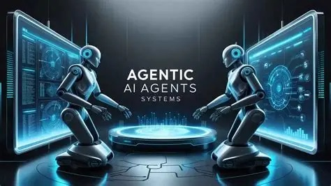

## Table of Contents

<!-- toc -->

## Why Learn Agentic AI and AI Agents in 2026?

Agentic AI represents the next evolution of artificial intelligence, enabling autonomous systems that can reason, plan, and execute complex tasks with minimal human intervention. Building on concepts explored in our [best generative AI courses for 2026](/top-10-best-generative-ai-courses-udemy/), agentic workflows in 2026 are increasingly driven by frameworks like CrewAI, LangGraph, AutoGen, and the OpenAI SDK.

Unlike traditional AI pipelines, agentic systems coordinate multiple agents, integrate tools, maintain persistent memory, and operate with real-world constraints. These capabilities are driving enterprise adoption across automation, decision support, cybersecurity, and applied AI engineering—making agentic AI skills highly valuable in 2026.

## How We Selected These Courses

Our CoursesWyn criteria ensure top-tier recommendations:
- ≥4.0 rating & minimum 500 enrollments (as of February 2026)
- Updated Oct–Dec 2025 (new features like MCP integration, advanced agent orchestration)
- At least 70% content focused on **agentic AI and building autonomous agents** (with hands-on projects and frameworks)
- Includes real-world projects like multi-agent systems or automation workflows
- Renowned instructors with active Q&A support
- Typical Udemy discounted pricing observed during promotional periods

## Agentic AI Courses in 2026: What Actually Matters (Expert Perspective)

By 2026, the biggest mistake learners make with Agentic AI is **learning tools instead of systems**.

In production environments, autonomous agents must handle far more than prompt execution:
- Multi-agent coordination and failure handling
- Persistent memory across sessions
- Tool orchestration with retries and fallbacks
- Human-in-the-loop approvals
- Security, guardrails, and risk boundaries

Most Udemy courses only demonstrate *what agents can do*.  
The courses ranked below were selected based on **how well they teach agentic systems that survive real-world usage**, not just demos.

---

## Best Udemy Agentic AI and AI Agents Courses (2026)

### 1. AI Engineer Agentic Track: The Complete Agent & MCP Course (Ed Donner)

#### Why This Course Ranks #1 in 2026

This course ranks #1 not because of popularity alone, but because it is one of the few Udemy programs that treats Agentic AI as **an engineering discipline**, not a collection of frameworks.

It uniquely stands out for:
- Deep, practical coverage of **Model Context Protocol (MCP)** beyond surface-level mentions
- Cross-framework agent orchestration (OpenAI SDK, CrewAI, LangGraph, AutoGen)
- Emphasis on **agent systems** rather than single-agent scripts
- Portfolio-grade projects that mirror real enterprise use cases

**Best for**: Comprehensive mastery of agentic frameworks with real-world projects.

2025 is the year that Agents enter the workforce. This is nothing short of a watershed moment for Artificial Intelligence. It has never been more important to be an expert with Agentic AI. And that is precisely the goal of this course: to equip you with the skills and expertise to design, build and deploy Autonomous AI Agents, opening up new career and commercial opportunities.

This is an intensive 6-week program to master Agentic AI. We start by building foundational expertise, connecting LLMs using proven design patterns. Then, each week, we upskill with new frameworks: OpenAI Agents SDK, CrewAI, LangGraph and Autogen. The course culminates with a full week on the remarkable opportunities opened up by MCP.
Above all, this is a hands-on course. I’m a big believer that the best way to learn is by DOING. So please prepare to roll up your sleeves! We’ll build 8 real-world projects; some are astonishing, some are intriguing, and some are quite surreal. But one thing’s for sure: all are powerful demonstrations of Agentic AI’s potential to utterly transform the business landscape.

So come join me on this comprehensive 6-week journey. By the end, you will have mastered Agentic AI. You will have expertise in all the major frameworks. You’ll be well-versed in the strengths and traps of Agentic AI. You’ll confidently unleash Autonomous Agents to solve real-world commercial problems. And along the way, you’ll have had a whole lot of fun with the astounding, groundbreaking technology that is Agentic AI.

[Top 10 MCP Courses on Udemy 2026](/top-10-best-mcp-courses-udemy-2026/)

**Key learning outcomes**:
- Project 1: Career Digital Twin. Build and deploy your own Agent to represent you to potential future employers.
- Project 2: SDR Agent. An instant business application: create Sales Representatives that craft and send professional emails .
- Project 3: Deep Research. Make your own version of the essential Agentic use case: a team of Agents that carry out extensive research on any topic you choose.
- Project 4: Build a Stock Picker Agent in minutes with CrewAI—automate your search for investment gems!
- Project 5: Deploy your own 4-Agent Engineering Team—manage, build, and test software apps with CrewAI and Coder Agents in Docker!
- Project 6: Build your own version of OpenAI’s Operator Agent—your Sidekick works with you inside your browser via LangGraph!
- Project 7: Agent Creator—an Agent that builds and launches new Agents using AutoGen, unlocking endless AI possibilities!
- Project 8: Capstone—build a Trading Floor with 4 Agents making autonomous trades, powered by 6 MCP servers and 44 tools!

**Ideal students**:
- Well, perhaps I'm biased, but I'd say: anyone and everyone! If you're fascinated in the potential of Agents and hungry to have the skills to create powerful Agentic AI – then you've come to the right place. While it's most suited to those with programming experience, I've designed the course to work for all backgrounds.

### Limitations to Consider
- Not ideal if you want purely no-code automation
- Requires Python familiarity for advanced agent workflows
- Focuses more on building than certification theory

> Compared to Course #2, this track focuses more on engineering depth and system design than workflow automation.

**Enrollment**: 175k+ | **Rating**: 4.7/5 | **Duration**: 17+ hours
[Get Course: AI Engineer Agentic Track: The Complete Agent & MCP Course](https://trk.udemy.com/jevv0a)

### 2. The Agentic AI Engineering Masterclass 2026 (Stemplicity)

**Best for**: Advanced workflows and low-code automation integration.

In this hands-on masterclass, you’ll learn how to design, build, and deploy next-generation AI agents that combine memory, tools, collaboration, and automation to solve real-world problems. Starting with the OpenAI Agents SDK, you’ll explore how to create simple agents and gradually extend them with advanced features such as persistent memory, guardrails, and smooth handoffs between workflows.

You’ll then dive into multi-agent systems, where specialized agents, like researchers, analysts, and writers, work together, passing context and outputs to build complex deliverables. Along the way, you’ll learn how to orchestrate these systems with manager functions, enforce ethical and domain boundaries with guardrails, and design creative pipelines for use cases from market research to advertising campaigns.

The course introduces multiple frameworks for building production-ready agentic workflows. You’ll explore AutoGen for multi-model collaboration, LangGraph for modular pipelines connected to user interfaces, and CrewAI for advanced orchestration. You’ll also learn how to extend agents with custom tools, from Python code execution for data analysis to classical machine learning models like linear regression, random forest, and XGBoost.

You’ll gain practical experience with the Model Context Protocol (MCP), enabling agents to interoperate with standardized external services, and learn how to build and deploy MCP tools using Gradio. Finally, you’ll see how low-code platforms like n8n can bring everything together into seamless automation flows, integrating Gmail, Google Sheets, Google Calendar, and AI models to create complete end-to-end systems.

**Key learning outcomes**:
- Build and deploy intelligent autonomous AI agents using cutting-edge frameworks like OpenAI Agents SDK, N8N, AutoGen, CrewAI, LangGraph, & MCP.
- Build AI agents that remember, reason, and collaborate using memory, tools, guardrails, and handoffs.
- Learn the foundational components of the OpenAI Agents SDK, including the Agent object and Runner class.
- Build and run AI agents and monitor their activity using traces on the OpenAI API platform.
- Build handoff mechanisms that smoothly transfer context and inputs between agents (e.g., Planner → Writer).
- Implement guardrails to enforce boundaries (e.g., preventing responses on restricted topics like politics).
- Explore CrewAI for building more advanced agentic workflows and extend agents with custom Python execution tools for analysis and modeling.
- Grasp the fundamentals of multi-model AI agents in AutoGen and build teams of agents using different LLMs (e.g., GPT, Gemini, Claude).
- Understand how to design agentic workflows in LangGraph, including connecting them to interfaces like Gradio for user interaction.
- Use n8n for low-code automation, building AI-powered flows that integrate with Google Sheets, Calendar, and Gmail.
- Learn the principles of the Model Context Protocol (MCP) for tool interoperability and build agents that interact with MCP services.
- Build manager functions to orchestrate multi-agent workflows from input to final deliverable.
- Build AI agents that integrate Tavily web search for structured, real-time search results.
- Extend agents by integrating OpenAI tools (e.g., Code Interpreter) and combining real-time search, memory, and reasoning into workflows.
- Apply memory-enabled agents to real use cases (e.g., market research assistant) for multi-turn queries.
- Develop a library of specialist agents (Planner, Writer, Analyst, Search Agent) and coordinate their interactions.
- Create collaborative agent teams for real-world tasks like marketing strategy, with the option of adding a human-in-the-loop User Proxy for oversight.
- Build domain-specific LangGraph agents (e.g., flights and hotel booking) and define custom tools for task-specific workflows.
- Create tools as agents by wrapping autonomous agents behind a function-tool interface, enabling seamless invocation by others.
- Design a multi-agent research assistant that can triage queries, delegate tasks, and generate executive-ready reports.
- Design creative multi-agent pipelines for advertising campaigns, with role-specific agents like Creative Director, Strategist, and Copywriter.
- Create and deploy Gradio-based MCP tools as standardized services accessible to agents.
- Create collaborative agent teams for real-world tasks like marketing strategy, with the option of adding a human-in-the-loop User Proxy for oversight.

**Ideal students**:
- Data scientists, ML engineers, and AI researchers who want to build AI Agents.
- Software developers with basic Python skills who want to integrate cutting-edge LLMs and agent frameworks into real-world applications.
- Entrepreneurs and startup Founders wanting to build AI-powered autonomous agents.
- Corporate innovation teams or R&D teams wanting to prototype AI-powered workflows, assistants, and automations.
- Advanced students and educators looking for practical, hands-on experience with Agentic AI Engineering.

**Enrollment**: 20k+ | **Rating**: 4.7/5 | **Duration**: 15+ hours
[Get Course: The Agentic AI Engineering Masterclass 2026](https://trk.udemy.com/kOn4An)

### 3. 2026 Bootcamp: Understand and Build Professional AI Agents (Julio Colomer)

**Best for**: Professional-level agent building from basics to advanced.

The creators of the #1 Generative AI Bootcamp Worldwide (2026 Bootcamp: Generative AI, LLM Apps, AI Agents, Cursor AI, with more than 45,000 students from more than 154 countries), present now this 2026 Bootcamp: Understand and Build Professional AI Agents. Join Today: Take your place among the pioneers of the AI Agent revolution. Don’t miss this opportunity—enroll now before conditions change!

**Key learning outcomes**:
- How AI Agents fit into the Generative AI Revolution.
- What framework is better to build your AI Agents? Comparative.
- Learn to build basic, intermediate, and advanced AI Agents.
- Learn CrewAI the right way: from basic Crews to advanced Flows.
- Learn LangGraph the right way: from basic Agents to advanced Subgraphs.
- Real Cases of AI Agents that will inspire you.
- How to build advanced AI Agents that manage your email and other custom tools.
- How to build advanced AI Agents that remember who you are and what you want.
- How to build advanced Multi-Agents able to replace whole teams of people.
- How to improve your AI Agents with Human-in-the-loop and other advanced techniques.
- The process to build an AI Agent from scratch: from the initial interview with your client to the final app.
- How to design a Plan to Introduce AI Agents in your company.

**Ideal students**:
- Students and professionals with and without previous experience.
- Students without prior knowledge interested in taking advantage of the professional opportunities opened by the field of Artificial Intelligence.
- Executives interested in introducing Artificial Intelligence into their company.
- Machine Learning, Deep Learning, and Data Science professionals interested in expanding their professional opportunities in the area of Generative AI and LLM Applications.
- Software application developers interested in expanding their professional opportunities by learning to develop Generative Artificial Intelligence and LLM Applications.

**Enrollment**: 2k+ | **Rating**: 4.2/5 | **Duration**: 40+ hours
[Get Course: 2026 Bootcamp: Understand and Build Professional AI Agents](https://trk.udemy.com/55R0aj)

### 4. Agentic AI: Build AI Agents with LangGraph, CrewAI & MCP (Techlink Selenium)

**Best for**: Hands-on multi-agent systems and real-world agents.

Is 2025 the year you master the next evolution of Artificial Intelligence? Say goodbye to passive chatbots and hello to Agentic AI. The future belongs to intelligent agents that can reason, plan, execute code, and collaborate to solve complex real-world problems autonomously.

Welcome to the Agentic AI: Build AI Agents with LangGraph, CrewAI & MCP, the most comprehensive and hands-on guide to building production-grade Autonomous AI Agents. Whether you are a Python developer, Data Scientist, or AI Engineer, this course is your roadmap to mastering the leading frameworks: LangGraph, CrewAI, MCP, and the OpenAI Agents SDK.

Why This Course?
Unlike other courses that focus on theory, we focus on Engineering. You won't just learn about agents; you will build 8 distinctive, portfolio-ready Agentic Applications from scratch.

**Key learning outcomes**:
- Master Agentic AI concepts: Planning, Reasoning, Tool Use, and Memory.
- Build complex stateful workflows using LangGraph and LangChain.
- Create Multi-Agent Systems where AI agents collaborate using CrewAI and AutoGen.
- Implement Anthropic's MCP (Model Context Protocol) to standardise agent tool use.
- Connect LLMs to the internet, databases, and APIs using Function Calling.
- Develop robust agents with Human-in-the-loop approval workflows.
- Deploy 8 Real-World Projects including Research Assistants and Coding Agents.

**Ideal students**:
- Developers who want to move beyond basic RAG pipelines.
- Entrepreneurs building AI-SaaS products.
- Engineers looking to implement Multi-Agent Systems in enterprise environments.

**Enrollment**: 5k+ | **Rating**: 4.9/5 | **Duration**: 21+ hours
[Get Course: Agentic AI: Build AI Agents with LangGraph, CrewAI & MCP](https://trk.udemy.com/kO52gz)

### 5. Agentic AI - Risk and Cybersecurity Masterclass 2026 (Taimur Ijlal)

**Best for**: Securing autonomous agentic systems.

Agentic AI represents the next evolution of artificial intelligence—systems that can autonomously make decisions, plan actions, and interact with the world with minimal human intervention. As AI becomes increasingly autonomous, new risks and security challenges emerge that go beyond traditional cybersecurity concerns.

The "Agentic AI Risk and Cybersecurity Masterclass" is a comprehensive course designed to provide a deep understanding of agentic AI technologies, their unique risk landscape, and the best practices for securing these intelligent systems.

This course explores the principles, components, and security considerations of Agentic AI, equipping you with the knowledge to assess, mitigate, and defend against emerging AI threats.

**Key learning outcomes**:
- How Agentic AI Is A Game Changer For Risk And Security
- How Agentic AI Works
- What Are The Unique Risks That Agentic AI Introduces
- How To Mitigate Agentic AI Risks
- How To Threat Model Agentic AI Systems

**Ideal students**:
- Cybersecurity professionals interested in Agentic AI
- IT Professionals
- CISOs who to secure Agentic AI
- Risk and GRC Professionals Interested In Agentic AI
- AI Professionals

**Enrollment**: 3k+ | **Rating**: 4.5/5 | **Duration**: 4+ hours
[Get Course: Agentic AI - Risk and Cybersecurity Masterclass 2026](https://trk.udemy.com/GK6ad2)

### 6. RAG, AI Agents and Generative AI with Python and OpenAI 2026 (Diogo Alves)

**Best for**: Combining RAG with agentic systems.

Unlock the Power of RAG, AI Agents, and Generative AI with Python and OpenAI in 2026! Welcome to "RAG, AI Agents, and Generative AI with Python and OpenAI 2026"—the ultimate course to master Retrieval-Augmented Generation (RAG), AI Agents, and Generative AI using Python and OpenAI's cutting-edge technologies.

If you aspire to become a leader in artificial intelligence, machine learning, and natural language processing, this is the course you've been waiting for! Stay ahead of the curve by enrolling in "RAG, AI Agents, and Generative AI with Python and OpenAI 2026" today. Unlock endless possibilities in AI and machine learning!

Enroll Now and transform your career with the most comprehensive RAG and Generative AI course available!

**Key learning outcomes**:
- Build Retrieval-Augmented Generation (RAG) systems using Python and OpenAI.
- Develop AI Agents with state management and memory using OpenAI Swarm.
- Master Generative AI models like OpenAI GPTs for text generation.
- Leverage Agentic RAG and LangChain for efficient retrieval systems.
- Integrate Multimodal RAG using text, audio, and images with Whisper and CLIP models.
- Build real-world projects, including a capstone project analyzing financial data.
- Stay ahead with the latest advancements in AI, Generative AI, and AI Agents in 2026.
- Develop AI Agents using CrewAI for advanced task automation and orchestration.
- Deploy an Agentic RAG System with LangGraph for a Digital Waiter.
- Fine-tune GPT models using Python for customized AI solutions.

**Ideal students**:
- Data Scientists and Machine Learning Engineers looking to deepen their knowledge of generative AI systems.
- AI Researchers and Enthusiasts interested in exploring the latest advancements in (RAG) and generative AI technologies.
- Software Developers and Programmers who want to expand their skill set to include AI and machine learning techniques.
- Technical Product Managers and AI Strategists who manage AI projects and need a deeper technical understanding of how RAG systems work and their potential applications.
- AI Consultants and Data Analysts aiming to add AI capabilities to their skillset
- Entrepreneurs and business leaders in the tech space who want to understand the potential of RAG systems and generative AI to innovate.

**Enrollment**: 10k+ | **Rating**: 4.5/5 | **Duration**: 38+ hours
[Get Course: RAG, AI Agents and Generative AI with Python and OpenAI 2026](https://trk.udemy.com/vPBZAL)

### 7. Complete Agentic AI Bootcamp With LangGraph and Langchain (Krish Naik)

**Best for**: End-to-end agentic application development.

Are you excited about the future of AI where intelligent agents can think, act, and collaborate to solve complex tasks autonomously? Welcome to the Complete Agentic AI Bootcamp with LangGraph and LangChain — your one-stop course to master the art of building agentic AI applications from scratch!

This course is designed to teach you everything you need to know about Agentic AI, LangGraph, and LangChain — two of the most powerful frameworks for building intelligent AI agents and multi-agent systems.

You will start by understanding the fundamentals of Agentic AI — how it differs from traditional AI models, the key components of agents (memory, tools, decision-making), and real-world use cases.
We will then dive deep into LangGraph, a cutting-edge framework that helps you design complex agent workflows using graphs, events, and state transitions. You’ll also learn how to combine LangChain's power with LangGraph to build production-ready agent applications. If you are a developer, data scientist, AI/ML engineer, or tech enthusiast looking to future-proof your skills and build cutting-edge AI applications, this is the course for you!

Enroll now and start building the future with intelligent AI agents today!

**Key learning outcomes**:
- Understand the core principles of Agentic AI and how to design intelligent, autonomous agents for real-world tasks.
- Master building AI agents using LangGraph, including creating workflows, managing agent state, memory, and event-driven behavior.
- Develop and deploy multi-agent collaborative systems that can communicate, reason, and solve complex problems together.
- Implement hands-on projects to create powerful agentic applications like autonomous research agents, task automation systems, and knowledge retrieval assistants.

**Ideal students**:
- AI/ML Engineers and Developers who want to build advanced AI agent workflows and autonomous applications.
- Data Scientists and Researchers looking to integrate agentic behavior into their data-driven projects.
- Tech Enthusiasts and Students eager to explore the next generation of AI application development with practical hands-on projects.
- Software Engineers interested in learning how to orchestrate multi-agent systems using modern frameworks like LangGraph.

**Enrollment**: 34k+ | **Rating**: 4.6/5 | **Duration**: 38+ hours
[Get Course: Complete Agentic AI Bootcamp With LangGraph and Langchain](https://trk.udemy.com/55ek0L)

### 8. AI Agents For All! Build No-Code AI Agents & Master AI 2026 (Diogo Alves)

**Best for**: No-code entry into agentic AI.

Unlock the power of artificial intelligence and build practical AI agents without writing a single line of code. Designed specifically for beginners and business professionals, this course gives you the skills and confidence to create intelligent AI solutions using the intuitive, no-code platform, Flowise.

Whether you're automating tasks, enhancing customer experiences, or exploring new business opportunities, this course will empower you to integrate advanced AI effortlessly into your workflow.

**Key learning outcomes**:
- Create and deploy AI agents without coding, using intuitive visual workflows in Langflow.
- Understand AI agent fundamentals, including prompt engineering and system messaging.
- Master Retrieval-Augmented Generation (RAG) to build smarter AI agents that leverage internal databases.
- Integrate AI agents with real-world tools such as Slack, Discord, Google Calendar, and Hugging Face.
- Design and implement a Virtual AI Waiter to automate customer service interactions.
- Effortlessly build AI-powered chatbots and virtual assistants tailored for business use cases.
- Automate daily tasks and workflows to increase productivity using AI agents integrated with popular business tools.
- Learn how to structure and chunk data for effective embedding and retrieval within AI workflows.
- Troubleshoot and debug common issues encountered in AI agent creation and deployment.
- Complete a practical Capstone Project by building your own Jarvis-inspired AI assistant.

**Ideal students**:
- Business professionals and entrepreneurs looking to leverage AI to streamline tasks, automate workflows, and enhance productivity without writing code.
- Beginners curious about AI who want a practical, hands-on introduction to building real-world AI agents.
- Non-technical individuals and teams interested in integrating AI solutions quickly and efficiently into their daily operations or products.
- Managers and decision-makers aiming to understand and practically apply AI agents in their businesses without technical complexity.
- Anyone enthusiastic about AI, eager to gain practical skills in no-code AI development using Langflow.

**Enrollment**: 5k+ | **Rating**: 4.5/5 | **Duration**: 8+ hours
[Get Course: AI Agents For All! Build No-Code AI Agents & Master AI 2026](https://trk.udemy.com/YROmgR)

> 💡 Tip: Udemy courses frequently drop to under $10.99 during sales.  
> Bookmark this page and check back before enrolling.

## Comparison Table (Quick Overview)

| # | Course Name | Instructor | Enrollment | Rating | Duration | Key Focus |
|---|-------------|------------|------------|--------|----------|-----------|
| 1 | AI Engineer Agentic Track: The Complete Agent & MCP Course | Ed Donner | 175k+ | 4.7/5 | 17+ hours | Agentic AI engineering, MCP, multi-framework |
| 2 | The Agentic AI Engineering Masterclass 2026 | Stemplicity | 20k+ | 4.7/5 | 15+ hours | Advanced workflows, memory, guardrails, multi models |
| 3 | 2026 Bootcamp: Understand and Build Professional AI Agents | Julio Colomer | 2k+ | 4.2/5 | 40+ hours | Professional-level agent building from basics to advanced |
| 4 | Agentic AI: Build AI Agents with LangGraph, CrewAI & MCP | Techlink Selenium | 5k+ | 4.9/5 | 21+ hours | Hands-on multi-agent systems and real-world projects |
| 5 | Agentic AI - Risk and Cybersecurity Masterclass 2026 | Taimur Ijlal | 3k+ | 4.5/5 | 4+ hours | Security & risk mitigation for agentic systems |
| 6 | RAG, AI Agents and Generative AI with Python and OpenAI 2026 | Diogo Alves | 10k+ | 4.5/5 | 38+ hours | RAG + agentic integration with Python & OpenAI |
| 7 | Complete Agentic AI Bootcamp With LangGraph and Langchain | Krish Naik | 34k+ | 4.6/5 | 38+ hours | End-to-end agent development with LangGraph + LangChain |
| 8 | AI Agents For All! Build No-Code AI Agents & Master AI 2026 | Diogo Alves | 5k+ | 4.5/5 | 8+ hours | No-code agentic AI for beginners/business |

## Agentic AI vs AI Agents Courses: What’s the Difference?

While often used interchangeably, **Agentic AI courses** focus on autonomous systems capable of planning, reasoning, and execution across tools and agents.  
**AI Agents courses** may stop at single-agent implementations or prompt-driven workflows.

If your goal is production deployment or AI engineering roles, Agentic AI–focused courses provide significantly higher long-term value.

## Supplementary Learning: Free AI Agent Course (Optional)

<iframe
  width="100%"
  height="415"
  loading="lazy"
  src="https://www.youtube.com/embed/MyLyDSlc_7Y"
  title="AI Agent Full Course For Beginners 2026 | Edureka"
  frameborder="0"
  allow="accelerometer; autoplay; clipboard-write; encrypted-media; gyroscope; picture-in-picture"
  allowfullscreen>
</iframe>

> Video references in this article include content from YouTube and the Edureka channel.

## Frequently Asked Questions

### Which course should a complete beginner start with?

Start with **#8 No-Code AI Agents** or **#3 Professional AI Agents Bootcamp** – both build from fundamentals.

### I want the most hands-on projects – which one?

**#1 Complete Agent & MCP Course** – features eight advanced real-world projects.

### I care about production and security?

**#5 Agentic AI Risk Masterclass** for security; **#2 Engineering Masterclass** for deployment.

### Are these courses updated for 2026 tools?

Yes – all include 2025 updates with MCP, LangGraph advancements, and new agent patterns.

### Will these help advance my career?

Yes. Projects build portfolios; skills align with rising demand for agentic AI engineers.

## Are Agentic AI Courses Worth It for Your Career in 2026?

Yes — but only if the course teaches system-level agent design.

Companies hiring for AI engineers, automation specialists, and applied AI roles increasingly expect experience with:
- Multi-agent orchestration
- Tool integration and memory
- Guardrails and approval workflows
- Production deployment patterns

The courses ranked above align directly with these expectations.

## Conclusion

Choose one course, complete the projects end to end, and deploy at least one agent in a real environment.
That practical experience is what separates learners from professionals in the agentic AI job market in 2026.

*Disclosure: Affiliate links. We earn a commission at no extra cost to you.*

> Related AI Learning Paths:
> - [AI Engineer Roadmap 2026](/ai-engineer-roadmap-2026/)
> - [Best MCP Courses on Udemy](/top-10-best-mcp-courses-udemy-2026/)
> - [Best LangChain Courses on Udemy](/top-10-best-langchain-courses-udemy/)

---

