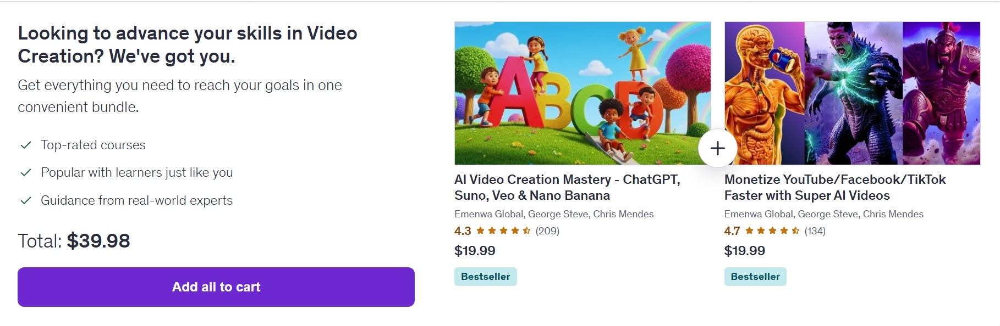

## Why AI Video Creation Is the Skill That Actually Pays in 2026

Short-form video didn't just grow in 2026 — it absorbed everything else. TikTok, YouTube Shorts, Instagram Reels, and Facebook Reels now account for more than 70% of total watch time across every major platform, according to creator analytics widely discussed in Reddit communities and X creator threads. That's not a trend anymore. That's the infrastructure of how people consume content online.

What's changed in the last 18 months is who gets to participate. For most of the short-form video era, consistent output meant expensive gear, editing software subscriptions, on-screen talent, and hours of production time per video. Most people with a day job couldn't compete. That constraint is effectively gone now.

With the right AI stack — **ChatGPT** for scripting, **Suno** for background music, **Veo** or **Nano Banana** for generative video clips, **ElevenLabs** for voiceover, and **CapCut** for final editing — one person working from a laptop can realistically produce 10 to 20 polished short-form videos per day. Completely faceless. No camera, no microphone, no studio. And because the production cost is near zero, even modest monetization numbers translate into real income. Channels in this space are reporting $1,000 to $15,000+ per month through ad revenue, affiliate programs, and digital products.

The gap that most people run into isn't access to tools — it's knowing how to string everything together into a workflow that actually produces upload-ready content consistently. That's where structured courses earn their value. The four courses reviewed below are the strongest-performing AI video creation courses on Udemy right now. All have real student enrollment numbers, strong ratings, and content that's been updated for the tools that matter in 2026. Before you enroll, it's worth checking our [Udemy coupon codes page](/udemy-coupon-code) — we track active discounts that can bring individual course prices down significantly.

---

## What Separates a Good AI Video Course from a Shallow One

Before the reviews, it's worth being direct about what we actually looked for — because this category has a lot of courses that look impressive in the title and deliver very little in practice.

The problem is that AI video tools change fast. A course built around tools that were relevant in early 2024 is genuinely useless today. Veo 3, Nano Banana, Hailuo, and Grok Flux didn't exist or weren't widely accessible when most older courses were recorded. Any course not covering these specifically is already behind.

Beyond recency, there's a difference between a course that shows you what a tool does and a course that teaches you a complete production workflow. The first type makes for good YouTube content. The second type is what actually helps you build a channel that earns money. We weighted heavily toward the second.

Here's the filtering criteria we applied using live student data as of February 2026:

- Rating of 4.3 or higher with at least 40 verified reviews
- Enrollment in the thousands — real market validation, not a ghost listing
- Content updated in 2025 or 2026, specifically covering tools like Veo 3, Nano Banana, Hailuo, Grok Flux, and current CapCut workflows
- Project-based: content you can actually upload to TikTok or YouTube, not just slide decks
- Priced under $15 during Udemy's standard promotional windows, with bundle options where available

Four courses cleared this bar consistently. These courses sit at the intersection of two of the fastest-growing learning categories on Udemy right now — [Artificial Intelligence & AI](/topics/best-udemy-courses/artificial-intelligence-ai-) and [Generative AI](/topics/best-udemy-courses/generative-ai-genai-) — which signals that instructor quality and content freshness in this space are being actively maintained by the platform.

---

## 📋 Table of Contents

- **[Why AI Video Creation Pays](#why-ai-video-creation-is-the-skill-that-actually-pays-in-2026)**
- **[What Makes a Good Course](#what-separates-a-good-ai-video-course-from-a-shallow-one)**
- **[Official Udemy Bundle](#-official-udemy-bundle--ai-video-creation-mastery--monetize-faster)**
- **[Course Reviews](#best-udemy-ai-video-courses-2026)**
- **[Comparison Table](#quick-comparison-table)**
- **[Which Course for You?](#which-course-is-right-for-you)**
- **[FAQ](#frequently-asked-questions)**
- **[Skills You'll Learn](#related-skills-youll-build-across-these-courses)**
- **[Start Free](#not-ready-to-invest-yet-start-free-first)**

---

## 🔥 Official Udemy Bundle — AI Video Creation Mastery + Monetize Faster

Before diving into the individual reviews, here's something worth knowing upfront: Udemy is officially bundling the two strongest courses on this list together — and the bundle page is live right now.

**What's in the bundle:**

Udemy's own bundle page shows both courses side by side — **AI Video Creation Mastery – ChatGPT, Suno, Veo & Nano Banana** and **Monetize YouTube/Facebook/TikTok Faster with Super AI Videos** — both tagged as Bestsellers, both from the same instructor team (Emenwa Global, George Steve, Chris Mendes). Individual pricing on each is $19.99, bringing the combined total to **$39.98** if purchased separately.

The bundle page positions this as a complete skill package: *"Get everything you need to reach your goals in one convenient bundle"* — top-rated courses, popular with learners, and taught by real-world practitioners. That framing is accurate. These two courses genuinely complement each other in a way that's rare even among bundled offerings.

Here's why the pairing makes sense in practice: Course #3 (Mastery) is your production engine — it teaches you the full AI video stack from scripting to export, covering every major tool in the 2026 workflow. Course #1 (Monetize Faster) is your distribution and income strategy — it picks up exactly where production leaves off, teaching you how to position that content for algorithm performance, how to hit monetization thresholds faster, and how to build passive income streams that compound as your library grows. One without the other leaves a real gap. Together, they cover the complete creator journey.

[👉 Get the Official Udemy Bundle — AI Video Creation Mastery + Monetize Faster](https://trk.udemy.com/1G59Om)

---

## Best Udemy AI Video Courses 2026

### 1. Monetize YouTube/Facebook/TikTok Faster with Super AI Videos — Emenwa Global, George Steve, Chris Mendes

**Best for:** Creators who want a clear, practical path from zero to monetization — not just video production skills, but actual income strategy.

**What makes this course different:** Most AI video courses teach you how to make videos. This one teaches you how to make videos that earn money — and that distinction runs through everything about how the course is structured.

The production workflow is covered, but it's always framed in terms of platform performance. You're not learning how to use Super AI tools in a vacuum; you're learning how to use them to hit specific algorithm signals — watch time, retention curves, comment velocity — that determine whether a video gets pushed or buried. That framing makes the technical content feel purposeful rather than just instructional.

The monetization section is where this course genuinely separates itself. Rather than a vague "build an audience and things will work out" approach, you get a concrete strategy for stacking income streams: ad revenue thresholds, affiliate product placement within AI-generated content, and digital product funnels that work specifically for faceless channels. The instructors walk through real examples of how these channels are structured, what kinds of niches are working in 2026, and how to build passive income that compounds as your library grows.

For creators whose primary goal is income rather than internet fame, this course cuts directly to what matters. The 4.7/5 rating across 134 reviews reflects that students who enrolled with an income goal came away feeling like the course delivered on it.

**Pros:**
- Monetization-first approach — every production skill is tied to a revenue outcome
- Strong coverage of 2026 algorithm signals across TikTok, YouTube Shorts, and Facebook Reels
- Practical passive income roadmap: ads, affiliate, digital products
- 4.7/5 rating across 134 reviews — very consistent student satisfaction
- Part of the $30 bundle with Course #3

**Cons:**
- Less depth on advanced generative video tools compared to Course #3
- If pure production mastery is your goal, Course #3 covers more technical ground

**Ideal for:** Anyone aiming for their first monetization payout within 30–90 days of starting.

**Enrollment:** 1,788 students | **Rating:** 4.7/5 | **Duration:** 6 hours | **Lectures:** 60 | 🏆 Best Seller

[👉 Enroll in Monetize YouTube/Facebook/TikTok Faster with Super AI Videos](https://trk.udemy.com/k4jO40)

---

### 2. Grok AI Video Creation & Image Generation | No Subscriptions — Emenwa Global, George Steve, Chris Mendes

**Best for:** Beginners who want to test AI video creation with zero financial commitment, using Grok (xAI) as a completely free generation tool.

**What makes this course different:** The biggest barrier most people face when getting started with AI video isn't knowledge — it's uncertainty about whether the tools are worth paying for before they've seen results. This course removes that barrier entirely.

The workflow taught here runs entirely on Grok AI, which xAI has made available with no credit card required and no subscription cost. That means you can follow the course from start to finish — scripting, image generation, video creation — without spending a dollar on tools. For someone who wants to understand what AI video creation actually looks like before committing to a paid stack, this is the most risk-free entry point available.

The course is shorter than the others on this list at 2.5 hours, and that's appropriate for the scope. It's not trying to teach you everything — it's teaching you enough to know whether this is a creative and business direction worth pursuing. Think of it as a confidence-builder and a proof of concept, not a complete monetization system.

One honest caveat: Grok's video generation capabilities are still limited compared to dedicated tools like Veo 3 or Runway. If you compare output quality side by side, the gap is visible. But for a free workflow designed to help you understand the fundamentals of AI video production and publish your first videos, it delivers on what it promises.

**Pros:**
- Genuinely zero-cost workflow — no tools, subscriptions, or credit cards required
- 4.8/5 rating — the highest on this list by raw number (small but consistent sample)
- 1,130 enrolled students and growing quickly
- Low time commitment at 2.5 hours — easy to complete in a single sitting
- Perfect first step before investing in paid tools or premium courses

**Cons:**
- Grok's video generation quality is below dedicated tools like Veo 3 or Runway
- Narrower scope — this is an introduction, not a complete production system
- Not included in the $30 bundle deal
- Lower enrollment and review volume than courses #1 and #3

**Ideal for:** Total beginners who want to explore AI video creation before spending anything.

**Enrollment:** 1,130 students | **Rating:** 4.8/5 | **Duration:** 2.5 hours | **Lectures:** 43 | 🏆 Best Seller

[👉 Enroll in Grok AI Video Creation & Image Generation – No Subscriptions](https://trk.udemy.com/oNe4No)

---

### 3. AI Video Creation Mastery – ChatGPT, Suno, Veo & Nano Banana — Emenwa Global, George Steve, Chris Mendes

**Best for:** Creators who want the most comprehensive AI production pipeline available in a single course — covering every major tool in the 2026 AI video stack.

**What makes this course different:** If you've spent any time piecing together an AI video workflow from YouTube tutorials, you know the frustration: one video teaches you ChatGPT prompting for scripts, another covers CapCut editing, a third is about Suno music generation, and none of them actually connect into a coherent production process. This course solves that problem directly.

At 80 lectures and 5.5 hours of content, it's the deepest and most tool-complete course on this list. The full stack is covered in sequence: **ChatGPT** for ideation and scripting (if you're new to using ChatGPT inside Udemy's learning ecosystem, this [guide on Udemy ChatGPT integration 2026](https://medium.com/@coursewyn/udemy-chatgpt-integration-2026-how-to-access-courses-inside-chatgpt-f8f572b57621) is worth a quick read first), CapCut for editing and post-production, Suno for AI-generated background music, Hailuo and Veo 3 for generative video footage, ImageFX and Whisk for AI image generation, and Nano Banana for additional visual content. You're not sampling each tool — you're building a working production pipeline that connects all of them.

The course also covers one thing that most AI video tutorials completely ignore: **workflow efficiency**. At this level of tool complexity, the bottleneck isn't usually creative quality — it's production speed and consistency. How do you prompt ChatGPT to produce scripts that require minimal editing? How do you batch-process Suno compositions for a week of content at once? How do you structure a CapCut project template that makes editing repeatable rather than starting from scratch every time? These workflow questions are what separate creators who burn out after two weeks from those who build sustainable channels.

The enrollment number tells its own story: 2,418 students make this the most-enrolled course on this list, which means the community around it is active and the instructor's Q&A responses are well-tested. If you get stuck on any tool or step, there's a good chance someone in the student community has already run into the same issue.

**Pros:**
- Most comprehensive tool coverage on the list — 8 major AI tools in one course
- 80 lectures — unmatched depth and production pipeline structure
- Workflow efficiency focus — teaches you how to produce at scale, not just make one video
- 2,418 students — largest enrolled community of any course here
- Part of the $30 bundle with Course #1

**Cons:**
- 4.3/5 rating — solid, but slightly lower than courses #1 and #4 (some students noted pacing could be tighter in later sections)
- Higher time investment than courses #2 and #4

**Ideal for:** Serious creators ready to build a complete, repeatable AI video production system.

**Enrollment:** 2,418 students | **Rating:** 4.3/5 | **Duration:** 5.5 hours | **Lectures:** 80 | 🏆 Best Seller

[👉 Enroll in AI Video Creation Mastery – ChatGPT, Suno, Veo & Nano Banana](https://trk.udemy.com/2RraR0)

---

### 4. AI Video Creation with Your Photos for YouTube & Commercials — Emenwa Global, George Steve, Chris Mendes

**Best for:** Faceless content creators and small business owners who want to convert existing photos into dynamic, publishable videos quickly.

**What makes this course different:** Most AI video courses assume you're starting from a blank canvas — no footage, no images, nothing. This course assumes something different and more realistic for a lot of creators and business owners: you already have photos. Product shots, travel images, personal photos, brand assets, stock images you've licensed — and you want to turn them into compelling video content without hiring a video editor or learning motion graphics.

The technical approach here is genuinely interesting. Using Whisk, Nano Banana, Lip Sync AI, Hailuo AI, and ImageFX, the course shows you how to add motion, camera movement, narrative structure, and voice to static images in ways that hold viewer attention. The Lip Sync AI section specifically is worth calling out — animating a still photo to speak a script is one of the most effective techniques for faceless YouTube intros and short-form ads, and the course covers it with enough depth to actually use it in production.

The commercial application focus separates this course from the others on this list. Where Courses #1, #2, and #3 are primarily aimed at content creators building YouTube or TikTok channels, this course also addresses small business video marketing — YouTube channel intros, product showcase videos, local business ads, e-commerce content. If you run a business and want professional video content without a production budget, the techniques here are directly applicable.

At 3.5 hours and tied for the highest rating on this list at 4.7/5, it's the most time-efficient option for anyone whose content needs fit the photo-to-video workflow.

**Pros:**
- Tied for highest rating on this list at 4.7/5
- Photo-to-video approach is uniquely practical for creators with existing image libraries
- Strong commercial application — product ads, business intros, e-commerce content
- Lip Sync AI coverage — one of the most effective faceless video techniques available
- Short and focused at 3.5 hours — completable in a weekend
- 1,207 students with consistently positive review patterns

**Cons:**
- Narrower scope by design — photo-based workflows only, not generative video from scratch
- Not included in the $30 bundle deal
- Less suitable if you want to build from-scratch generative video pipelines

**Ideal for:** Faceless YouTubers, e-commerce sellers, and local businesses who need compelling video content built from existing photo assets.

**Enrollment:** 1,207 students | **Rating:** 4.7/5 | **Duration:** 3.5 hours | **Lectures:** 66 | 🏆 Best Seller

[👉 Enroll in AI Video Creation with Your Photos for YouTube & Commercials](https://trk.udemy.com/7XmaXY)

---

## Quick Comparison Table

| Rank | Course | Rating | Students | Duration | Lectures | Best For | Bundle |
|------|--------|--------|----------|----------|----------|----------|--------|
| 1 | Monetize YouTube/FB/TikTok Faster with Super AI Videos | 4.7/5 | 1,788 | 6 hrs | 60 | Fast monetization strategy | ✅ $30 Bundle |
| 2 | Grok AI Video Creation & Image Generation – No Subscriptions | 4.8/5 | 1,130 | 2.5 hrs | 43 | Free, zero-cost entry point | ❌ |
| 3 | AI Video Creation Mastery – ChatGPT, Suno, Veo & Nano Banana | 4.3/5 | 2,418 | 5.5 hrs | 80 | Complete AI production pipeline | ✅ $30 Bundle |
| 4 | AI Video Creation with Your Photos for YouTube & Commercials | 4.7/5 | 1,207 | 3.5 hrs | 66 | Photo-to-video, business content | ❌ |

---

## Which Course Is Right for You?

**Your goal is income as fast as possible** → Start with the $30 bundle: Course #1 + Course #3. Course #3 builds your production system, Course #1 builds your monetization strategy around it. Together they cover the full journey.

**You want the deepest AI production pipeline** → Course #3 (Mastery) is the most comprehensive option on this list. If you're going to take it, grab it in the bundle — you're saving significant money and Course #1 is the natural follow-on anyway.

**You want to start for free before spending anything** → Course #2 (Grok) is built for exactly this. Zero cost, 2.5 hours, and you'll come away knowing whether AI video creation is a path worth investing in.

**You have photos and want professional video content quickly** → Course #4 (Photos to Video) is the most focused option on this list and tied for the highest rating. Completable in a weekend with results you can publish immediately.

---

## Frequently Asked Questions

**Q: Is the official Udemy bundle still available?**  
A: Yes — the official bundle page is live as of February 22, 2026. Combined price is $39.98 ($19.99 per course), both tagged Bestsellers. Lifetime access and a 30-day money-back guarantee included. Check the bundle page for any current flash sale pricing.

**Q: Which course has the highest rating?**  
A: Course #4 (Photos to Video) and Course #1 (Monetize Faster) are tied at 4.7/5. Course #2 (Grok) shows 4.8/5 but with a smaller review sample. Course #3 (Mastery) has the highest total review count at 209 — the most validated by volume.

**Q: Are these courses beginner-friendly?**  
A: Yes — all four are designed for beginners and intermediate creators. No prior video editing or technical experience required. Course #2 (Grok) is the gentlest entry point: entirely free tools, completable in 2.5 hours.

**Q: Can I realistically monetize within 30–90 days?**  
A: Many students report first payouts within this window posting 3–5 videos per week. Results depend on niche selection, consistency, and platform algorithm timing. These courses give you the workflow and strategy — execution determines your actual timeline.

**Q: Do I need paid tools or subscriptions?**  
A: Course #2 (Grok) runs entirely on free tools — no credit card required. The other three use a mix of free and freemium tools with free tiers sufficient to complete all course content. Tool costs are minimized, especially for beginners.

**Q: What is the total price for the Udemy bundle?**  
A: The official bundle is listed at $39.98 total — $19.99 per course individually. Udemy runs periodic flash sales where prices drop further. Check the bundle page for the most current pricing.

---

**Ready to build your AI video channel?**

If you're committed to making AI video creation work as a real income stream, the official Udemy bundle (Course #1 + Course #3) is the most efficient path forward. Both are Bestseller-rated, from the same instructor team, and designed to work in sequence — production pipeline first, monetization strategy second. Lifetime access and a 30-day refund guarantee on both.

[👉 Get the Official Udemy Bundle — AI Video Creation Mastery + Monetize Faster](https://trk.udemy.com/1G59Om)

---

## Related Skills You'll Build Across These Courses

One thing that surprises a lot of students: the skills you develop through AI video creation don't stay siloed. The tools and workflows you master in these courses quietly build a broader skill stack that applies well beyond TikTok and YouTube Shorts.

**Video Editing** is the foundation everything else sits on. Even with AI generating your raw clips and voiceover, CapCut is where the final product takes shape — pacing, cuts, captions, transitions, aspect ratios for different platforms. Students who complete Course #3 in particular consistently come away with CapCut fluency that transfers directly to traditional editing workflows.

**Video Production thinking** changes how you approach content at a structural level. You stop thinking in individual videos and start thinking in systems: content pillars, batch production schedules, thumbnail frameworks, hook formulas. This production mindset is the same one professional video teams use — you're just applying it with AI tools doing the heavy lifting on execution.

**YouTube Marketing** becomes less mysterious once you understand how the algorithm responds to watch time, click-through rate, and early engagement velocity. The monetization-focused content in Course #1 teaches this not as theory but as practical optimization you apply to every upload. That knowledge applies equally whether your content is AI-generated or traditionally filmed.

**AI Content Generation** as a broader skill — knowing how to prompt ChatGPT for scripts that don't need heavy editing, how to direct Suno for music that fits a specific emotional tone, how to get consistent visual output from Veo and Nano Banana — this is genuinely transferable to any content medium. Marketers, copywriters, and content strategists are all building these same prompting skills right now.

**YouTube Audience Growth** is ultimately what determines whether a channel earns or stagnates. The audience growth tactics covered across these courses — thumbnail psychology, title optimization, content consistency, community engagement signals — apply regardless of how your videos are produced. The AI tools accelerate production; the growth strategy is what makes that production volume pay off.

**Video Marketing** for businesses is a natural extension. Once you can produce 10–20 short-form videos per day at near-zero cost, the same workflow becomes a legitimate video marketing engine for any product or service. Several students in Course #4 specifically use the photo-to-video techniques for e-commerce advertising and local business content. If you're pairing this with design work, the [best Canva AI courses on Udemy in 2026](https://medium.com/@coursewyn/best-canva-ai-courses-on-udemy-2026-magic-studio-chatgpt-design-c4d215da596b) cover a complementary visual design stack — Magic Studio and ChatGPT integration — that pairs naturally with an AI video workflow.

**Content Creation** at scale — the meta-skill that ties all of it together — is what you actually walk away with. The ability to ideate, produce, publish, and iterate on video content consistently and efficiently is one of the most commercially valuable skills in the current digital economy. These courses teach you to do it with AI leverage.

---

## Not Ready to Invest Yet? Start Free First

If you're still on the fence about committing to a paid course, that's a reasonable place to be. The good news is you don't have to make that decision blind.

Udemy maintains a library of **[free Video Creation courses and tutorials](https://www.udemy.com/topic/video-creation/free/)** that cover foundational concepts — basic editing principles, intro to video marketing, platform-specific content strategies — at no cost. These aren't as deep or as current as the AI-focused paid courses reviewed above, but they're a legitimate way to test whether video creation as a skill and income path is something you actually want to pursue before spending anything.

Think of the free courses as the proof-of-concept stage. If you work through one and find yourself genuinely engaged — curious about tools, thinking about content ideas, wanting to go deeper — that's a strong signal the paid courses will pay off. If you find it's not clicking, you've lost nothing but time.

The creators in the courses we reviewed started exactly that way: free resources to build basic familiarity, then structured paid courses to build the complete workflow. There's no shame in doing the same.

[→ Browse Free Video Creation Courses on Udemy](https://www.udemy.com/topic/video-creation/free/)

---

*Disclosure: This article contains affiliate links. We may earn a commission at no extra cost to you when you enroll through our links. This doesn't affect our rankings or evaluations.*

---

