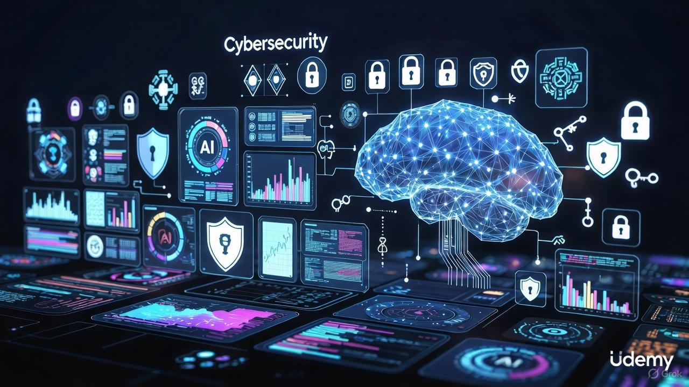

## Table of Contents

<!-- toc -->

## Why Learn Cybersecurity with AI Integration in 2026?

In 2026, artificial intelligence is poised to redefine cybersecurity landscapes, enabling advanced threat detection and response mechanisms while simultaneously introducing novel risks. Projections indicate that AI-driven cyber threats will escalate, with over 76% of experts anticipating an increase in cybercrime due to AI advancements. Deloitte's Tech Trends report highlights AI's dual role in enhancing defenses and amplifying vulnerabilities, forecasting a market expansion where AI integration becomes essential for organizational resilience. For beginners and professionals alike, these courses emphasize practical applications such as AI-powered ethical hacking, malware analysis, and governance frameworks, aligning with trends where AI automates responses and processes vast data sets for proactive security in a $300 billion global AI market.

## How We Selected These Courses

Our CoursesWyn criteria ensure top-tier recommendations:
- ≥4.0 rating & minimum 500 enrollments (as of Dec 2025)
- Updated Oct–Dec 2025 (new AI features like agentic systems, ethical modules)
- At least 70% content focused on **AI integration in cybersecurity for beginners** (with hands-on projects and tools)
- Includes real-world projects like detection systems or threat simulations
- Renowned instructors with active Q&A support
- Sale prices ≤$19.99 in Dec 2025

## Best Udemy Cybersecurity Courses with AI Integration (2026)

### 1. AI & Cyber Security Mastery 2026 (Emin Pazarac)

**Best for**: Mastering AI and machine learning tools for secure systems with hands-on cybersecurity experience.

Cyber Security AI is the next frontier in protecting digital landscapes. Whether you’re an aspiring AI enthusiast eager to delve into the realm of cybersecurity, a student aiming to solidify your understanding of securing systems, or a seasoned programmer looking to integrate Python and Artificial Intelligence into cutting-edge cybersecurity tools, this course is designed for you! Our hands-on and practical approach ensures you’ll learn by doing, diving into real-world applications and industry techniques. From harnessing AI tools to implementing advanced security measures, you’ll gain the skills needed to thrive in this evolving field. We’ll begin by introducing ChatGPT for Cyber Security, demonstrating how to leverage its capabilities for ethical hacking, prompt engineering, and advanced data analysis. From there, we’ll cover essential topics, including: 1. AI in Cybersecurity Tools and Techniques – Learn how AI enhances traditional tools like firewalls, email filters, and intrusion detection systems. 2. Deep Learning for Cybersecurity – Master TensorFlow, PyTorch, and neural networks by building phishing detection systems and more. 3. AI Voice Cloning and Security Implications – Learn how AI-generated voice cloning works, its use in social engineering, and how to defend against audio-based phishing threats. 4. Python Programming – Explore Python’s power for preprocessing data, training models, and creating robust security solutions. 5. Advanced Threat Detection – Utilize platforms like Splunk, Elasticsearch, AWS GuardDuty, and Microsoft Azure Security Center for modern security practices. 6. Network Security and Malware Detection – Develop AI-driven systems to monitor networks and detect malware threats. 7. AI Risks and Ethical Concerns – Delve into risks such as data bias, model vulnerabilities, and ethical considerations in AI. Throughout the course, you’ll work on projects like building phishing detection systems, analyzing network activity, and applying machine learning to real-world security problems. By the end, you’ll have mastered the tools and techniques to protect yourself, your business, and your clients in today’s rapidly advancing threat landscape. Join us and become a leader in the transformative field of Cyber Security AI!

**Key learning outcomes**:
- Understand the impact of AI in modern cyber security for threat detection, prevention, and response.
- Master top AI and machine learning tools like TensorFlow, PyTorch, and ChatGPT for building secure systems.
- Gain hands-on experience with cybersecurity tools such as Wireshark, Splunk, AWS GuardDuty, and VirtualBox for monitoring and attack mitigation.
- Learn how to use ChatGPT for cyber security tasks, from automation to anomaly detection.
- Explore the fundamentals of Artificial Intelligence and its role in cyber defense strategies.
- Build foundational skills in PyTorch, including model training and evaluation for cyber applications.
- Understand commonly used hardware tools in cyber security, including routers, sniffers, and firewalls.
- Identify and assess cyber threats, vulnerabilities, and apply effective risk management frameworks.
- Build and deploy AI-based cybersecurity models using Python and deep learning techniques.
- Apply the NIST AI Risk Management Framework to real-world cyber security challenges.
- Learn cyber security fundamentals, including encryption, firewalls, malware analysis, and more.
- Learn Python programming for security automation, data analysis, and AI model development.
- Design and implement a phishing detection system using artificial intelligence.
- Explore the use of AI voice cloning for social engineering simulations and cyber security awareness training.

**Ideal students**:
- IT professionals looking to upgrade their skills in AI-driven cybersecurity.
- Beginners interested in starting a career in cybersecurity or AI.
- Data scientists and software engineers exploring applications of AI in security.
- Cybersecurity enthusiasts who want to learn advanced tools and techniques.

**Enrollment**: 12k+ | **Rating**: 4.6/5 | **Duration**: 3 hours
[Get Course: AI & Cyber Security Mastery 2026](https://trk.udemy.com/YR6o7q)

### 2. Artificial Intelligence & ChatGPT for Cyber Security 2026 (Luka Anicin, Aleksa Tamburkovski)

**Best for**: Mastering cybersecurity and ethical hacking using AI, with practical implementation and risk navigation.

Whether you are an aspiring AI enthusiast eager to delve into the realm of Cyber Security, a student aiming to fortify your understanding of securing digital landscapes, or a seasoned programmer who is looking to implement Python and Artificial Intelligence into Cyber Security Tools, this course is tailored for you! Our approach is hands-on and practical, designed to engage you in the dynamic fusion of Artificial Intelligence and Cyber Security. We believe in learning by doing, guiding you through real-world techniques and methods utilised by experts in the field. At the start of this course, we will dive right in by showing you how to use ChatGPT for Cyber Security. You will learn practical ways to make the most of ChatGPT, from understand its basics to using it for data analysis and other advanced features. After that we will dive into topics like: 1. ChatGPT For Cyber Security/Ethical Hacking - In this section, we delve into the dynamic world of ChatGPT for Cyber Security and Ethical Hacking, exploring key topics that range from addressing mistakes and inaccuracies in ChatGPT to understanding the intricacies of prompt engineering, including context prompting and output formatting. Through hands-on exercises, participants will tackle Few-Shot prompting and Chain of thought prompting, building a solid foundation in applying ChatGPT effectively. Additionally we'll navigate through advanced functionalities like Data Analysis, DALL E integration, and plugin utilisation, providing practical insights into preventing data leakage and exploring alternatives to ChatGPT. Mistakes and Inaccuracies in ChatGPT Introduction to prompt engineering Few-shot prompting Chain of thought prompting Building Custom Instructions Summarising Data Advanced ChatGPT functionality (Data Analysis, Dalle, Plugins) Alternatives to ChatGPT (Bard, Claude, Bing Chat) How Companies leak their data to ChatGPT 2. New Age Of Social Engineering - In this section we unravel the concept of social engineering, delving into its nuances and equipping participants with strategies to prevent potential threats. The module further explores Implementing Artificial Intelligence to explore new social engineering techniques which include voice cloning and creation of deepfakes. What is social engineering ? Voice Cloning with ElevenLabs AI Voice Generating with Resemble Creating deepfakes with D-ID Using ChatGPT to write Emails in my style How to recognise these type of scams 3. Where Is AI Used In Cyber Security Today - In this section we explore the forefront of cybersecurity advancements, delving into the integration of AI across critical domains. Students will gain insights into how traditional Cybersecurity tools like Firewalls, SIEM systems, IDS/IPS, Email Filtering and Identity and Access Management work when Artificial Intelligence is applied to them. AI Based SIEM Systems Firewalls With AI Email Filtering With AI AI In IAM IDS/IPS with AI 4. Building an Email Filtering System With AI - In this section students encounter a hands-on journey, utilising Python programming to implement Artificial Intelligence algorithms for crafting effective email filtering system. This module not only introduces the fundamentals of email filtering and security but also provides a comprehensive understanding of spam filters, guiding learners through dataset analysis, algorithm implementation and practical comparisons with established systems like ChatGPT. Introduction To Email Security and Filtering What are Spam filters and how do they work ? Dataset analysis Training and testing our AI system Implementing Spam detection using ChatGPT API Comparing our system vs ChatGPT system 5. Building a Phishing Detection System With AI - In this section, students will gain essential knowledge about phishing and acquiring skills to recognise phishing attacks. Through practical implementation, this module guides learners in utilising decision trees with Python programming, enabling them to construct a robust phishing detection system. Introduction To Phishing How to Recognise and Prevent Phishing Attacks Dataset Analysis Splitting The Data Introduction To Decision Trees Training Random Forest Algorithm Precision and Recall 6. AI In Network Security - In this section, students get into the foundations of network security, exploring traditional measures alongside practical implementations using Python. With the help of Logistic Regression, learners gain hands-on experience in building a system for network monitoring. Introduction To Network Security Dataset Analysis Data Pre-Processing Data Preparation Logistic Regression Training Logistic Regression For Network Monitoring Hyperparameter Optimisation 7. AI For Malware Detection - In this section students get on a comprehensive exploration of malware types and prevention strategies before delving into the creation of a sophisticated malware detection system. This module guides learners through the training of multiple algorithms learned throughout the course, empowering them to evaluate and implement the most accurate solution for malware detection system. What Is Malware & Different Types of Malware Traditional Systems for Malware Detection Loading Malware Dataset Malware Dataset Analysis and Pre-Processing Training Machine Learning Algorithms Saving The Best Malware Detection Model 8. AI Security Risks - In this section we explore critical Artificial Intelligence security risks such as data poisoning, data bias, model vulnerabilities and ethical concerns. This module dives into deep understanding of potential risks and ethical considerations of Artificial Intelligence Implementation. Data Poisoning Data Bias Model Vulnerabilities Ethical Concerns 9. Appendix A: Introduction To Cyber Security - This is our first Appendix section which is a cybersecurity foundational journey, tracing the evolution of cybersecurity and gaining insights into essential tools, techniques, certificates and best practices. This module serves as a compass, guiding learners through the core principles of cybersecurity. Evolution Of Cyber Security Categories of Cyber Attacks Security Policies and Procedures Cyber Security Tools and Technologies Understanding Cyber Security Certifications Cyber Security Best Practices 10. Appendix B: Introduction to Artificial Intelligence - This is our second Appendix section which is Artificial Intelligence fundamentals, covering brief history, diverse categories such as Narrow, General and Super intelligence and the distinctions between AI, machine learning and deep learning. Brief History of AI Types of AI: Narrow, General and Superintelligence AI vs ML vs Deep Learning Fields influenced by AI Machine Learning Algorithms AI Ethics and Governance We assure you that this bootcamp on Artificial Intelligence in Cyber Security is designed to be the most comprehensive online course for mastering integration of AI in cybersecurity practices!

**Key learning outcomes**:
- Learn ChatGPT for Cyber Security
- Learn Prompt Engineering
- Use Advanced ChatGPT functionality
- Implement Bypassing ChatGPT filters
- Learn Social Engineering with Artificial Intelligence
- Create a Voice Clone with AI
- Create Deepfake Videos For Social Engineering with AI
- Learn AI Based SIEM
- Learn AI Based Firewalls
- Learn Email Filtering with AI
- Learn AI In Identity and Access Management
- Build an Email Filtering System with AI and Python
- Build a Phishing detection system with AI and Python
- Implement Artificial Intelligence in Network Security
- Using Logistic Regression Algorithm for Network Monitoring
- Create Malware Detection system with AI and Python
- Learn Decision Trees Algorithm
- Learn K-Nearest Neighbors Algorithm KNN
- Learn Data Poisoning Attack
- Cover Data Bias Vulnerability
- Learn Model Vulnerabilities
- Cover Ethical Concerns of Artificial Intelligence and ChatGPT
- Learn Basics of Cyber Security
- Learn Basics of Artificial Intelligence
- Learn Basics of Python Programming

**Ideal students**:
- Anyone Interested In Cyber Security
- Anyone Interested In Artificial Intelligence
- Anyone Interested In Applying AI In Cyber Security
- Anyone Who Wants To Learn About Threats and Vulnerabilities In Artificial Intelligence
- Anyone Who Wants To Learn How To Combine Python With AI To Develop Cyber Security Tools Like: Network Monitoring System, Phishing Detection System, Malware Detection System, Email Filtering System

**Enrollment**: 18k+ | **Rating**: 4.5/5 | **Duration**: 7 hours
[Get Course: Artificial Intelligence & ChatGPT for Cyber Security 2026](https://trk.udemy.com/xLxB6y)

### 3. Artificial Intelligence Risk and Cyber Security Course 2026 (Taimur Ijlal)

**Best for**: Governing and securing AI and machine learning systems with a focus on risks and frameworks.

Artificial Intelligence (AI) is transforming every aspect of our world — from how we work and learn to how organisations make decisions. The global AI market is projected to reach approximately US$300+ billion by 2026, and with this rapid adoption comes a new generation of risks that traditional cybersecurity and governance frameworks simply can’t address. AI governance and cyber-security is a new field for many professionals due to the (seeming) complexity around it. According to Gartner's Market Guide for AI Trust, Risk and Security Management “AI poses new trust, risk and security management requirements that conventional controls do not address.” This groundbreaking course has been addressed to cover this gap so that risk management professionals and cyber-security experts can understand the unique nature of AI risks and how to address them. Are you interested in learning about the new risks which Artificial Intelligence (AI) and Machine Learning introduces? Do you want to know how to create a governance and cyber-security framework for AI? If you answered YES then this course is for you! This course is specifically designed to teach you about AI risks without any prior knowledge assumed. No technical knowledge of AI systems is required for this course. With you course you will learn: The key risks which AI and Machine Learning models introduce and how to address them; How to create a governance framework in your organization to enable AI risk management; The cyber-security risks which AI systems introduce and how to address them; How to implement security controls at each phase of the Machine Learning lifecycle; How to use ChatGPT to enhance your security processes.

**Key learning outcomes**:
- Artificial Intelligence and Machine Learning risks
- How to create an AI governance framework
- Cyber-security risks of AI systems
- How to implement controls in a ML model lifecycle
- How ChatGPT can help you in Cybersecurity

**Ideal students**:
- Risk management professionals
- Cyber-security experts who want to understand AI controls
- AI professionals wanting to understand risks in their field

**Enrollment**: 22k+ | **Rating**: 4.4/5 | **Duration**: 2 hours
[Get Course: Artificial Intelligence Risk and Cyber Security Course 2026](https://trk.udemy.com/55eR01)

### 4. Agentic AI - Risk and Cybersecurity Masterclass 2026 (Taimur Ijlal)

**Best for**: Understanding and mitigating cybersecurity risks in autonomous AI systems.

Agentic AI represents the next evolution of artificial intelligence—systems that can autonomously make decisions, plan actions, and interact with the world with minimal human intervention. As AI becomes increasingly autonomous, new risks and security challenges emerge that go beyond traditional cybersecurity concerns. The "Agentic AI Risk and Cybersecurity Masterclass" is a comprehensive course designed to provide a deep understanding of agentic AI technologies, their unique risk landscape, and the best practices for securing these intelligent systems. This course explores the principles, components, and security considerations of Agentic AI, equipping you with the knowledge to assess, mitigate, and defend against emerging AI threats. What You Will Learn: Fundamental principles and architecture of Agentic AI systems; Understanding the risk landscape in autonomous AI and its implications; Security threats unique to Agentic AI, including AI autonomy risks, adversarial manipulation, and decision-based attacks; How prompt injections and model exploitation attacks evolve in an Agentic AI context; Strategies for designing secure Agentic AI systems with ethical safeguards and risk mitigation controls; Compliance and governance frameworks for Agentic AI cybersecurity.

**Key learning outcomes**:
- How Agentic AI Is A Game Changer For Risk And Security
- How Agentic AI Works
- What Are The Unique Risks That Agentic AI Introduces
- How To Mitigate Agentic AI Risks
- How To Threat Model Agentic AI Systems

**Ideal students**:
- Cybersecurity professionals interested in Agentic AI
- IT Professionals
- CISOs who to secure Agentic AI
- Risk and GRC Professionals Interested In Agentic AI
- AI Professionals

**Enrollment**: 3k+ | **Rating**: 4.5/5 | **Duration**: 3.92 hours
[Get Course: Agentic AI - Risk and Cybersecurity Masterclass 2026](https://trk.udemy.com/GK6ad2)

### 5. Generative AI - Risk and Cyber Security Masterclass 2026 (Taimur Ijlal)

**Best for**: Securing generative AI systems and managing associated risks.

Generative AI is transforming how the world works - from coding and design to decision-making and automation. Tools like ChatGPT, Claude, and Midjourney are revolutionizing industries, but they also introduce new security and governance risks that most professionals aren’t prepared for. The “Generative AI – Risk and Cybersecurity Masterclass 2026” gives you a complete understanding of how these systems work — and how to secure them. You’ll learn the core principles, components, and threat surfaces of generative AI systems, along with practical strategies, frameworks, and controls to manage emerging AI risks effectively.

**Key learning outcomes**:
- How Generative AI is a game changer for risk and security
- What are the key risks in Generative AI
- What are the unique risks that Generative AI introduces
- How to secure a Generative AI system

**Ideal students**:
- Cybersecurity professionals wanting to know about Generative AI
- IT Professionals interested in learning about Generative AI
- CISOs who want to practically secure GenAI
- Risk professionals who to understand GenAI risks

**Enrollment**: 23k+ | **Rating**: 4.4/5 | **Duration**: 3 hours
[Get Course: Generative AI - Risk and Cyber Security Masterclass 2026](https://trk.udemy.com/JK3kda)

### 6. Machine Learning & AI in Cybersecurity: Build 20+ Projects (Vulnsec Academy)

**Best for**: Building practical AI projects in cybersecurity aligned with ISC² certifications.

AI for Cybersecurity: Build 20+ Projects (ISC² Cert Aligned) is a comprehensive, hands-on course that combines cybersecurity, Python programming, and artificial intelligence to prepare learners for modern security challenges. The course focuses on developing practical skills through real projects, covering everything from fundamental security principles to building intelligent detection systems powered by machine learning. Each section is structured to ensure learners not only understand theory but also apply it through guided, real-world exercises.

**Key learning outcomes**:
- Cybersecurity fundamentals & terminology
- AI Security and Attacks
- How to create your own AI/ML using Python
- Python programming for cybersecurity
- Machine learning essentials
- Threat detection models
- Phishing and malware classifiers
- AI-driven intrusion detection
- Data preprocessing & feature engineering
- SIEM and IDS integration
- Hands-on labs & coding projects
- ISC² certifications alignment
- AI models Attacks

**Ideal students**:
- Cybersecurity students seeking practical AI skills
- Ethical hackers and penetration testers expanding into AI
- SOC analysts and incident responders learning automation
- Python developers exploring cybersecurity applications
- IT professionals transitioning into security and AI roles
- Beginners entering cybersecurity with no coding experience
- Anyone preparing for ISC²-aligned certifications

**Enrollment**: 408 | **Rating**: 4.9/5 | **Duration**: 9.5 hours
[Get Course: Machine Learning & AI in Cybersecurity: Build 20+ Projects](https://trk.udemy.com/OeNXdP)

### 7. AI for Ethical Hacking & Cybersecurity (2026) (Aleksa Tamburkovski)

**Best for**: Using AI and ChatGPT for ethical hacking, penetration testing, and cybersecurity automation.

Welcome to the future of cybersecurity with our hands-on AI & ChatGPT for Ethical Hacking & Cyber Security Bootcamp, where artificial intelligence meets real-world offensive security. Whether you're a beginner, IT professional, or experienced ethical hacker, this course will equip you with the skills to leverage AI for next-generation penetration testing, threat analysis, and social engineering. AI is transforming cybersecurity faster than any tool in the last decade. Professionals who know how to apply AI in real-world security workflows are gaining massive career advantages - faster analysis, smarter automation, and dramatically improved productivity across both offensive and defensive security roles. In this practical, hands-on course, you will learn how to use AI and ChatGPT as a powerful cybersecurity assistant. We will cover ethical hacking, SOC analysis, incident response, vulnerability management, malware investigation, automations, and more - all using AI tools you can apply immediately in your job or projects. We begin by introducing the fundamentals of ChatGPT prompting in cybersecurity, helping you build effective queries and workflows tailored for security use cases. Once you’ve mastered the basics, we dive deeper into advanced prompt engineering techniques specifically designed for reconnaissance, vulnerability analysis, and exploit development. You will explore key AI attack vectors such as jailbreaking and prompt injection, learning how attackers manipulate AI systems and how to defend against them. From there, we walk through a complete penetration test powered by ChatGPT, demonstrating how AI can automate and scale offensive operations. The course then expands into working with the OpenAI API combined with ShellGPT to create functional tools that interact with real-world systems. You’ll learn how to harness the power of Python in cybersecurity, using the OpenAI API to build intelligent tools and automate workflows. Throughout the course, you'll work on several AI-driven projects including: A reconnaissance tool using Python and AI for target mapping, Exploit development assisted by generative AI, Social engineering simulations enhanced with AI-generated content. The capstone project challenges you to craft an adversarial AI attack on a machine learning model designed to classify handwritten digits. You'll evaluate the attack using the MITRE ATLAS framework to understand real-world implications and threat mappings. Next, you will develop a custom AI agent in Python focused on autonomous reconnaissance and information gathering. Finally, we’ll explore the new wave of AI-powered social engineering through the use of deepfakes and voice cloning to demonstrate how modern threats are evolving with generative technologies. By the end of the course, you’ll have the tools, knowledge, and hands-on experience to conduct AI-enhanced penetration tests, build your own AI agents, and understand the defensive and offensive implications of AI in cybersecurity. This is the future of ethical hacking and you're about to be part of it.

**Key learning outcomes**:
- Create Python-based pentesting tools and AI-driven scripts with zero or minimal coding experience
- Use AI & ChatGPT to automate reconnaissance and vulnerability discovery - save hours per pentest
- Perform real-world security projects: network scanning, vulnerability assessment, AI-augmented pentest, basic social-engineering simulation
- Learn Generative AI for Cyber Security
- Learn Generative AI for Ethical Hacking
- Use AI to automate cybersecurity workflows
- Generate scripts, exploits, payloads, and red-team tools safely
- Analyze vulnerabilities, threats, and attack paths with AI
- Enhance SOC workflows using AI-driven log analysis
- Use ChatGPT for OSINT, phishing analysis & malware explanation
- Build AI-assisted ethical hacking workflows
- Apply AI in incident response, threat hunting & triage
- Build practical cybersecurity automations with ChatGPT
- Create checklists, reports, and documentation using AI
- Learn ChatGPT for Ethical Hacking
- Learn ChatGPT for Cyber Security
- Use Advanced ChatGPT functionality
- Learn ShellGPT for Ethical Hackers
- Code several AI Projects in Python
- Learn AI Augmented Penetration Testing (Pentest++)
- Foundations of Machine Learning for Ethical Hacking
- Create your AI Agent For Reconnaissance
- Exploit an AI Image Digit Classifier Model
- Create a Voice Clone With AI
- Create Deepfake Videos for Social Engineering with AI
- AI Generated Payloads and Exploits
- Prompt Injection & Jailbreaking
- Combine Artificial Intelligence with Ethical Hacking
- Implement Langchain for your Python Tools
- Learn Prompting for Cyber Security
- Learn Advance Prompting for Cyber Security
- Learn Python Programming for Cyber Security with AI
- Learn MITRE ATLAS
- Learn Model Vulnerabilities
- Implement OpenAI API In Python
- Implement OpenAI API In Kali Linux
- Learn Newest Ethical Hacking Methods using Artificial Intelligence

**Ideal students**:
- Anyone Interested In Generative AI & Artificial Intelligence
- Cybersecurity beginners
- Ethical hackers & penetration testers
- Anyone Interested In Combining Artificial Intelligence & Python & Ethical Hacking
- Anyone Interested In Developing Ethical Hacking/Cyber Security tools with AI/Python
- Developers or IT professionals curious about using AI to improve security skills
- SOC analysts & blue team members
- Anyone who wants to master AI tools in cyber defense & offense

**Enrollment**: 304 | **Rating**: 4.9/5 | **Duration**: 7.5 hours
[Get Course: AI for Ethical Hacking & Cybersecurity (2026)](https://trk.udemy.com/dOXxJ2)

### 8. Cyber security and Artificial Intelligence Risk Course (Vijaykumar Uddhadi)

**Best for**: Understanding AI risks in cybersecurity without prior technical knowledge.

Artificial Intelligence (AI) is rapidly transforming industries worldwide, creating new opportunities but also introducing significant risks that traditional cybersecurity and governance frameworks cannot fully address. The global AI market is expected to reach over US$300 billion by 2026, making it crucial for organizations to adapt and respond to these emerging challenges. Many professionals find AI governance and cybersecurity daunting due to its complexities and the fact that conventional controls are often insufficient for AI systems. This comprehensive course is designed to bridge the knowledge gap for risk management professionals, cybersecurity experts, and anyone interested in the evolving landscape of AI risk. You do not need a technical background to benefit from this course. The curriculum covers key risks associated with AI and Machine Learning models, practical strategies for managing these risks, and the creation of robust governance frameworks within organizations. You will also learn how to identify and mitigate cybersecurity threats specific to AI systems, implement essential security controls throughout the machine learning lifecycle, and leverage tools like ChatGPT to support your security processes. If you want to understand and manage AI risks effectively, this course is tailored for you—so let’s get started.

**Key learning outcomes**:
- Creating AI Governance Framework
- Implementing Controls in ML Model Lifecycle
- Artificial Intelligence and Machine Learning risks
- Cyber-security risks of AI systems

**Ideal students**:
- AI Professionals
- Cyber Security Professionals
- Risk management Professionals

**Enrollment**: 3k+ | **Rating**: 4.3/5 | **Duration**: 37 Mins
[Get Course: Cyber security and Artificial Intelligence Risk Course](https://trk.udemy.com/K0RV3e)

## Comparison Table

| Rank | Course                                                                 | Instructor                  | Enrollment | Rating | Duration | Best For                              | Sale Price (Dec 2025) |
|------|-------------------------------------------------------------------------|-----------------------------|------------|--------|----------|---------------------------------------|------------------------|
| 1    | AI & Cyber Security Mastery 2026                                       | Emin Pazarac                | 12k+      | 4.6    | 2h      | Overall best & secure systems         | $15.99                 |
| 2    | Artificial Intelligence & ChatGPT for Cyber Security 2026              | Luka Anicin et al.          | 18k+      | 4.5    | 7h       | Ethical hacking with AI               | $14.99                 |
| 3    | Artificial Intelligence Risk and Cyber Security Course 2026            | Taimur Ijlal                | 22k+      | 4.4    | 1.5h     | AI governance & risks                 | $13.99                 |
| 4    | Agentic AI - Risk and Cybersecurity Masterclass 2026                   | Taimur Ijlal                | 3k+       | 4.5    | 3.92h    | Autonomous AI security                | $12.99                 |
| 5    | Generative AI - Risk and Cyber Security Masterclass 2026               | Taimur Ijlal                | 23k+      | 4.4    | 3h       | Generative AI threats                 | $14.99                 |
| 6    | Machine Learning & AI in Cybersecurity: Build 20+ Projects             | Vulnsec Academy             | 408       | 4.9    | 9.5h     | Hands-on projects & certs             | $16.99                 |
| 7    | AI for Ethical Hacking & Cybersecurity (2026)                          | Aleksa Tamburkovski         | 304       | 4.9    | 7.5h     | AI in pentesting                      | $15.99                 |
| 8    | Cyber security and Artificial Intelligence Risk Course                 | Vijaykumar Uddhadi          | 3k+       | 4.3    | 31m      | Basic AI risk management              | $12.99                 |

## Frequently Asked Questions

### Which course should a complete beginner start with?

Start with **#3 Taimur Ijlal** or **#8 Vijaykumar Uddhadi** – both are short, assume no prior knowledge, and provide foundational insights.

### I only care about hands-on projects – which one?

- Projects focus → #6 Vulnsec Academy  
- Ethical hacking → #7 Aleksa Tamburkovski  
- Comprehensive AI tools → #2 Luka Anicin et al. or #1 Emin Pazarac

### I want the course with the most ethical considerations?

**#5 Taimur Ijlal** – includes ethical concerns and governance frameworks.

### Are these courses actually updated for 2026 tools?

Yes – all have 2025 updates covering agentic AI, ChatGPT integrations, and new threat models.

### Will these help me get certified or advance my career?

Absolutely. Many align with ISC² and include projects for portfolios. Students often report career boosts in cybersecurity roles.

## Conclusion

AI integration in cybersecurity is essential in 2026, balancing innovation with risk management. These 8 courses offer the most current, practical training on Udemy as of December 15, 2025.

Select one, complete the projects, and apply the knowledge – results will follow swiftly.

*Disclosure: Affiliate links. We earn a commission at no extra cost to you.*

---

