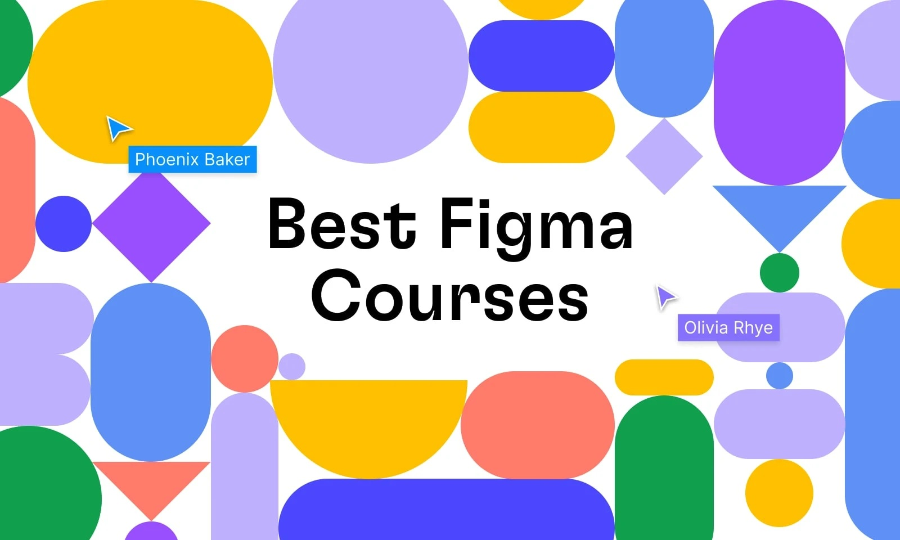

## Table of Contents

<!-- toc -->

## Why Learn **Figma for No-Code Web Design and UI/UX** in 2026?

2026 marks the explosion of no-code web design, where tools like Figma empower creators to build production-ready prototypes and sites without traditional coding. Gartner forecasts that low-code/no-code platforms will drive 75% of new applications by 2026, with 80% of users being non-IT citizen developers. Forrester echoes this, projecting a 21% annual growth rate for the low-code market, reaching $30 billion by 2028.

Udemy's 2025 data shows a 300% surge in no-code/UI/UX enrollments, fueled by freelancers averaging $5k+/month on Upwork. Figma's workflows streamline from ideation to interactive prototypes, incorporating AI for faster iterations and Webflow integrations for live sites. These courses highlight 2026 essentials: AI-assisted prototyping, responsive animations, and e-commerce readiness.

## How We Selected These Courses

Our CoursesWyn criteria ensure top-tier recommendations:
- ≥4.5 rating & minimum 10k enrollments (as of Dec 2025)
- Updated Oct–Dec 2025 (Figma AI features, Webflow CMS 3.0, etc.)
- At least 70% content focused on **Figma no-code/UI/UX** (with Webflow ties where applicable)
- Includes hands-on projects like app prototypes or portfolios
- Renowned instructors with active Q&A support
- Sale prices ≤$19.99 in Dec 2025

## Best Udemy Figma Courses for No-Code Web Design and UI/UX (2026)

### 1. Complete Web Design: from Figma to Webflow to Freelancing (Vako Shvili)

**Best for**: End-to-end no-code workflow from design to freelancing income

UPDATE: The latest update to this class was made in 2026. I keep all tutorial videos up-to-date to the latest versions of Figma and Webflow. If you notice any discrepancies just post in the Q&A and I'll get the update shipped right away. I teach Figma—a simple tool that is taking over the design world. You will be designing a complete website within a week, while others are still learning basic layouts in Photoshop.
Second, this is a development course, but I don’t teach you how to code. Coding for web design is needlessly complicated and takes too long to learn. Instead, I teach Webflow, a tool revolutionizing web design. You’ll be building complex websites within two weeks while others are still learning HTML and CSS basics.
Third, this is a freelancing course. But I don’t just teach you how to write great proposals—I give you a winning proposal template. By the end of the course, you’ll have a stunning portfolio website, complete with portfolio pieces.

**Key learning outcomes**:
- You will learn graphic design concepts like layout, typography, visual hierarchy, design tricks, and more.
- You will learn how to design beautiful websites using Figma, an interface design tool used by designers at Uber, Airbnb and Microsoft.
- You will learn how to take the designs and build them into websites using Webflow — a powerful site builder used by teams at Adobe, Dell, NASA and more.
- You will learn secret tips of freelance web designers and how they make great money freelancing online.

**Ideal students**:
- Anyone who wants to launch a web design career.
- Those looking to reboot their work life and try a new profession that’s fun, rewarding, and highly in-demand.

**Enrollment**: 100k+ | **Rating**: 4.8/5 | **Duration**: 21.5 hours
[Get Course: Complete Web Design: from Figma to Webflow to Freelancing](https://trk.udemy.com/nXOK6x)

### 2. Master Figma: Getting started the Beginner to Pro Class (Christine moonlearning)

**Best for**: Bite-sized, no-fluff lessons teaching you Figma in a 4-hour course + project.

This course is a comprehensive introduction to Figma from absolute beginner to advanced features. Short and focused, providing you with all you need to know to tackle any design.
We'll start from scratch by setting up your Figma account and familiarising ourselves with its file structure. Then, we'll dive into the fundamentals of Figma, such as setting up frames and nesting them, adding shapes, text, colours, and grids creating solid UI designs. Once you're comfortable with the basics, we dive into more advanced subjects like creating solid UI designs and working with components for reusable elements.
You'll learn how to establish styles and variables for consistency, create responsive designs with auto layout, and add basic prototyping to bring your designs to life—always keeping collaboration with development in mind.
With step-by-step exercises and valuable tips and tricks, you'll become proficient in Figma in under 4 hours. It's perfect for beginners or those transitioning from other design software.

**Key learning outcomes**:
- Setup your own free Figma account!
- Setting up UI Designs with Figma
- Setup a complete User Interface Design with Figma
- Share your work with other Designers and Developers
- Make your Designs Shine in Presentation Mode
- Basic Prototyping with Figma
- Creating reusable elements with components
- Advanced component sets with variants
- Understanding variables and styles
- Keeping up to date with latest releases
- Share and document your design with development
- Create shared team libraries
- Creating simple style guides for colour, typography and spacing
- Creat simple micro interactions for buttons and hover
- Work as a team
- Freebees to be used right away in your designs
- Figma exercise files so you can work alongside me

**Ideal students**:
- Total Beginners!
- Switching over from another Design Software to Figma (e.g Sketch or Adobe XD)

**Enrollment**: 8.6k+ | **Rating**: 4.7/5 | **Duration**: 5 hours
[Get Course: Master Figma: Getting started the Beginner to Pro Class](https://trk.udemy.com/9L16ae)

### 3. Complete Web & Mobile Designer: UI/UX, Figma, +more (Andrei Neagoie + Daniel Schifano)

**Best for**: Become a UX/UI Designer! Master Mobile and Web Design, User Interface + User Experience (UI/UX Design), HTML, and CSS

This brand new course will take you from the very basics where we talk about principles and fundamentals of graphic design, all the way to creating beautiful products, learning about UX/UI and interactions, and creating a full design process for you to use with all of your future projects and clients. We pretty much cover it all so that the next time you are in charge of designing a product you have the step by step outline and guide to work as a professional designer.

We are going to teach you the skills that will allow you to charge a lot of money for your time. Not to compete for a few dollars an hour on some random freelancing websites. The goal is to give you the skills of a top designer, and along the way, we are going to design an actual product for a company that you will be able to add to your portfolio.

This course is not about making you just watch along without understanding the principles so that when you are done with the course you don’t know what to do other than watch another tutorial. No! This course will push you and challenge you to go from an absolute beginner to someone that is a top Designer that can get hired! Design is a valuable skill that doesn’t get outdated easily like most technical skills. Trends change, but the skills and fundamentals you learn in this course will take you many years into the future.

**Key learning outcomes**:
- Build beautifully designed web and mobile projects for your customers using modern tools used by top companies in 2023
- Get hired as a Designer or become a freelancer that can work from anywhere and for anyone. Designers are in high demand!
- Includes 100+ assets and premium design templates that you can keep and use to customize for all your future projects
- Master Figma for your design needs then learn to convert your designs into a live HTML an CSS website
- Have an amazing design portfolio customized and professionally completed by the end of the course (we provide it for you!)
- Master both Web and Mobile design principles and how to go from sketching to fully fledged high fidelity designs that will wow customers
- Learn to design for all types of devices using Figma and other tools used by some of the top designers in the world
- Learn to use HTML5 and CSS3 to make your designs come to life and create fully working websites
- Learn best practices that takes years to learn in the design industry
- Learn to make professional logos and design choices for all branding needs
- Learn UI/UX best practices using the latest trends in the industry
- Learn to be a designer as well as a web developer at the same time (a rare combination of skills that is in high demand)!

**Ideal students**:
- Anyone who wants to start a Web or Mobile Design business on the side as a freelancer, or work as a designer at a company
- Web Developers and Mobile Developers wanting to add another valuable skill to their tool belt
- Anyone who wants to get hired as a Web Designer, Mobile Designer, UI/UX Designer
- Anyone who wants to learn about the latest CSS3 features like Flexbox, CSS Grid and CSS Variables as well as HTML5

**Enrollment**: 192k+ | **Rating**: 4.5/5 | **Duration**: 25 hours
[Get Course: Complete Web & Mobile Designer: UI/UX, Figma, +more](https://trk.udemy.com/jekzKb)

### 4. Webflow Essentials Course (Daniel Walter Scott)

**Best for**: Use Webflow to enable you to create responsive, accessible websites without the need for complex coding.

Webflow will enable you to create responsive, accessible websites using intuitive design techniques without the need for complex coding. This course is aimed at people who are new to Webflow and to web design in general. We will start by creating a simple single page site, learning basic layout techniques and using simple animations.
Webflow software is visual and does not require you to learn coding. You will learn how to ensure your website is consistent across desktop, laptop and mobile devices. We learn about CSS Classes for layout and font styling and also the importance of Class naming conventions.

**Key learning outcomes**:
- Create responsive websites using Webflow.
- Intuitive design techniques without the need for coding.
- Basic layout techniques.
- Simple animations.
- Consistent design across desktop, tablet and phone views.
- Flex, columns and divs.
- Build your own portfolio website.
- Create and style forms within your website.
- Converting Adobe XD and Figma files for use within Webflow.
- Sticky nav's, symbols, REM's, Floats, Gradients and Fonts.
- How to optimise your website for SEO.
- Create a CMS website with the ability to give responsibility to clients.
- -Handing over your site to admins and managers with login abilities.
- Create a shopping website with digital, physical products and services.

**Ideal students**:
- Anyone who wants to start using Webflow in their career & get paid for their user experience design skills.
- This course is for beginners, newbies & amateurs in the field of Web design & Webflow.
- Aimed at people new to the world of web design & user experience.
- For anyone that needs to add ‘Web Designer’ to their portfolio.
- Anyone who wants to learn the essentials of Webflow & Web Design.

**Enrollment**: 9k+ | **Rating**: 4.8/5 | **Duration**: 17 hours
[Get Course: Webflow Essentials Course](https://trk.udemy.com/e1o0GZ)

### 5. UI/UX Web Design in Figma 2025 | AI & Big Projects (Dmitrii Fokeev)

**Best for**: Everything you need to start a career in web design: tools, hands-on practice, AI integration, and support.

This course has been fully updated and redesigned to match the Figma 2025 interface and all its latest features. It’s the third and most refined version of this bestselling course. “Web Design in Figma — From Scratch to Results. UX/UI Basics” has become better, bigger, and more modern, now covering all the newest Figma capabilities. New lessons have been added on working with external AI tools as well as the AI features built directly into Figma.

**Key learning outcomes**:
- You will learn to create modern website and app layouts in Figma
- You will fully master all Figma tools for creating designs
- You will learn how to use AI in design
- You will explore Figma Jam for generating ideas in a team
- You will explore Figma Make to generate websites using AI directly in Figma
- You will explore Figma Site to create modern websites without code directly in Figma
- You will explore Figma Presentation to design beautiful slides and presentations
- You will learn how to speed up your workflow in Figma
- You will learn how to prototype layouts and create clickable interfaces
- You will master design systems and working with components to streamline your workflow
- You will learn what responsive design is
- You will learn how to adapt your layouts for any mobile device
- You will learn how to choose the right colors for your websites
- You will learn how to choose the right fonts for your websites
- You will learn how to combine elements on web pages
- You will learn how to work with images in Figma
- You will learn how to create wireframes and turn them into full interfaces
- You will understand what a UX/UI designer does and whether this career path is right for you
- You will learn how to negotiate with your future clients
- You will learn how to write a brief for a client as a freelancer

**Ideal students**:
- For beginner designers, front-end developers, web programmers, and creative individuals!
- For anyone who loves learning something new!

**Enrollment**: 1k+ | **Rating**: 4.6/5 | **Duration**: 16 hours
[Get Course: UI/UX Web Design in Figma 2025 | AI & Big Projects](https://trk.udemy.com/dOXW0y)

### 6. Figma UI/UX Complete Bootcamp: Design 10 Job-Ready Projects (Vapa Academy)

**Best for**: Figma Master Class: Design Professional Figma UI/UX for Ride-Sharing, Chat, and Shoe Shop Apps with Prototyping Skills

In this Figma bootcamp, students will dive deep into the fundamentals and advanced techniques of mobile app design. Through hands-on projects, they will learn to create high-fidelity UI/UX designs and interactive prototypes for real-world applications. Each project will help build core skills in layout, navigation, user flow, and interactive elements using Figma's powerful design tools.

**Key learning outcomes**:
- Figma Prototyping Basic to Advanced Level
- Uses of Prototyping in Real world App
- Zooming Hover Prototyping
- Different Types of Prototypes
- Accordion Prototyping
- Advance Prototyping Techniques
- Real Time Typing Keyboard Prototyping
- How On Drag Trigger Works

**Ideal students**:
- If you're a Figma UI/UX designer looking to enhance your prototyping skills
- If you want to master Figma prototyping
- If you want to learn about different types of prototypes with real-world examples

**Enrollment**: 26k+ | **Rating**: 4.6/5 | **Duration**: 63 hours
[Get Course: Figma UI/UX Complete Bootcamp: Design 10 Job-Ready Projects](https://trk.udemy.com/e1o0MZ)

### 7. Complete UI/UX Design Course 2025: Figma + AI + Real Project (Mohammad Iqbal)

**Best for**: Become a UI/UX Designer in 2026 — Real Projects, Components, Auto Layout, and AI Tools

Ready to become a UI/UX designer from scratch and build real-world projects? This course will completely change the way you think about design — whether you're just starting or looking to level up. Whether you want to freelance, land a job, or start your own project — this course will guide you every step of the way. By the end of this course, you’ll be confident in designing beautiful, functional, and job-ready UI/UX projects — with real-world design thinking and the power of AI.

**Key learning outcomes**:
- Design Real-World User Interfaces Using Figma
- Apply AI Tools to Speed Up and Improve the UI/UX Design Process
- Build a Real, Live UI/UX Project from Start to Finish
- Understand Design Thinking, UX Principles, and How to Create Portfolio-Worthy Case Studies

**Ideal students**:
- Beginners who want to start a career in UI/UX design with no prior experience.
- Students or job seekers looking to build a strong portfolio and gain real-world design skills.
- Freelancers who want to offer UI/UX design services and land clients in 2025.
- Aspiring product designers who want to learn how to use Figma and AI tools to speed up their design process.
- Anyone curious about how real apps are designed from scratch, using modern tools and workflows.

**Enrollment**: 5k+ | **Rating**: 4.5/5 | **Duration**: 26 hours
[Get Course: Complete UI/UX Design Course 2025: Figma + AI + Real Project](https://trk.udemy.com/bOZBz6)

### 8. Motion Design with Figma: Animations, Motion Graphics, UX/UI (Andrei Neagoie + Daniel Schifano)

**Best for**: Figma like a Pro! Learn Motion Design on Mobile and Web using modern practices that top designers use + build projects!

Just launched with all modern Motion Design principles and best practices for 2023! This is a project based course where we are going to learn by building many design projects to add to your portfolio together! Join a live online community of over 900,000+ students and a course taught by industry experts that have actually worked both in Silicon Valley and Toronto for top companies. Graduates of Andrei’s courses are now working at Google, Tesla, Amazon, Apple, IBM, JP Morgan, Facebook, + other top tech companies.
Using the latest best practices in Motion Design, as well as User Interface and User Experience Design (UI/UX), this course focuses on efficiently teaching you all about building Interactions, Animations and Motion Graphic for all your future Web and Mobile App projects. We will be using Figma to accomplish this, which is now the #1 tool used by modern designers, and is replacing all outdated design tools of the past.

We will provide all Figma files, premium design templates, and assets in this course for you, so you can keep and use them when you work with all your future clients! We guarantee you this is the most comprehensive online resource on Motion Design, Microinteractions, Animations and creating beautiful UX/UI!

**Key learning outcomes**:
- Use Figma like a pro and get a job in User Interface Design, User Experience Design (UX/UI), Web Design or Mobile App Design
- Learn to build Motion Design Prototypes with Figma and add Animations and Motion Graphics to your projects
- Have an amazing design portfolio customized and professionally completed by the end of the course (we provide it for you!)
- Build these projects: Photo Inspiration App, Nat Geo Carousel, Smart Home Mobile App, Home Reno Web Landing Page and Form + more!
- Learn to use Smart Animate in Figma
- Learn UI/UX best practices using the latest trends in the industry
- Learn the principles of Motion Design, the motion design process, best practices, and prototyping your projects for your customers and clients

**Ideal students**:
- Anyone interested in Motion Design and wants to learn more about the power of Figma and what you can create with this amazing tool
- Anyone who wants to start a Web or Mobile Design business on the side as a freelancer, or work as a designer at a company
- Web Developers and Mobile Developers wanting to add another valuable skill to their tool belt
- Anyone who wants to get hired as a Web Designer, Mobile Designer, UI/UX Designer
- Anyone who wants to learn about the latest Motion Design practices to build modern and beautiful applications

**Enrollment**: 35k+ | **Rating**: 4.5/5 | **Duration**: 10 hours
[Get Course: Motion Design with Figma: Animations, Motion Graphics, UX/UI](https://trk.udemy.com/xLxKaO)

## Comparison Table

| Rank | Course                                                                                     | Instructor                                  | Enrollment | Rating | Duration | Best For                                                        | Sale Price (Dec 2025) |
|------|--------------------------------------------------------------------------------------------|---------------------------------------------|------------|--------|----------|-----------------------------------------------------------------|------------------------|
| 1    | Complete Web Design: from Figma to Webflow to Freelancing                                  | Vako Shvili                                 | 100k+     | 4.8    | 21.5h    | End-to-end no-code freelancing                                   | $14.99                 |
| 2    | Master Figma: Getting started the Beginner to Pro Class                                    | Christine moonlearning                      | 8.6k+     | 4.7    | 5h       | Beginner-to-pro Figma fundamentals                               | $12.99                 |
| 3    | Complete Web & Mobile Designer: UI/UX, Figma, +more                                        | Andrei Neagoie + Daniel Schifano            | 192k+     | 4.5    | 25h      | Full web/mobile UI/UX mastery                                    | $13.99                 |
| 4    | Webflow Essentials Course                                                                  | Daniel Walter Scott                         | 9k+       | 4.8    | 17h      | Responsive Webflow basics with Figma imports                     | $15.99                 |
| 5    | UI/UX Web Design in Figma 2025 \| AI & Big Projects                                                  | Dmitrii Fokeev                              | 1k+      | 4.6    | 16h      | AI-integrated web design projects                                | $11.99                 |
| 6    | Figma UI/UX Complete Bootcamp: Design 10 Job-Ready Projects                                | Vapa Academy                                | 26k+      | 4.6    | 63h      | Job-ready app prototypes                                         | $14.99                 |
| 7    | Complete UI/UX Design Course 2025: Figma + AI + Real Project                               | Mohammad Iqbal                              | 5k+       | 4.5    | 26h      | Real-world AI-enhanced projects                                  | $12.99                 |
| 8    | Motion Design with Figma: Animations, Motion Graphics, UX/UI                               | Andrei Neagoie + Daniel Schifano            | 35k+      | 4.5    | 10h      | Motion graphics and interactions                                 | $10.99                 |

## Frequently Asked Questions

### Which course is best if I’m completely new to Figma and no-code design?

If you are a total beginner and want a gentle introduction:

- Start with **Master Figma: Getting started the Beginner to Pro Class** for quick Figma basics.
- If you prefer a comprehensive path with freelancing, **Complete Web Design: from Figma to Webflow to Freelancing** covers design to deployment.

### I’m a designer and want to build real prototypes. What should I take?

If you know basic Figma:

- **Figma UI/UX Complete Bootcamp: Design 10 Job-Ready Projects** – for extensive prototyping.
- **UI/UX Web Design in Figma 2025 | AI & Big Projects** – AI and large-scale web projects.
- **Webflow Essentials Course** – if focusing on Webflow conversions.

### Which courses focus more on freelancing than pure design?

If you care more about income and portfolios:

- **Complete Web Design: from Figma to Webflow to Freelancing** – includes client strategies.
- **Complete Web & Mobile Designer: UI/UX, Figma, +more** – portfolio building and job readiness.

### Do I need strong design skills to start?

No. For most courses in this list, you mainly need:

- Basic computer literacy.
- Interest in UI/UX.

For advanced courses, it helps to know:

- Figma basics: frames, components, auto-layout.

### Can these courses help me land freelance UI/UX work?

They can be a strong foundation if you:

- Complete a **Figma bootcamp** course.
- Build and prototype 5-10 projects.
- Create a Behance/Dribbble portfolio.

Clients want **interactive prototypes**, not static mocks.

### Are these courses worth it if I’m interested in AI integrations?

Yes. If AI-focused:

- **UI/UX Web Design in Figma 2025 | AI & Big Projects** – built-in Figma AI.
- **Complete UI/UX Design Course 2025: Figma + AI + Real Project** – workflow acceleration.

## Conclusion

Figma dominates 2026 no-code web design and UI/UX, bridging prototypes to live experiences with AI and tools like Webflow. These Udemy courses offer hands-on paths from basics to pro projects, ideal for freelancers and career switchers.

Pick 1–2 aligning with your goals, complete prototypes, and showcase them. This blend of skills positions you in the thriving no-code economy.

*Disclosure: Affiliate links. We earn a commission at no extra cost to you.*

## Related Posts

- [Top 8 AI-Powered Web Development Courses on Udemy 2026](/top-8-ai-powered-web-development-courses-udemy-2026/) - AI for web enhancement
- [Top 10 No-Code App Development Courses on Udemy](/top-10-no-code-app-courses-udemy/) - Broader no-code tools
- [Top 10 UI/UX Design Bootcamps on Udemy 2026](/top-10-ui-ux-bootcamps-udemy-2026/) - Advanced design mastery

---

