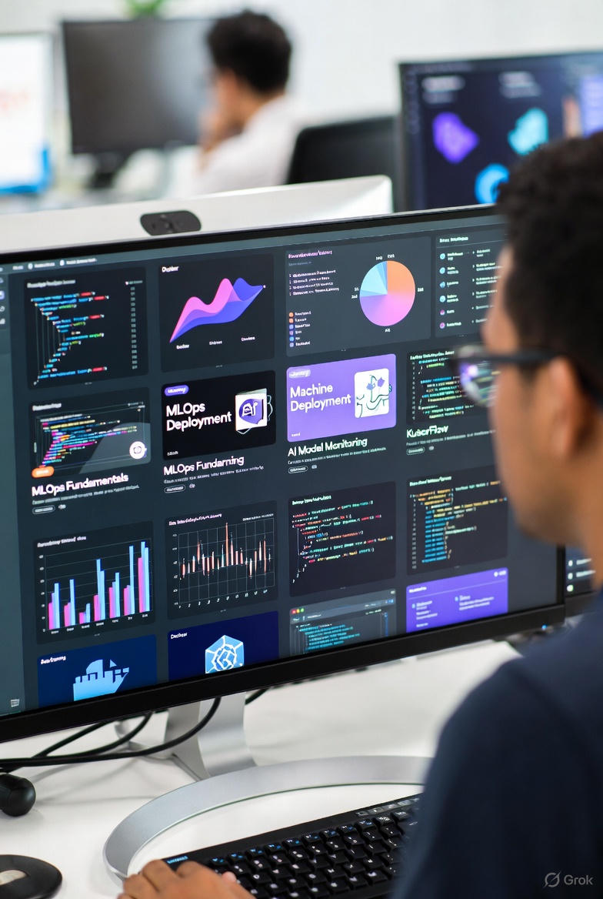

## Table of Contents

<!-- toc -->

## Why Learn MLOps in 2026?

In 2026, MLOps (Machine Learning Operations) emerges as a critical discipline for transitioning machine learning models from experimentation to reliable production environments. Industry reports highlight the necessity of automated pipelines, monitoring, and scalability to address challenges like model drift and reproducibility. These courses focus on integrating DevOps principles with ML workflows, utilizing tools such as MLflow, Docker, Kubernetes, and cloud platforms (AWS, Azure, GCP), enabling professionals to deploy scalable AI systems efficiently.

## How We Selected These Courses

Our CoursesWyn criteria ensure top-tier recommendations:
- ≥4.0 rating & minimum 500 enrollments (as of Dec 2025)
- Updated Oct–Dec 2025 (new features like LLMOps integration, advanced monitoring)
- At least 70% content focused on **MLOps and production deployment** (with hands-on projects and tools)
- Includes real-world projects like CI/CD pipelines or cloud deployments
- Renowned instructors with active Q&A support
- Sale prices ≤$19.99 in Dec 2025

## Best Udemy MLOps Courses (2026)

### 1. MLOps Zero to Hero (Abhishek Veeramalla)

**Best for**: Comprehensive production-grade MLOps with AWS and Kubernetes.

MLOps Zero to Hero is a practical, hands-on course designed to help engineers understand how machine learning systems are built, deployed, and operated in real production environments. The course focuses on the real challenges teams face after a model is trained versioning data, tracking experiments, deploying models, scaling inference, and managing ML workloads reliably.

You will start with the fundamentals of the ML lifecycle and gradually move into core MLOps practices. The course covers data and model versioning using DVC, experiment tracking with MLflow, and containerization using Docker. You will deploy models on Kubernetes, understand production-grade serving patterns, and implement Kubernetes-native inference using KServe.

The course also introduces AWS-based MLOps workflows, including Amazon SageMaker, to help you understand how managed platforms are used in real organizations. You will further explore Kubeflow to learn how ML pipelines and training workloads are orchestrated in Kubernetes environments.

Every concept is explained using simple examples and real-world workflows, with a strong emphasis on clarity and practical understanding rather than theory. By the end of the course, you will have a complete picture of how machine learning moves from experimentation to production — and the confidence to design, deploy, and operate MLOps systems in real projects.

**Key learning outcomes**:
- Introduction to Machine Learning Operations (MLOps)
- Transition from DevOps Engineers to MLOps Engineers
- Machine Learning Basics for DevOps Engineers
- Model Deployment and Monitoring in Production
- End-to-End ML Pipeline Orchestration
- Real-World MLOps Project

**Ideal students**:
- DevOps Engineers planning to transition to MLOps roles
- Beginners curious about Model Deployments and Model Maintenence
- Everyone who is curious about undertstanding how ML models are dealt at production level.

**Enrollment**: 5k+ | **Rating**: 4.7/5 | **Duration**: 15+ hours
[Get Course: MLOps Zero to Hero 2026](https://trk.udemy.com/kO524L)

### 2. Ultimate DevOps to MLOps Bootcamp - Build ML CI/CD Pipelines (Gourav J. Shah)

**Best for**: Bridging DevOps and MLOps with real-world CI/CD projects.

This hands-on bootcamp is designed to help DevOps Engineers and infrastructure professionals transition into the growing field of MLOps. With AI/ML rapidly becoming an integral part of modern applications, MLOps has emerged as the critical bridge between machine learning models and production systems.

In this course, you will work on a real-world regression use case — predicting house prices — and take it all the way from data processing to production deployment on Kubernetes. You’ll start by setting up your environment using Docker and MLFlow for tracking experiments. You’ll understand the machine learning lifecycle and get hands-on experience with data engineering, feature engineering, and model experimentation using Jupyter notebooks.

Next, you'll package the model with FastAPI and deploy it alongside a Streamlit-based UI. You’ll write GitHub Actions workflows to automate your ML pipeline for CI and use DockerHub to push your model containers.

In the later stages, you'll build a scalable inference infrastructure using Kubernetes, expose services, and connect frontends and backends using service discovery. You’ll explore production-grade model serving with Seldon Core and monitor your deployments with Prometheus and Grafana dashboards.

Finally, you'll explore GitOps-based continuous delivery using ArgoCD to manage and deploy changes to your Kubernetes cluster in a clean and automated way.

By the end of this course, you'll be equipped with the knowledge and hands-on experience to operate and automate machine learning workflows using DevOps practices — making you job-ready for MLOps and AI Platform Engineering roles.

**Key learning outcomes**:
- Build end-to-end Machine Learning pipelines with MLOps best practices
- Understand and implement ML lifecycle from data engineering to model deployment
- Set up MLFlow for experiment tracking and model versioning
- Package and serve models using FastAPI and Docker
- Automate workflows using GitHub Actions for CI pipelines
- Deploy inference infrastructure on Kubernetes using KIND
- Use Streamlit for building lightweight ML web interfaces
- Learn GitOps-based CD pipelines using ArgoCD
- Serve models in production using Seldon Core
- Monitor models with Prometheus and Grafana for production insights
- Understand handoff workflows between Data Science, ML Engineering, and DevOps
- Build foundational skills to transition from DevOps to MLOps roles

**Ideal students**:
- DevOps Engineers looking to break into the field of MLOps
- Platform Engineers and SREs supporting ML teams
- Cloud Engineers wanting to understand ML workflows and productionization
- Developers transitioning into ML Engineering or Data Engineering roles
- Anyone curious about how real-world ML systems are deployed and scaled

**Enrollment**: 18k+ | **Rating**: 4.6/5 | **Duration**: 12+ hours
[Get Course: Ultimate DevOps to MLOps Bootcamp 2026](https://trk.udemy.com/QjBdKo)

### 3. Complete MLOps Bootcamp With 10+ End To End ML Projects (Krish Naik)

**Best for**: Automate ML with Data Science Projects

Welcome to the Complete MLOps Bootcamp With End to End Data Science Project, your one-stop guide to mastering MLOps from scratch! This course is designed to equip you with the skills and knowledge necessary to implement and automate the deployment, monitoring, and scaling of machine learning models using the latest MLOps tools and frameworks.

In today’s world, simply building machine learning models is not enough. To succeed as a data scientist, machine learning engineer, or DevOps professional, you need to understand how to take your models from development to production while ensuring scalability, reliability, and continuous monitoring. This is where MLOps (Machine Learning Operations) comes into play, combining the best practices of DevOps and ML model lifecycle management.

This bootcamp will not only introduce you to the concepts of MLOps but will take you through real-world, hands-on data science projects. By the end of the course, you will be able to confidently build, deploy, and manage machine learning pipelines in production environments.

**Key learning outcomes**:
- Build scalable MLOps pipelines with Git, Docker, and CI/CD integration.
- Implement MLFlow and DVC for model versioning and experiment tracking.
- Deploy end-to-end ML models with AWS SageMaker and Huggingface.
- Automate ETL pipelines and ML workflows using Apache Airflow and Astro.
- Monitor ML systems using Grafana and PostgreSQL for real-time insights.

**Ideal students**:
- Data Scientists and Machine Learning Engineers looking to scale and deploy ML models.
- DevOps professionals wanting to integrate ML pipelines.
- Software Engineers interested in transitioning to MLOps.
- Beginners with basic ML knowledge aiming to learn end-to-end deployment.
- IT professionals eager to understand MLOps tools and practices for real-world projects.

**Enrollment**: 31k+ | **Rating**: 4.5/5 | **Duration**: 51+ hours
[Get Course: Complete MLOps Bootcamp With 10+ End To End ML Projects 2026](https://trk.udemy.com/o4A6zO)

### 4. LLMOps Masterclass 2026 - Generative AI - MLOps - AIOps (Manifold AI Learning)

**Best for**: LLMOps with Open AI and Hugging Face Models Deploy to Prod

Unlock the potential of Generative AI with our comprehensive course, "LLMOps - Generative AI - MLOps - AIOps Masterclass 2026" From understanding the fundamentals to deploying advanced applications, this course equips you with the knowledge and skills to thrive in the era of artificial intelligence.

**Key learning outcomes**:
- Gain a deep understanding of Generative AI, including its impact on daily life and real-world applications.
- Explore fundamental concepts such as AI levels, types, and the difference between generative and discriminative models.
- Learn about Prompt Engineering, including its architecture, components, and techniques for prompt generation.
- Understand the technical details of Language Model (LLM), its training process, and its enterprise applications.
- Develop hands-on experience by building LLM applications using ChatGPT and Hugging Face Library.
- Master the art of packaging and deploying AI applications using technologies such as FastAPI, Docker, and Kubernetes.
- Implement continuous integration and continuous deployment (CI/CD) pipelines using GitHub Actions, ensuring efficient project management.
- Explore monitoring techniques for LLM models in production, ensuring their reliability and performance.
- Acquire essential LLMOps basics, including version control systems, Git setup, and CICD demonstrations.
- Prepare for industry standards and best practices in AI development and operations, ensuring readiness for real-world challenges.

**Ideal students**:
- AI Enthusiasts: Individuals passionate about artificial intelligence and eager to explore advanced topics such as Generative AI and MLOps will find this course valuable in expanding their expertise.
- Data Scientists and Machine Learning Engineers: Professionals working in data science and machine learning roles who seek to deepen their understanding of AI operations, including model deployment, monitoring, and optimization, will benefit from this course.
- Software Engineers: Developers interested in incorporating AI technologies into their applications and understanding the operational aspects of AI model deployment and management will find this course highly relevant.
- AI Researchers: Researchers aiming to enhance their understanding of practical AI deployment and operations, particularly in the context of Generative AI, will gain valuable insights from this course.
- IT Professionals and DevOps Engineers: Professionals involved in IT operations and DevOps who wish to expand their skill set to include AI Ops and cloud-native technologies like Kubernetes will find this course beneficial for career advancement.
- Entrepreneurs and Innovators: Individuals seeking to leverage AI technologies to innovate and develop new products and services will gain valuable knowledge and practical skills for building and deploying AI applications.

**Enrollment**: 5k+ | **Rating**: 4.5/5 | **Duration**: 16+ hours
[Get Course: LLMOps Masterclass 2026 - Generative AI - MLOps - AIOps](https://trk.udemy.com/RGzd1N)

### 5. Full-Stack AI Engineer 2026: ML, Deep Learning, GenerativeAI (School of AI)

**Best for**: Gen AI through hands-on projects to become a Full-Stack AI Engineer

Welcome to Full-Stack AI Engineer: Python, ML, Deep Learning & GenAI, the ultimate end-to-end program designed to turn you into a production-ready Artificial Intelligence Engineer. In this comprehensive AI course, you will master every layer of the AI engineering pipeline, from Python programming and data science foundations to machine learning, deep learning, MLOps, and Generative AI with Large Language Models (LLMs).

This course is your complete roadmap to becoming a Full-Stack AI Engineer, capable of designing, building, training, deploying, and scaling AI models across real-world environments. You’ll gain hands-on experience through real projects using NumPy, Pandas, Scikit-learn, TensorFlow, PyTorch, Docker, Git, MLflow, LangChain, and FastAPI, ensuring you learn the same AI tools used by leading tech companies.

**Key learning outcomes**:
- Master Python programming for AI, including data types, control flow, functions, and file handling to build strong foundations for machine learning.
- Apply data science techniques using NumPy, Pandas, Matplotlib, and Seaborn to clean, visualize, and analyze datasets for actionable AI insights.
- Build and evaluate machine learning models using Scikit-learn, covering regression, classification, ensemble methods, and model optimization.
- Design and train deep learning models using TensorFlow and PyTorch, including CNNs, RNNs, and LSTMs for vision and sequence-based tasks.
- Implement MLOps pipelines with Git, DVC, Docker, MLflow, and CI/CD to automate model deployment and management on AWS, GCP, and Azure.
- Create Generative AI and LLM-based applications using OpenAI GPT, Claude, and Gemini APIs with RAG pipelines and custom fine-tuned models.

**Ideal students**:
- Aspiring AI Engineers, Machine Learning Developers, and Data Scientists who want a complete, end-to-end learning path from Python to Generative AI.
- Beginners in programming who want to break into Artificial Intelligence with a structured, guided roadmap of practical projects and real-world examples.
- Software Engineers and Developers looking to upgrade their skills and transition into Machine Learning, Deep Learning, or AI Infrastructure roles.
- Students, researchers, and tech enthusiasts eager to understand how modern AI systems like GPT, Claude, and Gemini are built and deployed.
- Professionals in IT, analytics, or data-driven industries aiming to automate workflows using AI models, MLOps, and cloud deployment tools.
- Anyone who wants to build and deploy AI applications — not just study them — and become a Full-Stack AI Engineer ready for enterprise-level challenges.

**Enrollment**: 4k+ | **Rating**: 4.6/5 | **Duration**: 33+ hours
[Get Course: Full-Stack AI Engineer 2026: ML, Deep Learning, GenerativeAI](https://trk.udemy.com/POodr6)

### 6. AI Engineer MLOps Track: Deploy Gen AI & Agentic AI at Scale (Ed Donner)

**Best for**: Deploy AI to AWS, GCP, Azure, Vercel with MLOps, Bedrock, SageMaker, RAG, Agents, MCP: scalable, secure and observable.

This is the course that more of my students have asked for than any other course — put together.

One student called it: “The missing course in AI.”

This course is for:
- Entrepreneurs
- Enterprise engineers
- …and everyone in between.

It’s not just about RAG — although we’ll work with RAG.

It’s not just about Agents — but there will be many Agents.

It’s not just about MCP — but yes, there will be plenty of MCP too.

This course is about:
RAG, Agents, MCP, and so much more… deployed to production.

**Key learning outcomes**:
- Deploy SaaS LLM apps to production on Vercel, AWS, Azure, and GCP, using Clerk
- Design cloud architectures with Lambda, S3, CloudFront, SQS, Route 53, App Runner and API Gateway
- Integrate with Amazon Bedrock and SageMaker, and build with GPT-5, Claude 4, OSS, AWS Nova and HuggingFace
- Rollout to Dev, Test and Prod automatically with Terraform and ship continuously via GitHub Actions
- Deliver enterprise-grade AI solutions that are scalable, secure, monitored, explainable, observable, and controlled with guardrails.
- Create Multi-Agent systems and Agentic Loops with Amazon Bedrock AgentCore and Stands Agents

**Ideal students**:
- If you're excited about the idea of deploying Gen AI and Agents live in production - then this course is for you.

**Enrollment**: 20k+ | **Rating**: 4.8/5 | **Duration**: 18+ hours
[Get Course: AI Engineer MLOps Track: Deploy Gen AI & Agentic AI at Scale](https://trk.udemy.com/kO52oM)

### 7. MLflow in Action - Master the art of MLOps using MLflow tool (J Garg)

**Best for**: Streamline MLOps workflows using MLflow tool

Why MLOps ?
MLOps is the backbone of modern Machine learning workflows. It solves the pressing problem of operationalizing the ML models in production systems. Pushing the ML models to production which could traditionally take months can now be operationalized in few days using MLOps tools.

As per the tech talks in market, 2024 is the year of MLOps and would become the mandate skill for Enterprise ML projects.

Why MLflow tool for MLOps ?
MLflow is the ultimate tool for MLOps because it streamlines the entire Machine learning lifecycle. It allows you to efficiently track experiments, package code, register versions and deploy models, all within one unified platform. Unlike other tools, MLflow simplifies the process, enabling you to transition from development to deployment seamlessly.

MLflow's popularity is evident from the thousands of organizations, ranging from startups to Fortune 500 companies, that have integrated MLflow into their MLOps workflows.

**Key learning outcomes**:
- Explore the fundamentals of MLOps and how it overcomes the challenges inherent in the traditional ML lifecycle.
- Gain a deep understanding of MLflow and the role of its 4 components in managing the end-to-end Machine learning operations (MLOps).
- Learn how to efficiently Track experiments, Package code, Register and reproduce models in the realm of MLOps using MLflow tool.
- A range of MLflow logging functions to effectively track and record experiments, runs, artifacts, parameters, code, metrics etc.
- MLflow Tracking - To log, organize, and compare Machine learning experiments effortlessly.
- MLflow Model - For efficient model packaging into distinct flavors allowing to streamline model deployment and integration into production systems.
- MLflow Project - To create structured, reproducible, and easily shareable Machine Learning workflows.
- MLflow Registry - For efficient model management, version tracking in order to maintain model quality and performance over time.
- A complete end-to-end ML project demonstrating MLflow integration with AWS cloud.
- Build, Train, Test and Deploy a Machine learning model in AWS cloud using AWS Sagemaker and MLflow.

**Ideal students**:
- Data Scientists
- Machine Learning Engineers
- MLOps Engineers
- Operations Engineers

**Enrollment**: 8k+ | **Rating**: 4.5/5 | **Duration**: 12+ hours
[Get Course: MLflow in Action - Master the art of MLOps using MLflow tool](https://trk.udemy.com/9LNdEe)

### 8. Deployment of Machine Learning Models (Soledad Galli)

**Best for**: Learn how to integrate robust and reliable Machine Learning Pipelines in Production

Welcome to Deployment of Machine Learning Models, the most comprehensive machine learning deployments online course available to date. This course will show you how to take your machine learning models from the research environment to a fully integrated production environment.

What is model deployment?
Deployment of machine learning models, or simply, putting models into production, means making your models available to other systems within the organization or the web, so that they can receive data and return their predictions. Through the deployment of machine learning models, you can begin to take full advantage of the model you built.

**Key learning outcomes**:
- Build machine learning model APIs and deploy models into the cloud
- Send and receive requests from deployed machine learning models
- Design testable, version controlled and reproducible production code for model deployment
- Create continuous and automated integrations to deploy your models
- Understand the optimal machine learning architecture
- Understand the different resources available to productionise your models
- Identify and mitigate the challenges of putting models in production

**Ideal students**:
- Data scientists who want to deploy their first machine learning model
- Data scientists who want to learn best practices model deployment
- Software developers who want to transition into machine learning

**Enrollment**: 43k+ | **Rating**: 4.5/5 | **Duration**: 10+ hours
[Get Course: Deployment of Machine Learning Models](https://trk.udemy.com/POodbq)

## Comparison Table

| Rank | Course                                                                 | Instructor                  | Enrollment | Rating | Duration | Best For                              | Sale Price (Dec 2025) |
|------|-------------------------------------------------------------------------|-----------------------------|------------|--------|----------|---------------------------------------|------------------------|
| 1    | MLOps Zero to Hero                                                     | Abhishek Veeramalla         | 5k+       | 4.7    | 15+h     | Production-grade with AWS/K8s         | $15.99                 |
| 2    | Ultimate DevOps to MLOps Bootcamp                                      | Gourav J. Shah              | 18k+      | 4.6    | 12+h     | DevOps to MLOps transition            | $16.99                 |
| 3    | Complete MLOps Bootcamp With 10+ End To End ML Projects                | Krish Naik                  | 31k+      | 4.5    | 51+h     | Multiple end-to-end projects          | $17.99                 |
| 4    | LLMOps Masterclass 2026 - Generative AI - MLOps - AIOps                 | Manifold AI Learning        | 5k+       | 4.5    | 16+h     | LLMOps and Generative AI              | $14.99                 |
| 5    | Full-Stack AI Engineer 2026: ML, Deep Learning, GenerativeAI           | School of AI                | 4k+       | 4.6    | 33+h     | Full-stack AI with MLOps              | $18.99                 |
| 6    | AI Engineer MLOps Track: Deploy Gen AI & Agentic AI at Scale           | Ed Donner                   | 20k+      | 4.8    | 18+h     | Gen AI and Agentic deployment         | $16.99                 |
| 7    | MLflow in Action - Master the art of MLOps using MLflow tool           | J Garg                      | 8k+       | 4.5    | 12+h     | MLflow-focused MLOps                  | $13.99                 |
| 8    | Deployment of Machine Learning Models                                  | Soledad Galli               | 43k+      | 4.5    | 10+h     | Model deployment fundamentals         | $12.99                 |

## Frequently Asked Questions

### Which course should a complete beginner start with?

Start with **#8 Deployment of Machine Learning Models** or **#1 MLOps Zero to Hero** – both provide strong foundational concepts with practical guidance.

### I want the most hands-on projects – which one?

**#3 Complete MLOps Bootcamp** (10+ projects) or **#2 Ultimate DevOps to MLOps Bootcamp**.

### I focus on AWS or Kubernetes?

**#1 MLOps Zero to Hero** for comprehensive AWS and Kubernetes coverage.

### I am interested in LLMOps or Generative AI?

**#4 LLMOps Masterclass** or **#6 AI Engineer MLOps Track**.

### Are these courses updated for 2026 tools?

Yes – all include recent updates with cloud advancements, LLM integration, and monitoring tools.

### Will these help advance my career?

Absolutely. Hands-on projects build strong portfolios; skills align with high-demand MLOps and AI engineering roles.

## Conclusion

MLOps is essential for production AI in 2026. These eight courses offer current, practical training on Udemy as of December 2025.

Select one, complete the projects, and deploy models – professional growth will follow.

*Disclosure: Affiliate links. We earn a commission at no extra cost to you.*

---

