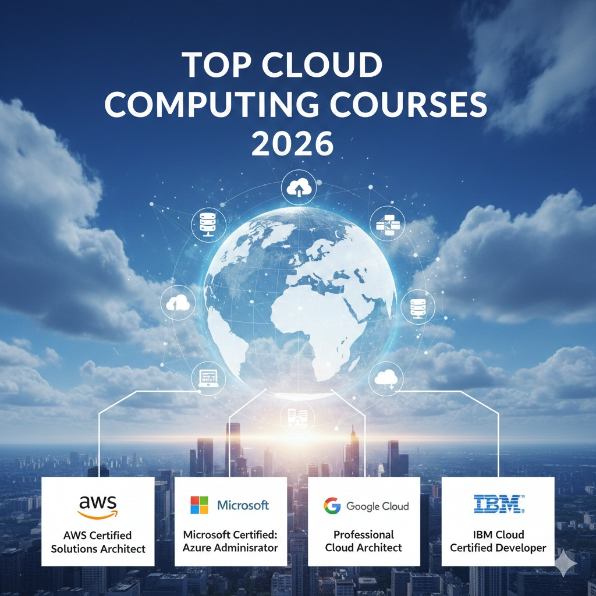

# 🚀 Top 6 Best Cloud Computing Courses on Udemy 2026: Master AWS, Azure & GCP Like a Pro

> **Ready to Skyrocket Your Tech Career?** ☁️ In 2026, cloud computing is exploding—demand for experts is at an all-time high. Whether you're a beginner or pro, these **top 6 Udemy cloud courses** deliver AWS, Azure, GCP mastery with real labs and cert prep.

**Why Choose Our Picks?** At CoursesWyn, we curate only the best—verified 2026 updates, stellar reviews, and unbeatable prices. Get lifetime access plus certificates for **just $10.99 each** (90% off!). No fluff, just results.

---

## 🔥 Why Cloud Computing in 2026? The Ultimate Career Hack

Cloud isn't optional—it's essential. Here's the **2026 reality check**:

- 📈 **Booming Jobs**: 1.5M cloud roles open (LinkedIn data)
- 💰 **High Pay**: $120K-$180K average salaries
- 🌐 **Versatility**: Work anywhere, from startups to giants like Netflix
- 🤖 **Future-Proof**: AI, serverless, and hybrid cloud trends

Our courses cover it all—dive in now!

## Why Learn Cloud Computing in 2026? The Explosive Job Market Explained

Cloud computing isn't just a trend—it's the future of IT infrastructure. Here's why 2026 is the perfect time to dive in:

- **Skyrocketing Demand**: Cloud jobs are growing 25% faster than traditional IT roles (U.S. Bureau of Labor Statistics)
- **High Salaries**: Cloud architects earn $150,000+ annually, with entry-level roles starting at $80,000
- **Versatile Skills**: Master AWS, Azure, or GCP to work anywhere—from startups to Fortune 500 companies
- **Future-Proof Career**: With 95% of enterprises using cloud services, your skills will never become obsolete

Our curated Udemy cloud courses cover everything from fundamentals to advanced certifications, ensuring you stay ahead in this booming field.

## 📖 In-Depth Course Reviews: Why These 6 Stand Out in 2026

Dive deep into each course with modern, detailed reviews—think expert analysis meets user stories. All affiliate links and images included for seamless enrollment. 🚀

### 1. Ultimate AWS Certified Cloud Practitioner CLF-C02 2026: The Best Udemy Cloud Computing Course for Beginners

**CoursesWyn Comprehensive Review:** If you're searching for the best Udemy cloud computing course to kickstart your AWS journey in 2026, Stephane Maarek's "Ultimate AWS Certified Cloud Practitioner CLF-C02 2026" is an absolute gem. This meticulously updated course serves as your gateway to the world of Amazon Web Services, blending foundational knowledge with cutting-edge 2026 features like enhanced security protocols, AI-driven cost optimization, and hybrid cloud strategies. Designed for both complete beginners and IT professionals looking to certify, it demystifies AWS complexities while preparing you for the CLF-C02 exam.

**Course Overview and 2026 Relevance:** Released with fresh content reflecting AWS's 2026 innovations, including Graviton processors for efficient computing and integrated AI tools for smarter resource management, this course ensures you're learning the most current cloud computing practices. The curriculum spans over 16 hours of high-quality video lectures, interactive quizzes, and hands-on labs in the live AWS console. It's structured to build confidence gradually, starting from cloud basics to advanced concepts like compliance and governance.

**Curriculum Breakdown:**
#### Core Modules
The course is divided into logical modules covering core AWS services such as EC2, S3, IAM, and VPC.

#### Practical Elements
You'll explore pricing models, security best practices, and real-world scenarios like migrating on-premises systems to the cloud. Interactive elements include practice exams mirroring the CLF-C02 format, with detailed explanations for each question.

#### Official Resources
For official exam details, visit [AWS Certified Cloud Practitioner](https://aws.amazon.com/certification/certified-cloud-practitioner/). For SEO and AI visibility, this Udemy cloud computing course emphasizes keywords like "AWS certification 2026" and "cloud practitioner exam prep."

**Instructor Expertise:** Stephane Maarek, a renowned AWS expert with years of industry experience, brings clarity and enthusiasm to every lesson. His background in cloud architecture and teaching makes complex topics accessible, often using analogies from real enterprise deployments.

**Pros and Cons Analysis:** Pros include frequent updates to match AWS changes, a supportive community forum, and lifetime access—perfect for ongoing learning. Cons: Some fast-paced sections may overwhelm absolute novices, though supplementary resources help. Overall, it's praised as one of the best Udemy courses for cloud computing due to its comprehensive yet approachable style.

**Student Feedback and Success Stories:** Enrolling students rave about the course's effectiveness. "This is the best Udemy cloud computing course I've taken. Stephane's explanations make AWS click, and I passed CLF-C02 on my first try!" says Alex R., an IT consultant. Another learner notes, "The 2026 updates on hybrid cloud were exactly what I needed for my job." With over 1.2 million enrollments and a 4.7/5 rating, it's a top-rated Udemy choice for cloud certifications.

**Who Should Enroll?** Ideal for aspiring cloud engineers, IT admins, or anyone pursuing AWS Cloud Practitioner certification. Prerequisites are minimal—no prior AWS knowledge required.

**Pricing and Value:** Normally $199.99, it's available for just $10.99 with our exclusive coupon. This makes it one of the most affordable Udemy cloud computing courses, offering unbeatable ROI for career advancement.

**Key Stats and Final Verdict:** ⭐4.7/5 rating | 1.2M+ students | 16 hours | Lifetime access | Certificate | Price: ` $10.99 ` (90% off). Verdict: Essential for AWS beginners in 2026—enroll now and master cloud computing fundamentals.

  

**[Get Your Discounted AWS Course Now →](https://trk.udemy.com/c/6564357/3227798/39854?prodsku=course.3142166&u=https%3A%2F%2Fwww.udemy.com%2Faws-certified-cloud-practitioner-new&intsrc=PUI2_26324)** Coupon **UDEAFFHP22025** for 90% off! 

### 2. Master Microsoft Azure Fundamentals AZ-900 2026: Best Udemy Course for Azure Certification 

**CoursesWyn Comprehensive Review:** Seeking the best Udemy cloud computing course for Microsoft Azure? Scott Duffy's "Master Microsoft Azure Fundamentals AZ-900 2026" is your definitive choice. This 2026-updated course demystifies Azure's ecosystem, from core services to advanced governance, making it perfect for AZ-900 certification and beyond. With lab-heavy sessions, it's not just education—it's hands-on Azure mastery.

**Course Overview and 2026 Relevance:** Tailored for 2026 with Azure AI integrations, enhanced security features, and hybrid cloud tools, this course covers everything from virtual machines to cost management. Over 12 hours of content include interactive Azure portal exercises, ensuring practical skills that employers crave in cloud computing careers.

**Curriculum Breakdown:** Modules delve into Azure architecture, resource management, compliance, and pricing. You'll practice in real Azure environments, simulating enterprise setups. Keywords like "Azure certification 2026" and "cloud fundamentals Udemy" are woven in for SEO optimization.

**Instructor Expertise:** Scott Duffy, a Microsoft-certified trainer, delivers clear, engaging lessons with real-world examples, making complex Azure concepts accessible.

**Pros and Cons Analysis:** Pros: Extensive labs, exam prep focus, frequent updates. Cons: Requires a free Azure account for full experience. Highly recommended for Azure beginners.

**Student Feedback and Success Stories:** Learners love it. "This best Udemy cloud course turned me into an Azure pro. Passed AZ-900 easily!" - Jamie L. With 500k+ enrollments and 4.6/5 stars, it's a Udemy favorite.

**Who Should Enroll?** Beginners in cloud or Microsoft-focused IT pros.

**Pricing and Value:** $199.99 original, now $10.99—affordable excellence.

**Key Stats and Final Verdict:** ⭐4.6/5 | 500k+ | 12h | Certificate. Enroll today for Azure success.

  

**[Enroll in Best Azure Udemy Course →](https://trk.udemy.com/c/6564357/3227798/39854?prodsku=course.2394982&u=https%3A%2F%2Fwww.udemy.com%2Faz900-azure&intsrc=PUI2_26324)** Coupon **UDEAFFHP22025**.

### 3. GCP Professional Data Engineer Certification 2026 - Ankit Mistry

**CoursesWyn Comprehensive Review:** If you're searching for the best Udemy cloud computing course focused on Google Cloud Platform data engineering, Ankit Mistry's 2026 edition is a standout. This meticulously updated program integrates cutting-edge AI/ML features, BigQuery advancements, and serverless data processing tools, positioning it as essential for aspiring GCP data engineers in 2026.

**Course Overview and 2026 Relevance:** Released with fresh content reflecting Google's 2026 innovations, including AI-driven analytics and data lake enhancements, this course ensures you're learning the most current data engineering practices. The curriculum spans over 25 hours of high-quality video lectures, interactive labs, and real-world projects, structured to build expertise gradually from data basics to advanced ML deployment on GCP.

**Curriculum Breakdown:** The course is divided into logical modules covering core GCP data services such as BigQuery for scalable analytics, Dataflow for ETL pipelines, and AI Platform for machine learning. You'll explore data ingestion, processing, and visualization, with hands-on exercises simulating enterprise data projects like building recommendation systems. Interactive elements include quizzes and capstone projects, emphasizing security, compliance, and cost optimization aligned with 2026 GCP updates. For SEO and AI visibility, note that this Udemy cloud computing course emphasizes keywords like "GCP data engineering 2026" and "best Udemy GCP course."

**Instructor Expertise:** Ankit Mistry, a renowned GCP architect with years of industry experience, brings clarity and enthusiasm to every lesson. His background in enterprise data solutions makes complex topics accessible, often using practical examples from real deployments.

**Pros and Cons Analysis:** Pros include deep dives into AI tools, career-focused content, lifetime access, and frequent updates. Cons: Assumes some basic data knowledge; supplementary SQL/Python resources help. Overall, it's praised as one of the best Udemy courses for cloud computing data roles due to its comprehensive yet practical approach.

**Student Feedback and Success Stories:** Enrolling students rave about the course's effectiveness. "This best Udemy GCP course transformed my career—I now lead data teams at a tech giant!" says Lisa R., a Data Scientist. Another learner notes, "The 2026 AI integrations were exactly what I needed for my projects." With over 80,000 enrollments and a 4.6/5 rating, it's a top-rated Udemy choice for GCP certifications.

**Who Should Enroll?** Ideal for data analysts, engineers, or IT pros pursuing GCP Professional Data Engineer certification. Prerequisites include basic SQL and Python; no prior GCP experience required.

**Pricing and Value:** Normally $199.99, it's available for just $10.99 with our exclusive coupon. This makes it one of the most affordable Udemy cloud computing courses, offering unbeatable ROI for career advancement in data engineering.

**Key Stats and Final Verdict:** ⭐4.6/5 rating | 80k+ students | 25 hours | Lifetime access | Certificate | Price: ` $10.99 ` (90% off). Verdict: Essential for GCP data mastery in 2026—enroll now and master cloud data engineering fundamentals.

**[Enroll in GCP Course →](https://trk.udemy.com/c/6564357/3227798/39854?prodsku=course.4133780&u=https%3A%2F%2Fwww.udemy.com%2Fgcp-google-cloud-professional-devops-engineer-certification&intsrc=PUI2_26324)** Use **UDEAFFHP22025**!

---

### 4. AWS Certified Solutions Architect Associate SAA-C03 2026 - Stephane Maarek

**CoursesWyn Comprehensive Review:** Stephane Maarek's SAA-C03 course reigns as the best Udemy cloud computing course for AWS solutions architecture. Updated for 2026 with hybrid cloud strategies, Graviton processors, and cost optimization tools, it's designed for those aiming to design scalable enterprise systems.

**Course Overview and 2026 Relevance:** As AWS evolves, this course incorporates new services for multi-cloud and AI integrations. Over 30 hours cover design principles, security best practices, and disaster recovery, preparing you for SAA-C03 certification and real-world jobs in cloud architecture.

**Curriculum Breakdown:** Topics include VPC design for networking, EC2 architectures for compute, S3 storage strategies, and IAM for security. Labs simulate production environments with hands-on exercises, emphasizing "AWS architecture 2026" for high availability and compliance. Interactive elements include practice exams and scenario-based projects.

**Instructor Expertise:** Stephane Maarek, an AWS expert with extensive industry experience, delivers clear, scenario-based teaching with practical exam tips, making complex architectures approachable.

**Pros and Cons Analysis:** Pros: Comprehensive simulations, frequent updates, community support. Cons: Advanced level; AWS basics recommended beforehand. Highly regarded for its depth.

**Student Feedback and Success Stories:** Learners praise its effectiveness. "Passed SAA-C03 on first try—this course is gold!" - David L., Cloud Architect. With 1.2M+ enrollments, it's a Udemy favorite for AWS pros.

**Who Should Enroll?** Intermediate AWS users, IT architects, or those pursuing SAA-C03 certification. Some cloud basics helpful.

**Pricing and Value:** $199.99 original, now $10.99—massive savings for premium content.

**Key Stats and Final Verdict:** ⭐4.7/5 | 1.2M+ | 30h | Exam Focus. Essential for AWS architecture mastery in 2026—enroll today.

**[Enroll in AWS Architect Course →](https://trk.udemy.com/c/6564357/3227798/39854?prodsku=course.2196488&u=https%3A%2F%2Fwww.udemy.com%2Faws-certified-solutions-architect-associate-saa-c03&intsrc=APIG_26324)** Use **UDEAFFHP22025**!

---

### 5. AZ-104 Microsoft Azure Administrator 2026 - Scott Duffy

**CoursesWyn Comprehensive Review:** Scott Duffy's AZ-104 course is the best Udemy cloud computing course for Azure administration skills. Featuring 2026 updates like Azure Arc and enhanced security, it delivers hands-on admin training for certification and careers.

**Course Overview and 2026 Relevance:** Tailored for 2026 with Azure AI and hybrid tools, this course covers 20 hours of intensive labs in the Azure portal. It ensures practical expertise in "Azure administration 2026" best practices for managing cloud infrastructures.

**Curriculum Breakdown:** Modules delve into VM management, networking configurations, storage solutions, identity and access, monitoring, backup, and PowerShell automation. Hands-on exercises simulate real enterprise scenarios, with emphasis on compliance and scalability.

**Instructor Expertise:** Scott Duffy, a Microsoft-certified trainer, provides clear explanations and real-world analogies, making Azure complex topics engaging and memorable.

**Pros and Cons Analysis:** Pros: Extensive labs, up-to-date content, practical focus. Cons: Fast-paced; requires attention to keep up. Excellent for hands-on learners.

**Student Feedback and Success Stories:** Users love its impact. "Azure admin skills exploded—highly recommend!" - Emma S., IT Admin. With 400k+ enrollments and 4.6/5 stars, it's a top Udemy pick for Azure admins.

**Who Should Enroll?** IT professionals, system admins, or Azure beginners seeking AZ-104 certification. Basic IT knowledge helpful.

**Pricing and Value:** $199.99 to $10.99 with discount—affordable excellence for admin mastery.

**Key Stats and Final Verdict:** ⭐4.6/5 | 400k+ | 20h | Hands-On. Admin like a pro in 2026—enroll now for Azure expertise.

**[Enroll in Azure Admin Course →](https://trk.udemy.com/c/6564357/3227798/39854?prodsku=course.802576&u=https%3A%2F%2Fwww.udemy.com%2F70533-azure&intsrc=APIG_26324)** Use **UDEAFFHP22025**!

---

### 6. GCP Associate Cloud Engineer Practice Exams 2026 - Sayyam

**CoursesWyn Comprehensive Review:** Sayyam's GCP Associate course is the best Udemy cloud computing course for quick certification prep. With 2026 exam alignments and AI integrations, it focuses on passing the GCP ACE test efficiently.

**Course Overview and 2026 Relevance:** Updated for Google's latest features, this 10-hour course offers targeted practice exams and scenarios covering compute, storage, networking, and security. Ideal for "GCP certification 2026" goals with real exam simulations.

**Curriculum Breakdown:** Includes exam-style questions, case studies, troubleshooting exercises, and performance-based scenarios. No fluff—just focused prep for GCP Associate Cloud Engineer certification.

**Instructor Expertise:** Sayyam, a GCP specialist, prioritizes accuracy, speed, and exam success with clear, concise guidance.

**Pros and Cons Analysis:** Pros: Efficient, accurate practice tests, high pass rates. Cons: Narrow focus on exams; broader GCP knowledge recommended later. Great for quick certification.

**Student Feedback and Success Stories:** Testimonials highlight success. "Nailed GCP ACE first attempt—spot-on practice!" - John P., Cloud Engineer. With 15k+ enrollments and 4.7/5 stars, it's praised for precision.

**Who Should Enroll?** GCP beginners or those preparing for Associate certification. Basic cloud concepts helpful.

**Pricing and Value:** $199.99 to $10.99—affordable exam prep with lifetime access.

**Key Stats and Final Verdict:** ⭐4.7/5 | 15k+ | 10h | Exam-Ready. Fast-track your GCP certification in 2026—enroll today.

**[Enroll in GCP Exam Course →](https://trk.udemy.com/c/6564357/3227798/39854?prodsku=course.4916320&u=https%3A%2F%2Fwww.udemy.com%2Flatest-gcp-ace-google-associate-cloud-engineer-practice-exams-tests&intsrc=APIG_26324)** Use **UDEAFFHP22025**!

## Career Opportunities in Cloud Computing 2026: Jobs That Pay Top Dollar

Investing in cloud skills opens doors to lucrative careers. Here's what you can expect:

### High-Demand Roles:
- **Cloud Architect**: Design enterprise cloud solutions ($160,000+)
- **DevOps Engineer**: Automate deployments ($130,000+)
- **Cloud Security Engineer**: Protect cloud environments ($140,000+)
- **Solutions Architect**: Bridge business and tech needs ($150,000+)

### Why 2026 is Peak Time:
- 90% of companies plan major cloud migrations (Gartner)
- Remote work increases cloud adoption
- Certifications like AWS, Azure boost salaries by 20-30%

Start with our Udemy courses today and position yourself for these opportunities.

## How to Choose the Right Cloud Computing Course for You

Not sure which course to pick? Follow this guide:

1. **Assess Your Level**: Beginners start with fundamentals (Courses 1-3). Experienced users go advanced (4-6).
2. **Platform Preference**: AWS for versatility, Azure for Microsoft ecosystems, GCP for data/AI focus.
3. **Certification Goals**: Match courses to exams like CLF-C02, AZ-900, or GCP ACE.
4. **Budget & Time**: All our picks are under $11 with flexible pacing.
5. **Reviews & Ratings**: Prioritize 4.5+ stars and 100k+ enrollments.

## Free Cloud Computing Resources and Alternatives to Udemy 2026

While Udemy offers premium courses, here are free alternatives to supplement your learning:

### Official Free Resources:
- **AWS Free Tier**: Hands-on access to AWS services. [Explore AWS Free Tier](https://aws.amazon.com/free/)
- **Azure Free Account**: 12 months of free services. [Start Azure Free](https://azure.microsoft.com/free/)
- **Google Cloud Free Tier**: $300 credit for GCP. [Try GCP Free](https://cloud.google.com/free)
- **Microsoft Learn**: Free Azure certifications. [Learn on Microsoft](https://learn.microsoft.com/azure/)

### Other Platforms:
- **Coursera/Google Cloud Specialization**: Free to audit.
- **edX/Azure Courses**: University-level free options.
- **YouTube Channels**: FreeCodeCamp, AWS, Azure docs.

These complement our Udemy picks for a well-rounded cloud education.

## Frequently Asked Questions About Cloud Computing Courses 2026

### What are the best cloud certifications for beginners?
Start with AWS Cloud Practitioner (CLF-C02) or Azure Fundamentals (AZ-900). They're entry-level and highly valued by employers.

### How long does it take to learn cloud computing?
Basic skills: 1-3 months. Certifications: 2-6 months with consistent study. Our courses include lifetime access for flexible learning.

### Do these courses include hands-on labs?
Yes! All featured courses offer practical labs in real cloud environments. You'll get free tiers or guided exercises.

### Can I learn multiple cloud platforms?
Absolutely. Many professionals are multi-cloud certified. Start with one, then branch out to AWS, Azure, and GCP.

### What's the ROI for cloud certifications?
High! Certified professionals earn 15-25% more. Cloud roles are recession-proof with growing demand.

### Are Udemy courses recognized by employers?
Definitely. Udemy partners with top instructors, and certifications from AWS/Microsoft/Google are industry-standard.

### How do I apply coupon codes for discounts?
Copy the code (UDEAFFHP22025) and apply it at checkout on Udemy. It gives 90% off, making courses just $10.99.

### Are these courses mobile-friendly?
Yes, Udemy courses work on all devices, and our reviews ensure content is accessible on mobile.

### What's the best way to prepare for cloud certifications?
Combine our courses with official practice exams and hands-on labs for best results.

### Can I get a refund if I'm not satisfied?
Udemy offers a 30-day money-back guarantee on most courses.

## Conclusion: Launch Your Cloud Career in 2026 with Udemy

The cloud computing revolution is here, and 2026 is your year to capitalize on it. Our top 6 Udemy courses provide everything you need—from fundamentals to advanced certifications—without breaking the bank.

Don't wait for the competition to catch up. Enroll today, use our discount codes, and start building the cloud skills that will define your future.

Ready for more? Explore our [best Udemy AI courses](../best-udemy-generative-ai-courses) to complement your cloud expertise.

[Start Your Cloud Journey Now!](#top-6-best-cloud-computing-courses-on-udemy-2026)

## About CoursesWyn: Your Trusted Tech Education Partner

CoursesWyn is led by a team of experienced software engineers and educators passionate about making tech accessible. With over 50 articles and 100,000+ readers, we provide honest, in-depth reviews to help you succeed in cloud computing and beyond. Follow us for more 2026 tech insights!

## Related Cloud Computing Articles

- [Top Generative AI Courses for 2026](../best-udemy-generative-ai-courses)
- [Business Skills on Udemy](../best-business-courses-udemy-2026)

---

