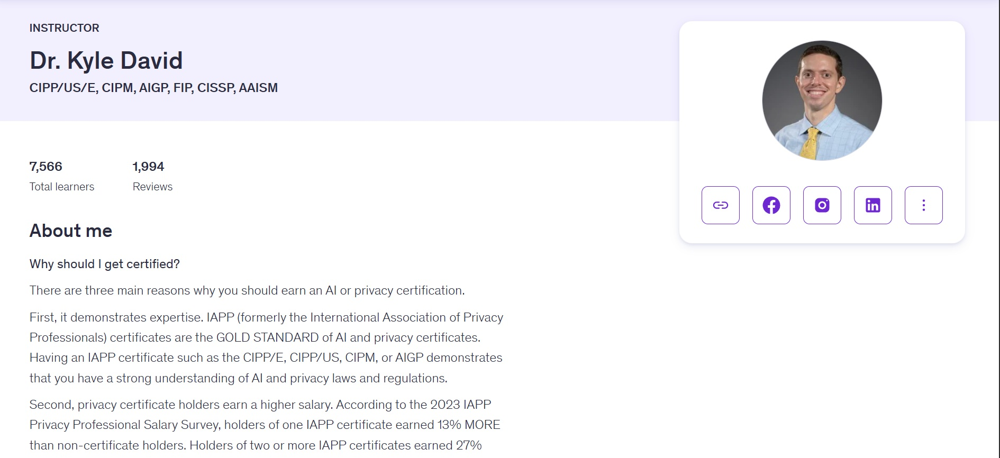
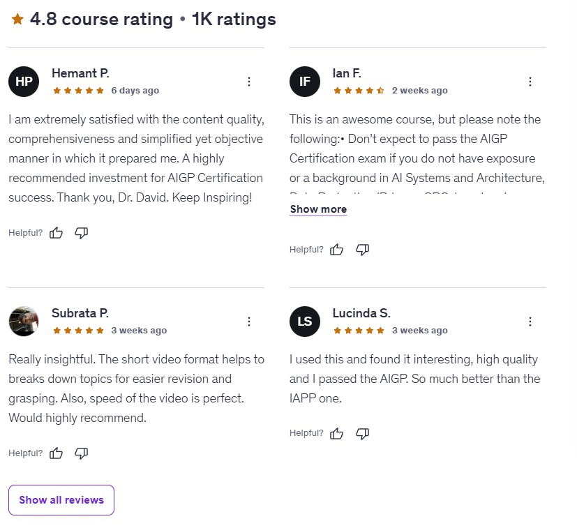

## Artificial Intelligence Governance Professional (AIGP) Certification Masterclass Course. is Worth it in 2026?
*As featured on leading education and technology publications, Courseswyn reviews evaluate courses based on instructor credibility, curriculum rigor, real-world applicability, and long-term professional value. [learn more](/about)*

Artificial intelligence has quietly transitioned from experimentation into infrastructure. It now underpins credit scoring systems, hiring pipelines, medical triage tools, insurance risk models, and public-sector decision-making. With this shift comes a reality many organizations were not prepared for: AI systems do not merely automate processes — they redistribute responsibility.

As regulators, auditors, and the public begin asking harder questions about accountability, transparency, and harm, organizations are discovering that technical excellence alone is no longer enough. What they need now is governance — structured oversight that determines who is responsible, how decisions are justified, and how risks are controlled across the AI lifecycle.

The **[AI Governance Professional (AIGP) Certification Masterclass Course](https://trk.udemy.com/JKxzbQ)** on Udemy is designed precisely for this inflection point. Rather than teaching how to build AI systems, it focuses on how organizations are expected to **govern** them: aligning AI initiatives with regulatory expectations, risk management practices, ethical standards, and institutional accountability.

This course positions itself as both a certification-aligned preparation program and a practical governance framework for professionals navigating AI oversight. The central question is whether it delivers genuine governance fluency — or simply repackages emerging terminology.

## Instructor Reputation

Unlike most AI-related courses on Udemy, the **AIGP Certification Masterclass** is not rooted in engineering culture or startup experimentation. Its foundation is governance, privacy, and compliance — a distinction that becomes immediately clear through the background of its instructor, **Dr. Kyle David**.

Dr. David’s professional authority is built not on developing machine learning models, but on designing and teaching the systems that **control** technology once it enters regulated environments. His credentials — including AIGP, CIPP, CIPM, FIP, and CISSP — place him firmly within the global community responsible for privacy engineering, trust frameworks, certification standards, and institutional governance.

This background fundamentally shapes how the course is taught. Governance is framed as an operational discipline rather than a moral aspiration. Lessons focus on how organizations fail in practice: unclear accountability, fragmented oversight, insufficient documentation, and governance processes that exist on paper but collapse under scrutiny.

Dr. David’s instructional style is deliberate and disciplined. There is no futurist hype, no speculative AI narratives, and no exaggerated claims about automation. Instead, the course emphasizes **decision integrity** — the ability to make and defend governance decisions under uncertainty, regulatory ambiguity, and organizational pressure.

A defining strength of his teaching is institutional realism. AI governance is presented as it exists inside real enterprises: shaped by competing incentives, legal risk, operational constraints, and evolving standards. Learners are trained to think like compliance officers, auditors, and regulators — anticipating scrutiny rather than reacting to it.

This approach may feel understated compared to more charismatic AI instructors, but for professionals seeking credibility and authority, it is precisely what makes the course valuable.

## Course Structure

The structure of the **[AI Governance Professional (AIGP) Certification Masterclass Course](https://trk.udemy.com/JKxzbQ)** mirrors how governance functions inside mature organizations. Rather than organizing content around tools or platforms, the curriculum is built around **responsibility domains**.

The opening modules focus on reframing AI as an organizational system rather than a technical artifact. Learners are guided to understand how AI redistributes responsibility across teams, roles, and processes. This foundation is particularly valuable for professionals coming from legal, compliance, audit, or business backgrounds.

From there, the course moves into the regulatory and standards landscape. Laws, frameworks, and guidelines are not presented as checklists to memorize, but as governance signals that shape institutional expectations. The emphasis is on interpretation and alignment — how external requirements translate into internal controls, policies, and oversight mechanisms.

A substantial portion of the curriculum is dedicated to **AI lifecycle governance**. Governance is framed as a continuous process spanning system design, data sourcing, model development, deployment, monitoring, and post-deployment evolution. This lifecycle perspective reflects how governance failures typically emerge: gradually, through cumulative decisions rather than single points of error.

Later modules address operational governance realities, including incident response, audit readiness, documentation practices, escalation pathways, and accountability mapping. These sections ground the course firmly in enterprise environments, preparing learners to operate where governance must withstand regulatory and legal scrutiny.

The result is a structured learning journey that builds governance thinking progressively, rather than overwhelming learners with disconnected concepts.

## Content Quality

The defining characteristic of the **AI Governance Professional (AIGP) Certification Masterclass Course** is intellectual discipline. Concepts are introduced methodically, revisited across multiple contexts, and reinforced through scenario-based reasoning. Rather than overwhelming learners with volume, the course builds a coherent governance worldview.

AI governance is consistently framed as a system of trade-offs. Learners are encouraged to reason through tensions between innovation and risk, automation and accountability, efficiency and ethics. This framing avoids both alarmism and complacency, reflecting how governance decisions are actually made in professional environments.

One of the strongest aspects of the content is its focus on **documentation and evidence**. Governance is presented not merely as intent, but as proof. Learners are trained to think about traceability, auditability, and defensibility — qualities that regulators and auditors prioritize when evaluating AI systems.

The pacing is deliberate and professional. While the material is dense, it remains accessible to non-technical learners and does not assume prior experience with AI development. At the same time, it avoids oversimplification, making it suitable for senior professionals seeking depth rather than surface familiarity.

Rather than teaching static rules, the course reshapes how learners reason about AI oversight. This cognitive shift — from technical optimization to institutional accountability — is the clearest indicator of content quality.

## Who This Course Is For (And Who It Isn’t)

The AIGP Certification Masterclass is best suited for professionals whose responsibilities intersect with AI risk, compliance, and oversight. This includes compliance officers, risk managers, legal and policy professionals, auditors, privacy engineers, consultants, and business leaders responsible for AI adoption.

It is particularly valuable for those preparing for the AIGP certification or seeking to formalize their governance expertise in anticipation of stricter AI regulation. The course provides the conceptual foundation needed to engage confidently with regulators, internal stakeholders, and executive leadership.

However, this course is not designed for learners seeking hands-on AI development or coding instruction. Those looking to build models, train neural networks, or experiment with AI frameworks will find the content conceptual rather than technical. Its strength lies in governance fluency, not implementation skills.

Understanding this distinction is critical. For its intended audience, the course delivers exactly what it promises.

## Overall Course Rating – 9.4/10

After evaluating the full curriculum, the **[AI Governance Professional (AIGP) Certification Masterclass Course](https://trk.udemy.com/JKxzbQ)** earns a strong **9.4 out of 10**.

Its relevance is its greatest strength. As AI systems become embedded in organizational decision-making, governance expertise is rapidly becoming a differentiator. This course addresses that demand directly, offering structured, credible preparation for professionals tasked with AI oversight.

While it does not provide technical implementation training, that limitation is also its defining focus. For learners seeking governance authority rather than engineering skills, the **AI Governance Professional (AIGP) Certification Masterclass Course** delivers substantial value.

## Pros & Cons

### What This Course Does Exceptionally Well

From an editorial perspective, the strongest aspect of the **AI Governance Professional (AIGP) Certification Masterclass** is how deliberately it avoids superficial AI compliance discussions. Instead of reducing governance to abstract ethics, the course consistently anchors concepts in **operational decision-making**—how governance frameworks actually function inside real organizations.

Another notable strength is its **alignment with the AIGP exam blueprint**. The structure mirrors how candidates are expected to think during the certification: scenario-driven, risk-aware, and policy-oriented. This makes the course particularly effective not just as a learning resource, but as an exam preparation tool.

Finally, the pacing deserves mention. While comprehensive, the course avoids overwhelming learners by layering complexity gradually—starting with governance fundamentals before moving into regulatory frameworks, risk controls, and organizational accountability.

### Where the Course May Not Be Ideal

That same depth can be a limitation for learners seeking purely technical or engineering-focused AI content. This is not a course about building models or writing code. Instead, it is designed for professionals who need to **govern, audit, or oversee AI systems**.

Additionally, beginners with no exposure to enterprise environments may find some policy and compliance discussions abstract. The course assumes a basic familiarity with how organizations operate at scale.

## Frequently Asked Questions (FAQ)

### Is this course aligned with the official AIGP certification exam?

Yes. The course content closely follows the **AI Governance Professional (AIGP) Masterclass Course** competency domains, making it suitable both as a primary study resource and as a structured revision guide before attempting the exam.

### Do I need a technical AI background to take this course?

No advanced technical background is required. While familiarity with AI concepts is helpful, the course is primarily focused on governance, risk, compliance, and organizational oversight rather than hands-on model development.

### Who benefits most from the AIGP Certification Masterclass?

This course is best suited for compliance professionals, risk managers, legal advisors, product leaders, policymakers, and executives who are responsible for AI oversight or regulatory alignment.

### Is this course useful even if I don’t plan to take the AIGP exam?

Yes. Even without pursuing certification, the course provides a comprehensive framework for understanding AI governance, which is increasingly relevant across regulated industries.

**Suggested courses:**

* Link to related Udemy reviews covering:

  * [AI Engineer Roadmap 2026](/blog/ai-engineer-roadmap-2026)
  * [Top AI and Machine Learning Courses on Udemy Updated 2026](/blog/top-ai-and-machine-learning-courses-on-udemy-2025)

