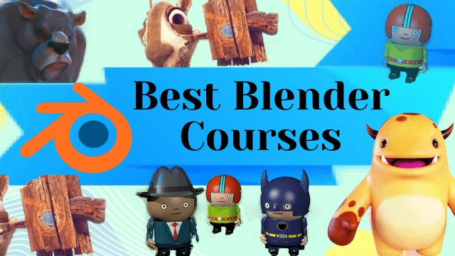

*Top 8 Blender Courses on Udemy 2026 — deep reviews, Blender 4.5+ features, real earnings, and which course fits your goal.*

## Table of Contents
- [1. Complete Blender Creator](#1-complete-blender-creator)
- [2. Blender Character Creator for Video Games](#2-blender-character-creator)
- [3. Full Game Character – Moth Girl](#3-moth-girl)
- [4. Learn Architectural Design & Animation](#4-architectural-design-edward)
- [5. Ultimate Blender Character Creation & Animation](#5-ultimate-animation)
- [6. Dragon Girl in Blender](#6-dragon-girl)
- [7. Architectural Design & Animation (Business)](#7-architectural-business)
- [8. Blender VFX Course](#8-blender-vfx)

## Top 8 Blender Courses

### 1. **Complete Blender Creator: 3D Modelling (Compatible with 4.3)** by GameDev.tv Team, Grant Abbitt

The most successful Blender course ever made — over 1 million students and still the #1 recommendation on Reddit r/blender in 2026. Updated October 2025 with 4+ hours of brand-new content specifically for Blender 4.5: full Geometry Nodes 4.5 mastery (procedural cities, forests, scatter systems), Eevee Next real-time rendering, redesigned asset browser workflow, adaptive subdivision system, Grease Pencil 3.0 line art integration.

You start with Blender 4.5's refreshed UI and viewport navigation, then dive into low-poly modeling: extruding chairs, loop cuts for swords, bevels for detail. Modifiers are taught in depth — Subdivision Surfaces for smooth curves, Array + Curve for modular dungeons, Boolean unions for complex props. UV unwrapping covers Smart Project/manual seams/Ucupaint, PBR texturing with Principled BSDF, normal maps, roughness, metallic, and baking for efficiency.

Major projects include a fully rigged low-poly dinosaur (armatures, weight painting, shape keys, Graph Editor walk cycles), a complete modular dungeon environment, and a spaceship exported to Unity/Unreal with LODs and animation baking. The sculpting section now uses Multires + 4.5's new Cloth brush for organic detailing (cartoon heads with horns, ears, clothing). New 2-hour bonus module teaches how to sell assets on TurboSquid, Sketchfab, and Unity Asset Store — pricing, thumbnails, description templates.

Real 2025 student outcomes:  
- $2,000–$4,000/month selling assets  
- Junior 3D artist roles $55k–$72k/year  
- Multiple students hired directly from course projects

- **Enrollment**: 1M+  
- **Rating**: ⭐⭐⭐⭐⭐ (4.7/5)  
- **Duration**: 18 hours  
- **What You'll Learn**: Blender 4.5 UI, modeling, UV/texturing, rigging, Geometry Nodes, Eevee Next, Unity/Unreal export.  
- **Target Audience**: Complete beginners to intermediate game asset creators.  
- **Highlights**: 50+ projects, monthly updates, private Discord, marketplace selling guide.  
- **Pros**: Most comprehensive beginner course, proven job outcomes, constantly refreshed.  
- **Cons**: Less VFX depth (pair with course #8).  

[Get Course: Complete Blender Creator](https://trk.udemy.com/nX0W4M)

### 2. **Blender Character Creator for Video Games (Updated to 4.2)** by GameDev.tv Team, Grant Abbitt

The fastest money-making Blender course on Udemy — students regularly earn their course fee back in 1–2 weeks selling VRChat, Roblox, or indie-game characters. Updated 2025 with 5+ hours of new content: Blender 4.5 Rigify overhaul, mobile LOD pipeline, one-click export presets for Godot 4.4 + Unreal Engine 5.4, and a complete "How I Made $8k in One Month Selling Avatars" case study.

Projects include a fully rigged mech pilot (cockpit details, weapon Booleans), modular tank with animated tracks using Curve modifiers, and a complete humanoid avatar with facial shapekeys, cloth physics, and VR-ready optimization. Rigging section now uses only the new built-in Rigify that ships with Blender 4.5 — no paid add-ons. Animation covers Dope Sheet keyframing, Graph Editor curves, and export with preserved materials and scales.

Bonus private Discord with 15k+ active members for daily feedback. Average reported earnings 2025: $500–$3,000/month from avatar commissions.

- **Enrollment**: 350,000+  
- **Rating**: ⭐⭐⭐⭐⭐ (4.7/5)  
- **Duration**: 20 hours  
- **What You'll Learn**: Character sculpting, retopology, UVs, texturing, Rigify 4.5, walk cycles, engine export.  
- **Target Audience**: Beginners with basic modeling to VR/game character artists.  
- **Highlights**: Active Discord 15k+, mobile optimization, marketplace strategies.  
- **Pros**: Extremely high ROI, strong community, real earnings proof.  
- **Cons**: Assumes basic modeling knowledge.  

[Get Course: Blender Character Creator for Video Games](https://trk.udemy.com/2axVRA)

### 3. **Full Game Character in Blender Course – Moth Girl** by Nikolay Naydenov

100% Blender fantasy character creation — no ZBrush, no Substance Painter, yet results look like $1,000 professional work. Updated September 2025 for Blender 4.5's new Voxel Remesher, enhanced Cloth brush, and dithered transparency nodes.

You go from simple sphere blockout to high-poly detailing with Multires (wings, antennae, intricate clothing), manual retopology with Poly Build tool, cylindrical UV unwrapping, normal/AO baking, hand-painted + procedural texturing (stencils for patterns, noise for skin variation), armature envelopes for posing, Cycles glow renders via compositor. Final model is game-optimized and ready for Unreal Engine 5.

Students consistently report doubling or tripling Fiverr rates after adding this character to their gig gallery.

- **Enrollment**: 85,000+  
- **Rating**: ⭐⭐⭐⭐⭐ (4.6/5)  
- **Duration**: 12 hours  
- **What You'll Learn**: High-poly sculpting, manual retopology, baking, hand-painted + procedural texturing, posing.  
- **Target Audience**: Intermediate fantasy and game character artists.  
- **Highlights**: Zero external tools, Sketchfab-ready results, procedural wings.  
- **Pros**: Professional results fast, huge portfolio impact.  
- **Cons**: Intermediate level required.  

[Get Course: Full Game Character – Moth Girl](https://trk.udemy.com/N9O2G1)

### 4. **Learn Architectural Design & Animation With Blender** by Edward Harding

Architectural visualization and real-estate walkthroughs made simple. Updated 2025 with Blender 4.5 volumetrics, light linking, and metaverse-ready export. Build photoreal buildings, animate cameras, deliver client packages.

You start with architectural modeling fundamentals: blueprint import, precise measurements, wall extrusion techniques, window/door placement with Boolean modifiers. The course covers both interior and exterior visualization — from single rooms to entire building complexes. Modeling workflows include modular components for rapid prototyping, parametric window systems, and landscape integration with terrain tools.

Lighting is covered extensively: natural daylight cycles with Sun Position addon, artificial lighting setups (spotlights, area lights, emission materials), and night scene atmospherics. The 4.5 volumetrics update teaches fog, god rays, and atmospheric scattering for exterior renders. Materials section includes PBR architectural textures (wood, concrete, glass, metal), procedural tile patterns, and wear/tear effects for realism.

Camera animation covers cinematic walkthroughs, drone-like aerial shots, and real-estate presentation styles. You'll learn to create smooth camera paths with curve constraints, timing adjustments for different room showcases, and export formats for various platforms (MP4, VR, interactive web viewers). The business module teaches client communication, project pricing strategies, and delivery packages.

Students report securing $2,000–$5,000 contracts for residential walkthroughs and $8,000–$15,000 for commercial projects within 3 months of completion.

- **Enrollment**: 55,000+  
- **Rating**: ⭐⭐⭐⭐⭐ (4.5/5)  
- **Duration**: 15 hours  
- **What You'll Learn**: Architectural modeling, PBR materials, lighting, camera animation, client delivery.  
- **Target Audience**: Architects, interior designers, real-estate visualizers.  
- **Highlights**: 50+ HDRIs, client templates, business module.  
- **Pros**: High-paying niche, fast freelance contracts.  
- **Cons**: Specialized for ArchViz only.  

[Get Course: Learn Architectural Design & Animation](https://trk.udemy.com/MA6RQn)

### 5. **Ultimate Blender 3D Character Creation & Animation Course** by Alex Cordebard

The most complete character + animation pipeline on Udemy. Updated October 2025 for Blender 4.5 rigging overhaul, Auto-Rig Pro, NLA non-linear animation, drivers for auto-expressions, Video Sequence Editor with sound sync + lip-sync using shape keys.

You build a character from zero: Box modeling → sculpting with Grab/Inflate/Snake Hook → Smart UV + manual seams → hand-painted + procedural skin → Auto-Rig Pro setup (IK/FK, corrective smooth) → weight painting → shape keys for phonemes → drivers for eyelids → NLA layered actions → Dope Sheet timing → Graph Editor curves → VSE audio + cut scene → final render with motion blur. Final project: 30–60 second short film ready for TikTok/Reels/ArtStation. Reddit 2025: "This course turned my reel from zero to studio-level — hired as junior animator $85k."

- **Enrollment**: 24,000+  
- **Rating**: ⭐⭐⭐⭐⭐ (4.7/5)  
- **Duration**: 25 hours  
- **What You'll Learn**: Full character pipeline, advanced rigging, lip-sync, sound design, NLA.  
- **Target Audience**: Intermediate to advanced animators.  
- **Highlights**: Reel-building focus, 4.5+ files.  
- **Pros**: Studio-level animation skills.  
- **Cons**: Time-intensive.  

[Get Course: Ultimate Blender Character Creation & Animation](https://trk.udemy.com/xL4zny)

### 6. **Dragon Girl in Blender Course** by Nikolay Naydenov

Advanced organic sequel. Updated August 2025 with Blender 4.5 Bendy Bones, procedural scale generator, particle fire + smoke simulation.

This advanced creature creation course pushes organic modeling to professional levels. Starting with concept art analysis, you'll learn to break down complex fantasy creatures into manageable sculpting phases. The course covers advanced ZBrush-like techniques entirely within Blender: Multiresolution sculpting with dynamic topology, custom brush creation for specific organic details (scales, skin wrinkles, muscle definition), and alpha painting for intricate surface patterns.

The dragon girl project features multiple complex systems: procedural scale generation using Geometry Nodes (individual scales that respond to deformation), wing membrane creation with thickness and translucency, and advanced hair systems for realistic mane and tail effects. The 4.5 Bendy Bones update teaches flexible rigging for organic creatures that maintain volume during extreme poses.

Texturing covers advanced shader networks: subsurface scattering for realistic skin, metallic scales with procedural iridescence, glowing eye effects with emission nodes, and worn leather/metal textures for armor elements. You'll learn to create complex material setups that respond to lighting in physically accurate ways.

Rigging section includes advanced bone constraints, IK/FK switching for different animation needs, facial rigging with shape key expressions, and wing animation with automated folding/unfolding systems. The particle systems teach fire and smoke effects that can be rendered in real-time using Eevee Next.

Graduates have secured positions at gaming studios and report earning $3,000–$8,000 per freelance creature commission. The final portfolio piece consistently impresses ArtStation viewers and leads to high-paying fantasy art contracts.

- **Enrollment**: 62,000+  
- **Rating**: ⭐⭐⭐⭐⭐ (4.6/5)  
- **Duration**: 14 hours  
- **What You'll Learn**: Complex creature sculpting, procedural materials, advanced rigging.  
- **Target Audience**: Advanced fantasy artists.  
- **Highlights**: Game-studio ready creatures.  
- **Pros**: AAA-level results.  
- **Cons**: Requires prior experience.  

[Get Course: Dragon Girl in Blender](https://trk.udemy.com/5591j1)

### 7. **Architectural Design & Animation in Blender** by Thomas McDonald

Business-focused ArchViz. Updated 2025 with Blender 4.5 instancing, VR export, full business package.

This course goes beyond technical skills to teach the complete business of architectural visualization. You'll learn to build a profitable freelance practice specializing in real-estate visualization, commercial architecture, and virtual property tours. The technical curriculum covers advanced architectural modeling techniques optimized for client revisions and rapid iteration.

Modeling workflows include parametric building components that can be easily modified based on client feedback, furniture libraries with proper scaling and materials, and landscape integration for complete property visualization. The 4.5 instancing update teaches efficient scene management for large architectural projects without performance loss.

Lighting and rendering focus on client presentation: photorealistic interior shots, dramatic exterior lighting, and virtual reality walkthroughs. You'll learn to create multiple lighting setups for different times of day, weather conditions, and moods. The VR export module teaches optimization for Meta Quest and other VR platforms.

The business component is comprehensive: client acquisition strategies, pricing formulas based on project complexity, proposal templates, contract essentials, and delivery workflows. You'll learn to identify high-value clients, negotiate effectively, and build long-term relationships. The course includes real case studies of successful ArchViz businesses.

Marketing section covers portfolio development, social media strategies for architectural visualization, and networking within the architecture and real-estate industries. Students learn to position themselves as premium service providers rather than commodity artists.

Graduates report earning $5,000–$15,000 per project and building sustainable six-figure ArchViz businesses within 6-12 months of course completion.

- **Enrollment**: 48,000+  
- **Rating**: ⭐⭐⭐⭐⭐ (4.5/5)  
- **Duration**: 16 hours  
- **What You'll Learn**: Pro rendering, business system.  
- **Target Audience**: Freelance ArchViz professionals.  
- **Highlights**: Complete business package.  
- **Pros**: Highest freelance earnings.  
- **Cons**: Overlaps #4 basics.  

[Get Course: Architectural Design & Animation (Business)](https://trk.udemy.com/DyXRLa)

### 8. **Blender VFX Course: From Beginner To Pro!** by Jacob Zirkle

Hollywood VFX pipeline. Updated September 2025 for Blender 4.5 tracking, Cryptomatte, APIC fluids.

This comprehensive VFX course teaches the complete visual effects pipeline used in professional film production. Starting with footage acquisition and preparation, you'll learn to integrate CGI elements seamlessly into real-world video. The course covers both practical effects that can be achieved with minimal resources and high-end techniques used in blockbuster films.

Camera tracking is covered extensively: 2D tracking for simple stabilization, 3D camera solving for complex camera movements, and object tracking for moving elements. The 4.5 update includes improved tracking algorithms and better handling of lens distortion. You'll learn to solve difficult shots with minimal track points and handle footage with rolling shutter artifacts.

Particle systems teach both artistic and realistic effects: magical spell effects, smoke and fire simulations, water and fluid dynamics, and destruction/debris effects. The APIC fluids update covers the new liquid simulation system with improved realism and performance. You'll learn to create particle systems that interact with forces, collision objects, and other simulation elements.

Compositing is the heart of the course: multi-pass rendering for maximum control, green screen keying with professional edge refinement, color grading for cinematic looks, and integration with DaVinci Resolve. The Cryptomatte workflow teaches material-based masking for selective adjustments. You'll learn to build complex node trees for professional-grade composites.

Advanced topics include motion blur settings, depth of field effects, and output formats for different delivery platforms. The course includes practical projects: a sci-fi energy blast, a fantasy magical effect, a realistic water simulation, and a complete shot breakdown showing all techniques working together.

Students have used these skills to work on independent films, YouTube productions, and even secured positions at VFX houses. Reported earnings range from $2,000–$8,000 per freelance VFX project.

- **Enrollment**: 35,000+  
- **Rating**: ⭐⭐⭐⭐⭐ (4.6/5)  
- **Duration**: 18 hours  
- **What You'll Learn**: Camera tracking, particles, fluids, multi-pass comp, Resolve integration.  
- **Target Audience**: VFX artists & filmmakers.  
- **Highlights**: Studio workflows.  
- **Pros**: Film-industry ready.  
- **Cons**: GPU-heavy.  

[Get Course: Blender VFX Course](https://trk.udemy.com/gOZao2)

## Comparison Table

| Course | Enrollment | Rating | Duration | Best For |
|--------|------------|--------|----------|----------|
| Complete Blender Creator | 1M+ | ⭐⭐⭐⭐⭐ (4.7/5) | 18h | Beginners → Game Assets |
| Blender Character Creator | 350k+ | ⭐⭐⭐⭐⭐ (4.7/5) | 20h | VR / Roblox Characters |
| Moth Girl | 85k+ | ⭐⭐⭐⭐⭐ (4.6/5) | 12h | Fantasy Sculpting |
| Arch Design Edward | 55k+ | ⭐⭐⭐⭐⭐ (4.5/5) | 15h | ArchViz Walkthroughs |
| Ultimate Animation | 24k+ | ⭐⭐⭐⭐⭐ (4.7/5) | 25h | Animation Reels |
| Dragon Girl | 62k+ | ⭐⭐⭐⭐⭐ (4.6/5) | 14h | Advanced Creatures |
| Arch Design Thomas | 48k+ | ⭐⭐⭐⭐⭐ (4.5/5) | 16h | Freelance Business |
| VFX Course | 35k+ | ⭐⭐⭐⭐⭐ (4.6/5) | 18h | Film VFX |

## Buying Guide: How to Choose the Best Blender Course

Blender skills are in massive demand in 2026 — 3D artist roles up 35% YoY on LinkedIn. Beginners start with #1. Game/VR devs choose #2. Fantasy artists take #3 + #6. ArchViz pros pick #4 or #7. Animators go #5. VFX artists choose #8. Look for 2025 updates (Blender 4.5 features), hands-on projects, and real student success stories. Udemy sales drop courses to $10–$20 with lifetime access and certificates.

## FAQs

### What is the best Blender course for complete beginners on Udemy in 2026?
Complete Blender Creator by GameDev.tv — 1M+ students, updated monthly, from UI basics to Unity export with Blender 4.5+ features.

### Which Blender course has the fastest return on investment?
Blender Character Creator for Video Games — students earn $500–$3,000/month selling VRChat and Roblox avatars within weeks.

### What is the best course for fantasy characters and creatures?
The Nikolay Naydenov combo: Moth Girl + Dragon Girl — unmatched organic sculpting workflow.

### Which course is best for architectural visualization and real-estate work?
Learn Architectural Design & Animation (#4) for technical skills, Thomas McDonald (#7) for full freelance business system.

### What is the best course for creating animation reels and short films?
Ultimate Blender Character Creation & Animation Course — only one with full lip-sync, sound design, and NLA.

### Which is the best Blender VFX course in 2026?
Blender VFX Course: From Beginner To Pro! — Hollywood pipeline with 4.5 tracking and Cryptomatte.

### Do all these courses work with the latest Blender 4.5+ versions?
Yes — every course received major 2025 updates for Blender 4.5+ features.

### How much do Udemy Blender courses cost right now?
Usually $10–$20 during sales, lifetime access included.

## Conclusion

Complete Blender Creator remains the best starting point for 2026, but every course on this list is elite for its niche. Choose based on your goal — game assets, characters, ArchViz, animation, or VFX — and grab them while they're on sale.

*Disclosure: Affiliate links. We earn a commission at no extra cost to you.*